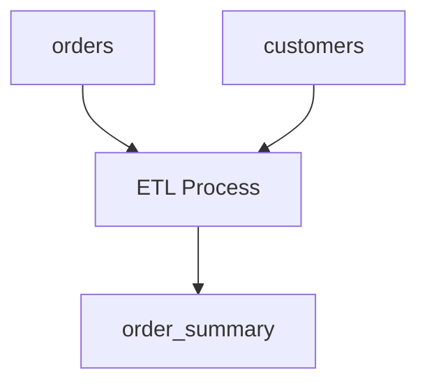

# 数据血缘分析

数据血缘分析（Data Lineage Analysis）是数据管理中的一个重要概念，用于追踪数据的来源、转换过程以及最终去向。它帮助我们理解数据在系统中的流动路径，确保数据的透明性、可追溯性和质量。

## 什么是数据血缘分析？

数据血缘分析是指通过分析数据的流动路径，追踪数据从源头到最终目标的整个过程。它可以帮助我们回答以下问题：

- 数据从哪里来？
- 数据经过了哪些处理步骤？
- 数据最终被用在了哪里？

通过数据血缘分析，我们可以更好地理解数据的生命周期，确保数据的准确性和一致性，同时也能在数据出现问题时快速定位原因。

## 数据血缘分析的重要性

在数据仓库设计中，数据血缘分析具有以下重要作用：

1. **数据质量保障**：通过追踪数据的流动路径，可以及时发现数据质量问题，并采取相应的措施。
2. **合规性检查**：在金融、医疗等行业，数据血缘分析可以帮助企业满足合规性要求，确保数据的可追溯性。
3. **影响分析**：当数据源或数据处理逻辑发生变化时，数据血缘分析可以帮助我们评估这些变化对下游系统的影响。
4. **优化数据处理流程**：通过分析数据血缘，可以发现数据处理流程中的瓶颈和冗余步骤，从而优化数据处理效率。

## 数据血缘分析的基本步骤

数据血缘分析通常包括以下几个步骤：

1. **数据源识别**：确定数据的来源，包括数据库、文件、API等。
2. **数据处理追踪**：追踪数据在系统中的处理过程，包括ETL（Extract, Transform, Load）过程、数据清洗、数据转换等。
3. **数据目标确认**：确定数据的最终去向，包括报表、分析模型、应用程序等。
4. **血缘关系可视化**：将数据血缘关系以图表的形式展示出来，便于理解和分析。

## 数据血缘分析的实际案例

假设我们有一个简单的Hive数据仓库，其中包含以下表：

- `orders`：存储订单信息。
- `customers`：存储客户信息。
- `order_summary`：存储订单汇总信息。

我们的目标是通过数据血缘分析，追踪`order_summary`表的数据来源和处理过程。

### 数据血缘关系图



在这个例子中，`orders`表和`customers`表通过ETL过程进行处理，最终生成`order_summary`表。

### 代码示例

以下是一个简单的Hive SQL示例，展示了如何从`orders`和`customers`表中生成`order_summary`表：

```sql
-- 创建orders表
CREATE TABLE orders (
    order_id INT,
    customer_id INT,
    order_date STRING,
    order_amount DOUBLE
);

-- 创建customers表
CREATE TABLE customers (
    customer_id INT,
    customer_name STRING,
    customer_email STRING
);

-- 创建order_summary表
CREATE TABLE order_summary AS
SELECT 
    o.order_id,
    c.customer_name,
    o.order_date,
    o.order_amount
FROM 
    orders o
JOIN 
    customers c
ON 
    o.customer_id = c.customer_id;
```

在这个示例中，`order_summary`表的数据来源于`orders`和`customers`表，通过`JOIN`操作将两个表的数据合并。

## 总结

数据血缘分析是数据仓库设计中的一个重要环节，它帮助我们理解数据的流动路径，确保数据的透明性和可追溯性。通过数据血缘分析，我们可以更好地管理数据质量、满足合规性要求，并优化数据处理流程。

## 附加资源

- [Hive官方文档](https://hive.apache.org/)
- [数据血缘分析工具推荐](https://www.example.com/data-lineage-tools)
- [数据质量管理最佳实践](https://www.example.com/data-quality-best-practices)

## 练习

1. 在你的Hive数据仓库中，选择一个表并尝试绘制其数据血缘关系图。
2. 编写一个Hive SQL脚本，生成一个新的汇总表，并分析其数据血缘关系。
3. 思考如何利用数据血缘分析优化你的数据处理流程。

:::tip
在进行数据血缘分析时，建议使用专门的数据血缘分析工具，如Apache Atlas、DataHub等，这些工具可以帮助你更高效地管理和可视化数据血缘关系。
:::