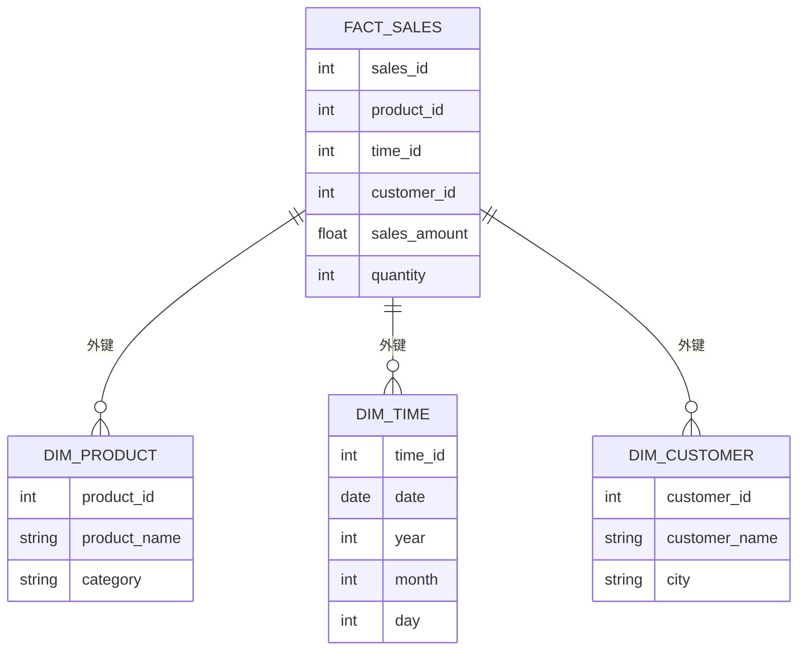

# 星型模式设计

星型模式（Star Schema）是数据仓库设计中最常用的数据模型之一。它以其简单的结构和高效的查询性能而闻名，特别适合用于分析型查询。本文将详细介绍星型模式的设计原理、结构及其在Hive数据仓库中的应用。

## 什么是星型模式？

星型模式是一种多维数据模型，由**事实表**和**维度表**组成。事实表存储业务过程中的度量值（如销售额、数量等），而维度表则存储与这些度量值相关的描述性信息（如时间、地点、产品等）。星型模式之所以得名，是因为其结构类似于一颗星星：事实表位于中心，维度表围绕在周围。

### 星型模式的结构

星型模式的核心是**事实表**，它包含以下内容：

- **度量值**：如销售额、数量等。
- **外键**：用于连接维度表。

维度表则包含以下内容：

- **主键**：唯一标识维度表中的每一行。
- **描述性属性**：如产品名称、客户名称等。

以下是一个简单的星型模式结构图：



## 星型模式的优点

1. **查询性能高**：由于星型模式的结构简单，查询时只需连接少量的表，因此查询性能较高。
2. **易于理解**：星型模式的结构直观，易于理解和维护。
3. **适合分析型查询**：星型模式特别适合用于分析型查询，如OLAP（联机分析处理）。

## 星型模式的设计步骤

### 1. 确定事实表

首先，确定业务过程中的核心度量值。例如，在销售业务中，核心度量值可能是销售额和销售数量。这些度量值将存储在事实表中。

### 2. 确定维度表

接下来，确定与事实表相关的维度。例如，在销售业务中，相关的维度可能包括产品、时间和客户。每个维度将对应一个维度表。

### 3. 设计事实表和维度表的结构

根据确定的度量值和维度，设计事实表和维度表的结构。确保事实表包含外键，用于连接维度表。

### 4. 创建表并加载数据

在Hive中创建事实表和维度表，并加载数据。以下是一个简单的Hive表创建示例：

```sql
-- 创建维度表：产品
CREATE TABLE dim_product (
    product_id INT,
    product_name STRING,
    category STRING
);

-- 创建维度表：时间
CREATE TABLE dim_time (
    time_id INT,
    date DATE,
    year INT,
    month INT,
    day INT
);

-- 创建维度表：客户
CREATE TABLE dim_customer (
    customer_id INT,
    customer_name STRING,
    city STRING
);

-- 创建事实表：销售
CREATE TABLE fact_sales (
    sales_id INT,
    product_id INT,
    time_id INT,
    customer_id INT,
    sales_amount FLOAT,
    quantity INT
);
```

### 5. 执行查询

使用SQL查询星型模式中的数据。例如，查询某个时间段内某个产品的销售额：

```sql
SELECT 
    dp.product_name,
    dt.year,
    dt.month,
    SUM(fs.sales_amount) AS total_sales
FROM 
    fact_sales fs
JOIN 
    dim_product dp ON fs.product_id = dp.product_id
JOIN 
    dim_time dt ON fs.time_id = dt.time_id
WHERE 
    dp.product_name = 'Laptop' AND dt.year = 2023
GROUP BY 
    dp.product_name, dt.year, dt.month;
```

## 实际案例：零售业数据仓库

假设我们正在为一家零售公司设计数据仓库，用于分析销售数据。以下是星型模式的应用示例：

### 事实表：销售

- **sales_id**：销售记录的唯一标识。
- **product_id**：产品ID，外键，连接产品维度表。
- **time_id**：时间ID，外键，连接时间维度表。
- **customer_id**：客户ID，外键，连接客户维度表。
- **sales_amount**：销售额。
- **quantity**：销售数量。

### 维度表：产品

- **product_id**：产品ID，主键。
- **product_name**：产品名称。
- **category**：产品类别。

### 维度表：时间

- **time_id**：时间ID，主键。
- **date**：日期。
- **year**：年份。
- **month**：月份。
- **day**：日期。

### 维度表：客户

- **customer_id**：客户ID，主键。
- **customer_name**：客户名称。
- **city**：客户所在城市。

通过这种设计，我们可以轻松地分析不同产品、不同时间段和不同客户的销售情况。

## 总结

星型模式是一种简单而高效的数据仓库设计方法，特别适合用于分析型查询。通过将数据组织成事实表和维度表，星型模式能够提供快速的查询性能和直观的数据结构。希望本文能帮助你理解星型模式的基本概念，并能够在Hive数据仓库中应用这一设计方法。

## 附加资源

- [Hive官方文档](https://hive.apache.org/)
- [数据仓库设计最佳实践](https://www.kimballgroup.com/data-warehouse-business-intelligence-resources/)

## 练习

1. 设计一个星型模式，用于分析电商网站的订单数据。确定事实表和维度表的结构，并编写Hive表创建语句。
2. 编写一个SQL查询，分析某个时间段内某个类别的产品销售情况。

:::tip
如果你在学习过程中遇到问题，可以参考Hive官方文档或加入我们的社区论坛，与其他学习者交流经验。
:::