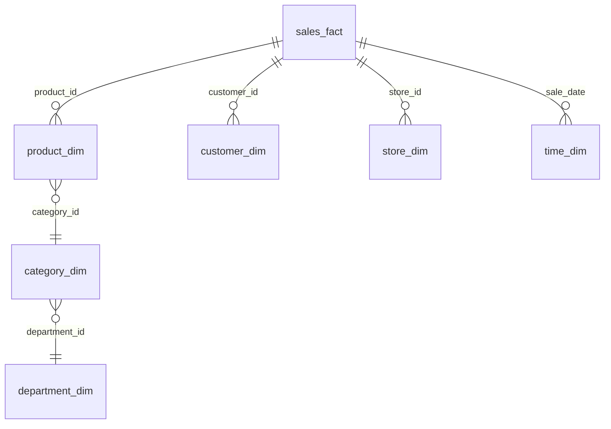

# 雪花模式设计

雪花模式（Snowflake Schema）是数据仓库设计中的一种常见模式，它是星型模式（Star Schema）的扩展。雪花模式通过将维度表进一步规范化，减少了数据冗余，并提高了数据的一致性。本文将详细介绍雪花模式的设计方法、优势及其在Hive数据仓库中的应用。

## 什么是雪花模式？

雪花模式是一种多维数据模型，它将维度表分解为多个相关的表，从而形成一个类似雪花的结构。与星型模式不同，雪花模式中的维度表可能包含多个层级，每个层级都通过外键与其他表关联。

### 星型模式 vs 雪花模式

- **星型模式**：所有维度表直接连接到事实表，形成一个星型结构。维度表通常是去规范化的，包含所有相关数据。
- **雪花模式**：维度表被进一步规范化，分解为多个相关的表，形成一个类似雪花的结构。这种设计减少了数据冗余，但可能增加查询的复杂性。

## 雪花模式的优势

1. **减少数据冗余**：通过规范化维度表，雪花模式减少了数据冗余，节省了存储空间。
2. **提高数据一致性**：规范化设计确保了数据的一致性，减少了数据更新异常的风险。
3. **灵活性**：雪花模式允许更灵活的数据模型设计，适用于复杂的业务场景。

## 雪花模式的设计步骤

### 1. 确定事实表

事实表是雪花模式的核心，它包含与业务过程相关的度量值（如销售额、数量等）。确定事实表是设计雪花模式的第一步。

```sql
CREATE TABLE sales_fact (
    sale_id INT,
    product_id INT,
    customer_id INT,
    store_id INT,
    sale_date DATE,
    amount DECIMAL(10, 2)
);
```

### 2. 确定维度表

维度表包含描述事实表中数据的属性（如产品、客户、时间等）。在雪花模式中，维度表可能被进一步分解为多个相关的表。

```sql
CREATE TABLE product_dim (
    product_id INT,
    product_name STRING,
    category_id INT
);

CREATE TABLE category_dim (
    category_id INT,
    category_name STRING
);
```

### 3. 建立外键关系

在雪花模式中，维度表通过外键与其他表关联。例如，`product_dim` 表通过 `category_id` 与 `category_dim` 表关联。

```sql
ALTER TABLE product_dim ADD FOREIGN KEY (category_id) REFERENCES category_dim(category_id);
```

### 4. 查询示例

以下是一个查询示例，展示了如何在雪花模式中查询数据：

```sql
SELECT 
    p.product_name,
    c.category_name,
    SUM(s.amount) AS total_sales
FROM 
    sales_fact s
JOIN 
    product_dim p ON s.product_id = p.product_id
JOIN 
    category_dim c ON p.category_id = c.category_id
GROUP BY 
    p.product_name, c.category_name;
```

## 实际案例

假设我们正在设计一个零售数据仓库，用于分析销售数据。以下是雪花模式的设计：



在这个案例中，`sales_fact` 是事实表，`product_dim`、`customer_dim`、`store_dim` 和 `time_dim` 是维度表。`product_dim` 进一步分解为 `category_dim` 和 `department_dim`，形成了一个雪花结构。

## 总结

雪花模式通过规范化维度表，减少了数据冗余并提高了数据一致性。尽管它可能增加查询的复杂性，但在复杂的业务场景中，雪花模式提供了更高的灵活性和可维护性。

## 附加资源

- [数据仓库设计模式](https://en.wikipedia.org/wiki/Data_warehouse#Design_methodologies)
- [Hive 官方文档](https://hive.apache.org/)

## 练习

1. 设计一个雪花模式，用于分析在线零售商的订单数据。
2. 编写 SQL 查询，从你设计的雪花模式中提取特定产品的销售总额。

:::tip
在设计雪花模式时，务必考虑业务需求和数据查询的复杂性。规范化虽然减少了冗余，但也可能增加查询的复杂性。
:::