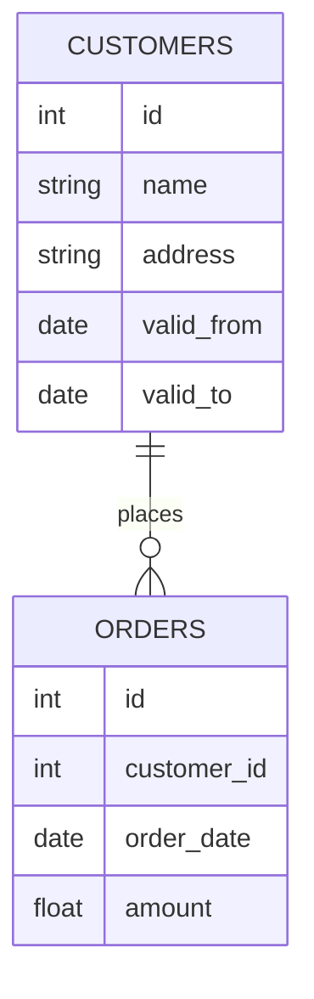

# 缓慢变化维度(SCD)

在数据仓库设计中，**缓慢变化维度（Slowly Changing Dimensions, SCD）** 是一个非常重要的概念。它描述了维度表中数据随时间变化的情况。维度表中的数据通常不会频繁变化，但当它们发生变化时，我们需要决定如何处理这些变化。本文将详细介绍SCD的概念、类型及其应用场景。

## 什么是缓慢变化维度？

维度表是数据仓库中用于描述业务实体的表，例如客户、产品、地理位置等。这些表中的数据通常是静态的，但随着时间的推移，某些属性可能会发生变化。例如，客户的地址可能会改变，产品的价格可能会调整。这些变化被称为**缓慢变化**，因为它们不会频繁发生。

SCD的核心问题是如何处理这些变化。不同的处理方式会影响数据的历史记录和分析结果。因此，理解SCD的类型及其应用场景至关重要。

## SCD的类型

SCD通常分为以下几种类型：

### 1. SCD类型1：覆盖旧值

在SCD类型1中，当维度表中的数据发生变化时，旧值会被新值直接覆盖。这种方式不会保留历史记录，适用于不需要跟踪历史变化的场景。

**示例：**

假设我们有一个客户表 `customers`，其中包含客户的姓名和地址。如果客户的地址发生变化，我们直接更新表中的记录。

```sql
-- 初始数据
SELECT * FROM customers;

+----+----------+-------------------+
| id | name     | address           |
+----+----------+-------------------+
| 1  | Alice    | 123 Main St       |
+----+----------+-------------------+

-- 更新地址
UPDATE customers SET address = '456 Elm St' WHERE id = 1;

-- 更新后的数据
SELECT * FROM customers;

+----+----------+-------------------+
| id | name     | address           |
+----+----------+-------------------+
| 1  | Alice    | 456 Elm St        |
+----+----------+-------------------+
```

**适用场景：** 当历史变化不重要时，例如客户的电话号码更新。

### 2. SCD类型2：添加新行

在SCD类型2中，当维度表中的数据发生变化时，会添加一行新记录，而不是覆盖旧值。这种方式保留了历史记录，适用于需要跟踪历史变化的场景。

**示例：**

继续使用客户表 `customers`，我们添加一个 `valid_from` 和 `valid_to` 列来记录每条记录的有效时间。

```sql
-- 初始数据
SELECT * FROM customers;

+----+----------+-------------------+------------+------------+
| id | name     | address           | valid_from | valid_to   |
+----+----------+-------------------+------------+------------+
| 1  | Alice    | 123 Main St       | 2023-01-01 | 9999-12-31 |
+----+----------+-------------------+------------+------------+

-- 更新地址
INSERT INTO customers (id, name, address, valid_from, valid_to)
VALUES (1, 'Alice', '456 Elm St', '2023-06-01', '9999-12-31');

UPDATE customers SET valid_to = '2023-05-31' WHERE id = 1 AND valid_to = '9999-12-31';

-- 更新后的数据
SELECT * FROM customers;

+----+----------+-------------------+------------+------------+
| id | name     | address           | valid_from | valid_to   |
+----+----------+-------------------+------------+------------+
| 1  | Alice    | 123 Main St       | 2023-01-01 | 2023-05-31 |
| 1  | Alice    | 456 Elm St        | 2023-06-01 | 9999-12-31 |
+----+----------+-------------------+------------+------------+
```

**适用场景：** 当需要保留历史记录时，例如客户的地址变化。

### 3. SCD类型3：添加新列

在SCD类型3中，当维度表中的数据发生变化时，会添加一个新列来存储旧值。这种方式只保留有限的历史记录，适用于需要跟踪少量历史变化的场景。

**示例：**

在客户表 `customers` 中，我们添加一个 `previous_address` 列来存储旧地址。

```sql
-- 初始数据
SELECT * FROM customers;

+----+----------+-------------------+-------------------+
| id | name     | address           | previous_address  |
+----+----------+-------------------+-------------------+
| 1  | Alice    | 123 Main St       | NULL              |
+----+----------+-------------------+-------------------+

-- 更新地址
UPDATE customers SET previous_address = address, address = '456 Elm St' WHERE id = 1;

-- 更新后的数据
SELECT * FROM customers;

+----+----------+-------------------+-------------------+
| id | name     | address           | previous_address  |
+----+----------+-------------------+-------------------+
| 1  | Alice    | 456 Elm St        | 123 Main St       |
+----+----------+-------------------+-------------------+
```

**适用场景：** 当只需要保留最近一次的历史记录时，例如客户的最近一次地址变化。

## 实际案例

假设我们有一个电商平台，需要跟踪客户的历史订单。我们可以使用SCD类型2来记录客户的地址变化，以便在分析订单时能够准确地关联客户的地址。



在这个案例中，`CUSTOMERS` 表使用SCD类型2来记录客户的地址变化，而 `ORDERS` 表则记录了客户的订单信息。通过这种方式，我们可以准确地分析每个订单发生时客户的地址。

## 总结

缓慢变化维度（SCD）是数据仓库设计中的一个重要概念，它帮助我们处理维度表中的数据变化。根据不同的需求，我们可以选择SCD类型1、类型2或类型3来处理这些变化。理解这些类型及其适用场景，可以帮助我们更好地设计数据仓库，确保数据的准确性和完整性。

## 附加资源与练习

- **练习1：** 设计一个产品表，使用SCD类型2来记录产品的价格变化。
- **练习2：** 在一个现有的客户表中，实现SCD类型3来记录客户的最近一次地址变化。
- **资源：** 阅读更多关于SCD的官方文档和案例研究，深入理解其在实际项目中的应用。

:::tip
在实际项目中，选择合适的SCD类型非常重要。确保在设计和实现过程中充分考虑业务需求和数据历史记录的重要性。
:::