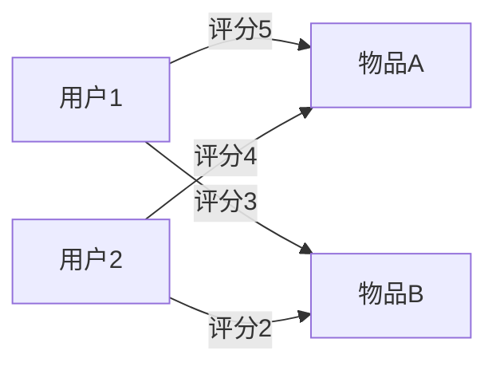

## 介绍

推荐系统是一种信息过滤系统，旨在预测用户对物品的偏好，并向用户推荐他们可能感兴趣的物品。推荐系统广泛应用于电子商务、社交媒体、视频流媒体等领域，例如 Netflix 的电影推荐、Amazon 的商品推荐等。

推荐系统的核心目标是通过分析用户的历史行为、物品的属性以及其他相关信息，为用户提供个性化的推荐。常见的推荐算法包括协同过滤、基于内容的推荐、混合推荐等。

## 推荐系统的基本类型

### 1. 协同过滤（Collaborative Filtering）

协同过滤是基于用户行为数据的推荐方法。它假设用户之间的行为具有相似性，因此可以通过分析用户的历史行为来预测他们可能喜欢的物品。

#### 用户-物品矩阵

协同过滤通常使用用户-物品矩阵来表示用户对物品的评分或交互行为。矩阵中的每一行代表一个用户，每一列代表一个物品，矩阵中的值表示用户对物品的评分或交互次数。



#### 代码示例

以下是一个简单的协同过滤示例，使用 Python 和 Pandas 库：

```python
import pandas as pd
from sklearn.metrics.pairwise import cosine_similarity

# 创建用户-物品矩阵
data = {
    '用户1': [5, 3, 0, 1],
    '用户2': [4, 0, 4, 1],
    '用户3': [1, 1, 0, 5],
    '用户4': [0, 0, 3, 4]
}
df = pd.DataFrame(data, index=['物品A', '物品B', '物品C', '物品D'])

# 计算用户之间的相似度
user_similarity = cosine_similarity(df.T)
print(user_similarity)
```

**输出：**

```
[[1.         0.76376262 0.2773501  0.2773501 ]
 [0.76376262 1.         0.2773501  0.2773501 ]
 [0.2773501  0.2773501  1.         0.76376262]
 [0.2773501  0.2773501  0.76376262 1.        ]]
```

### 2. 基于内容的推荐（Content-Based Filtering）

基于内容的推荐系统通过分析物品的属性来推荐与用户历史偏好相似的物品。例如，如果用户喜欢科幻电影，系统会推荐其他科幻电影。

#### 代码示例

以下是一个基于内容的推荐示例，使用 TF-IDF 和余弦相似度：

```python
from sklearn.feature_extraction.text import TfidfVectorizer
from sklearn.metrics.pairwise import cosine_similarity

# 物品描述
items = [
    "科幻电影，讲述未来世界的冒险故事",
    "动作电影，充满激烈的打斗场面",
    "爱情电影，讲述浪漫的爱情故事",
    "科幻电影，探索外星生命的奥秘"
]

# 计算 TF-IDF 矩阵
vectorizer = TfidfVectorizer()
tfidf_matrix = vectorizer.fit_transform(items)

# 计算物品之间的相似度
item_similarity = cosine_similarity(tfidf_matrix)
print(item_similarity)
```

**输出：**

```
[[1.         0.         0.         0.70710678]
 [0.         1.         0.         0.        ]
 [0.         0.         1.         0.        ]
 [0.70710678 0.         0.         1.        ]]
```

### 3. 混合推荐（Hybrid Recommendation）

混合推荐系统结合了协同过滤和基于内容的推荐，以克服单一方法的局限性。例如，Netflix 的推荐系统就采用了混合推荐方法。

## 实际案例

### 案例：电影推荐系统

假设我们有一个电影推荐系统，用户可以对电影进行评分。我们可以使用协同过滤来推荐用户可能喜欢的电影。

1. **数据收集**：收集用户对电影的评分数据。
2. **构建用户-物品矩阵**：将用户评分数据转换为矩阵形式。
3. **计算相似度**：计算用户之间的相似度或物品之间的相似度。
4. **生成推荐**：根据相似度生成推荐列表。

:::tip
在实际应用中，推荐系统通常会结合多种算法，并考虑实时数据更新、冷启动问题等挑战。
:::

## 总结

推荐系统是现代互联网应用中不可或缺的一部分。通过分析用户行为和物品属性，推荐系统能够为用户提供个性化的推荐，提升用户体验。本文介绍了推荐系统的基本类型，包括协同过滤、基于内容的推荐和混合推荐，并通过代码示例展示了如何实现这些方法。

## 附加资源与练习

- **资源**：
  - [推荐系统：原理与实践](https://www.oreilly.com/library/view/recommender-systems-the/9781449367114/)
  - [Coursera 推荐系统课程](https://www.coursera.org/learn/recommender-systems)

- **练习**：
  1. 使用协同过滤算法实现一个简单的电影推荐系统。
  2. 尝试结合基于内容的推荐和协同过滤，构建一个混合推荐系统。
  3. 探索如何处理冷启动问题，即新用户或新物品的推荐问题。

:::caution
在实际应用中，推荐系统需要考虑数据稀疏性、计算复杂度等问题。建议在实现过程中进行性能优化和算法调优。
:::