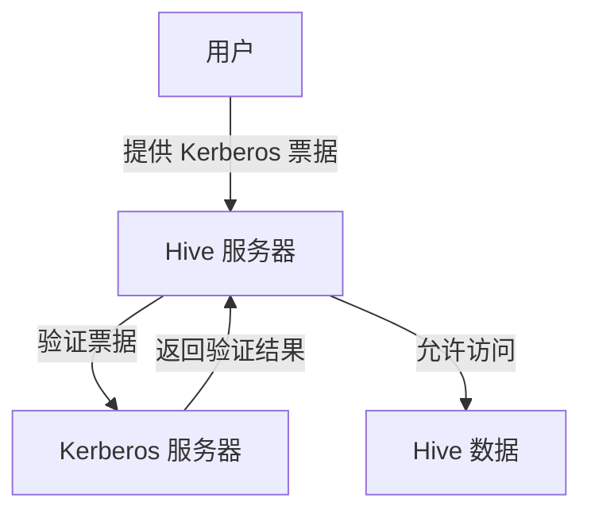

# 身份验证

身份验证是 Hive 安全与治理中的重要组成部分。它确保只有经过授权的用户或应用程序能够访问 Hive 中的数据。对于初学者来说，理解身份验证的基本概念及其实现方式至关重要。

## 什么是身份验证？

身份验证（Authentication）是确认用户或系统身份的过程。在 Hive 中，身份验证通常通过用户名和密码、Kerberos 票据或其他安全机制来实现。它的主要目的是防止未经授权的访问，确保数据的安全性。

## Hive 中的身份验证机制

Hive 支持多种身份验证机制，以下是常见的几种：

1. **简单身份验证**：使用用户名和密码进行验证。
2. **Kerberos 身份验证**：通过 Kerberos 票据进行验证，适用于企业级安全需求。
3. **LDAP 身份验证**：通过轻量级目录访问协议（LDAP）进行验证。

### 简单身份验证

简单身份验证是最基础的身份验证方式。用户通过提供用户名和密码来访问 Hive。

```sql
-- 示例：使用用户名和密码连接 Hive
beeline -u jdbc:hive2://localhost:10000 -n username -p password
```

:::note
简单身份验证适用于开发和测试环境，但在生产环境中建议使用更安全的身份验证机制。
:::

### Kerberos 身份验证

Kerberos 是一种网络身份验证协议，通过票据（Ticket）来验证用户身份。它比简单身份验证更安全，适用于企业级环境。

```bash
# 示例：使用 Kerberos 票据连接 Hive
beeline -u "jdbc:hive2://localhost:10000/default;principal=hive/_HOST@YOUR_REALM"
```

:::tip
Kerberos 身份验证需要提前配置 Kerberos 服务器，并生成相应的票据。
:::

### LDAP 身份验证

LDAP 是一种用于访问和维护分布式目录信息服务的协议。Hive 可以通过 LDAP 进行用户身份验证。

```bash
# 示例：使用 LDAP 连接 Hive
beeline -u jdbc:hive2://localhost:10000 -n ldapuser -p ldappassword
```

:::caution
LDAP 身份验证需要配置 LDAP 服务器，并确保 Hive 能够访问该服务器。
:::

## 实际案例

假设你在一家金融公司工作，需要确保只有经过授权的分析师能够访问 Hive 中的敏感数据。以下是实现步骤：

1. **配置 Kerberos**：在 Hive 服务器上配置 Kerberos，并生成票据。
2. **设置用户权限**：通过 Hive 的授权机制（如 Ranger）为分析师分配访问权限。
3. **验证身份**：分析师使用 Kerberos 票据登录 Hive，访问数据。



## 总结

身份验证是 Hive 安全与治理的核心部分。通过简单身份验证、Kerberos 或 LDAP，可以有效保护数据的安全性。在实际应用中，选择合适的身份验证机制并正确配置是关键。

## 附加资源

- [Hive 官方文档](https://hive.apache.org/)
- [Kerberos 身份验证指南](https://web.mit.edu/kerberos/)
- [LDAP 配置教程](https://ldap.com/)

## 练习

1. 在本地环境中配置简单身份验证，并尝试连接 Hive。
2. 研究 Kerberos 的工作原理，并尝试在企业环境中配置 Kerberos 身份验证。
3. 探索 LDAP 的其他用途，并思考如何将其与 Hive 集成。

通过以上学习和实践，你将掌握 Hive 中的身份验证机制，并能够应用于实际项目中。