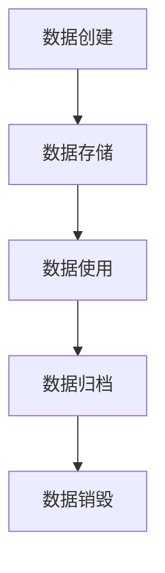

# 数据生命周期管理

数据生命周期管理（Data Lifecycle Management, DLM）是指从数据的创建、存储、使用、归档到最终销毁的整个过程管理。它确保数据在整个生命周期中的安全性、合规性和高效性。在 Hive 中，数据生命周期管理是确保数据治理和安全的重要组成部分。

## 数据生命周期的阶段

数据生命周期通常分为以下几个阶段：

1. **数据创建**：数据通过系统或用户输入生成。
2. **数据存储**：数据被存储在数据库、数据仓库或其他存储系统中。
3. **数据使用**：数据被查询、分析和处理。
4. **数据归档**：不再频繁使用的数据被移动到归档存储中。
5. **数据销毁**：数据被永久删除，以释放存储空间并确保合规性。



## Hive 中的数据生命周期管理

在 Hive 中，数据生命周期管理可以通过以下方式实现：

### 1. 数据创建与存储

数据创建后，通常会被存储在 Hive 表中。以下是一个创建表的示例：

```sql
CREATE TABLE IF NOT EXISTS user_data (
    user_id INT,
    user_name STRING,
    signup_date DATE
)
STORED AS ORC;
```

:::note
`STORED AS ORC` 表示数据以 ORC 文件格式存储，这是一种高效的列式存储格式。
:::

### 2. 数据使用

数据使用阶段包括查询和分析数据。以下是一个查询示例：

```sql
SELECT user_name, signup_date
FROM user_data
WHERE signup_date > '2023-01-01';
```

**输出示例：**

| user_name | signup_date |
|-----------|-------------|
| Alice     | 2023-02-15  |
| Bob       | 2023-03-10  |

### 3. 数据归档

当数据不再频繁使用时，可以将其归档到低成本存储中。以下是一个将数据归档到另一个表的示例：

```sql
CREATE TABLE user_data_archive AS
SELECT * FROM user_data
WHERE signup_date < '2022-01-01';
```

:::tip
归档数据可以显著降低存储成本，同时保留数据以备将来使用。
:::

### 4. 数据销毁

当数据不再需要时，可以将其永久删除。以下是一个删除数据的示例：

```sql
DELETE FROM user_data
WHERE signup_date < '2020-01-01';
```

:::caution
删除数据是不可逆的操作，请确保在删除前进行备份或确认。
:::

## 实际案例

假设一家电商公司使用 Hive 存储用户订单数据。随着时间推移，订单数据量不断增加，公司决定实施数据生命周期管理：

1. **数据创建与存储**：新订单数据存储在 `orders` 表中。
2. **数据使用**：分析师查询最近一年的订单数据以生成销售报告。
3. **数据归档**：超过一年的订单数据被移动到 `orders_archive` 表中。
4. **数据销毁**：超过五年的订单数据被永久删除，以符合数据保留政策。

通过这种方式，公司不仅优化了存储成本，还确保了数据的合规性和安全性。

## 总结

数据生命周期管理是确保数据高效、安全和合规的关键。在 Hive 中，通过合理的数据创建、存储、使用、归档和销毁策略，可以有效管理数据的生命周期。希望本文能帮助你理解并应用数据生命周期管理的概念。

## 附加资源

- [Hive 官方文档](https://hive.apache.org/)
- [数据治理最佳实践](https://www.datagovernance.com/)
- [数据生命周期管理指南](https://www.dlmguide.com/)

## 练习

1. 创建一个 Hive 表 `employee_data`，包含 `employee_id`、`employee_name` 和 `hire_date` 字段。
2. 编写一个查询，查找所有在 2022 年之前入职的员工。
3. 将 2018 年之前入职的员工数据归档到 `employee_data_archive` 表中。
4. 删除 2015 年之前入职的员工数据。

通过完成这些练习，你将更好地掌握数据生命周期管理的实际操作。