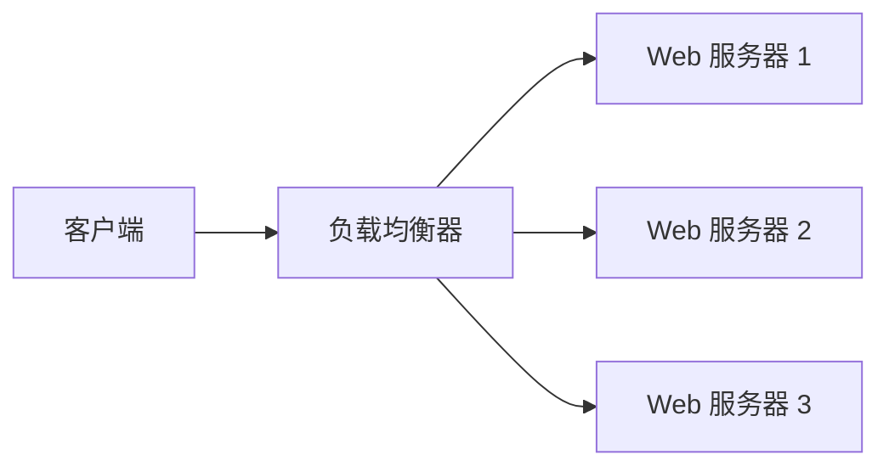
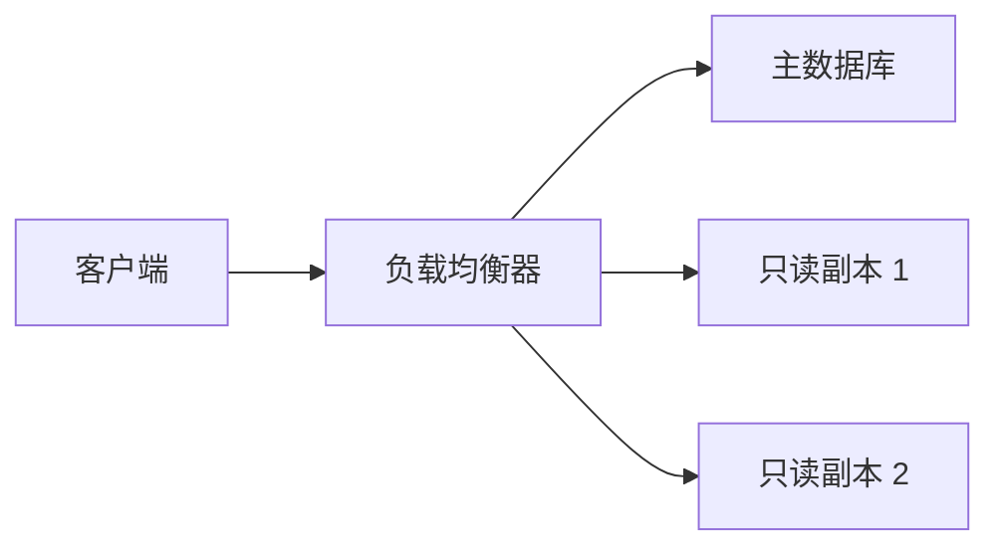

# 负载均衡

## 介绍

负载均衡（Load Balancing）是一种将工作负载分配到多个计算资源（如服务器、网络链接或存储设备）的技术。它的主要目的是优化资源使用、最大化吞吐量、最小化响应时间，并避免任何单一资源的过载。在 Hive 部署与运维中，负载均衡是确保系统高可用性和高性能的关键技术之一。

## 负载均衡的基本原理

负载均衡的核心思想是将请求分发到多个服务器上，以避免单个服务器过载。常见的负载均衡算法包括：

1. **轮询（Round Robin）**：依次将请求分发到每个服务器。
2. **加权轮询（Weighted Round Robin）**：根据服务器的处理能力分配不同的权重，权重高的服务器处理更多的请求。
3. **最少连接（Least Connections）**：将请求分发到当前连接数最少的服务器。
4. **IP 哈希（IP Hash）**：根据客户端 IP 地址的哈希值将请求分发到固定的服务器。

## 负载均衡的实现方式

负载均衡可以通过硬件设备（如负载均衡器）或软件（如 Nginx、HAProxy）来实现。以下是一个使用 Nginx 实现负载均衡的简单示例：

```nginx
http {
    upstream backend {
        server 192.168.1.101;
        server 192.168.1.102;
        server 192.168.1.103;
    }

    server {
        listen 80;

        location / {
            proxy_pass http://backend;
        }
    }
}
```

在这个配置中，Nginx 会将请求分发到 `192.168.1.101`、`192.168.1.102` 和 `192.168.1.103` 这三个服务器上。

## 负载均衡的实际应用场景

### 场景 1：Web 服务器集群

假设你有一个高流量的网站，单台服务器无法处理所有的请求。你可以使用负载均衡将请求分发到多台 Web 服务器上，从而提高网站的响应速度和可用性。



### 场景 2：数据库读写分离

在数据库系统中，读操作通常比写操作频繁。你可以使用负载均衡将读请求分发到多个只读数据库副本上，而写请求则发送到主数据库。



## 负载均衡的挑战与解决方案

### 挑战 1：会话保持（Session Persistence）

在某些应用中，用户的会话需要保持在同一台服务器上。如果负载均衡器将请求分发到不同的服务器，可能会导致会话丢失。

**解决方案**：使用基于 IP 哈希的负载均衡算法，或者使用共享会话存储（如 Redis）来存储会话数据。

### 挑战 2：健康检查

如果某台服务器出现故障，负载均衡器需要能够检测到并将其从服务器池中移除。

**解决方案**：配置负载均衡器定期对服务器进行健康检查，确保只有健康的服务器接收请求。

## 总结

负载均衡是确保系统高可用性和高性能的关键技术。通过将请求分发到多个服务器上，负载均衡可以优化资源使用、最大化吞吐量、最小化响应时间，并避免任何单一资源的过载。在实际应用中，负载均衡可以用于 Web 服务器集群、数据库读写分离等场景。

## 附加资源与练习

- **练习 1**：使用 Nginx 配置一个简单的负载均衡器，并将请求分发到三台虚拟机上。
- **练习 2**：研究并实现一种基于最少连接的负载均衡算法。

:::tip
如果你对负载均衡的更多高级特性感兴趣，可以进一步研究动态负载均衡、全局负载均衡（GSLB）等概念。
:::