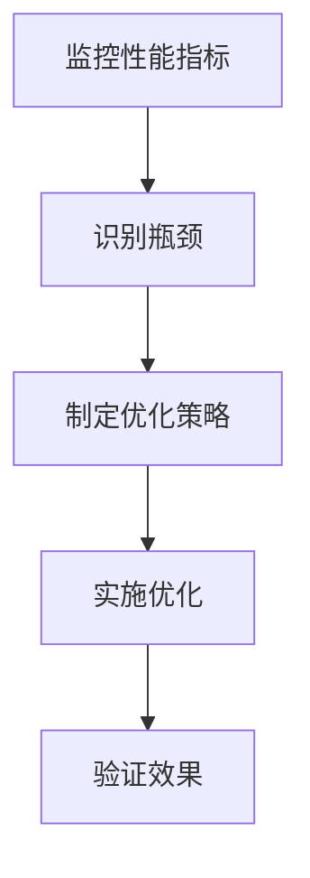
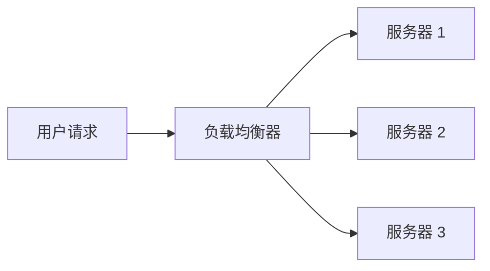

# 云服务性能调优

在现代云计算环境中，性能调优是确保应用程序高效运行的关键步骤。无论是处理大规模数据还是支持高并发用户，优化云服务的性能都可以显著提升用户体验并降低成本。本文将逐步介绍云服务性能调优的基本概念、方法和实际应用场景。

## 什么是云服务性能调优？

云服务性能调优是指通过调整资源配置、优化代码和架构设计，以提高云服务的响应速度、吞吐量和资源利用率的过程。调优的目标是确保服务在满足业务需求的同时，尽可能减少资源浪费。

## 性能调优的关键步骤

### 1. 监控与分析

性能调优的第一步是监控云服务的运行状态。通过收集和分析性能指标（如 CPU 使用率、内存占用、网络延迟等），可以识别性能瓶颈。



:::tip
使用云服务提供商的内置监控工具（如 AWS CloudWatch、Azure Monitor）可以轻松获取性能数据。
:::

### 2. 优化资源配置

云服务通常允许用户动态调整资源（如 CPU、内存、存储）。通过合理分配资源，可以避免资源浪费或不足。

例如，在 AWS EC2 实例中，可以通过以下步骤调整实例类型：

1. 登录 AWS 管理控制台。
2. 导航到 EC2 实例页面。
3. 选择目标实例，点击“操作” > “实例设置” > “更改实例类型”。
4. 选择合适的实例类型（如从 `t2.micro` 升级到 `t2.medium`）。

### 3. 优化代码与查询

代码和查询的效率直接影响云服务的性能。以下是一些常见的优化方法：

- **减少数据库查询次数**：通过批量查询或缓存结果来减少数据库负载。
- **使用索引**：为数据库表添加索引以加速查询。
- **异步处理**：将耗时任务（如文件上传）放入后台队列，避免阻塞主线程。

例如，以下是一个优化前后的 SQL 查询示例：

**优化前：**
```sql
SELECT * FROM orders WHERE customer_id = 123;
```

**优化后：**
```sql
CREATE INDEX idx_customer_id ON orders(customer_id);
SELECT * FROM orders WHERE customer_id = 123;
```

:::note
添加索引后，查询速度会显著提升，尤其是在处理大量数据时。
:::

### 4. 使用缓存

缓存是提升性能的有效手段。通过将频繁访问的数据存储在内存中，可以减少对后端服务的请求。

例如，使用 Redis 缓存热门商品信息：

```python
import redis

# 连接 Redis
cache = redis.Redis(host='localhost', port=6379, db=0)

# 检查缓存中是否存在数据
cached_data = cache.get('hot_products')
if cached_data:
    print("从缓存中获取数据:", cached_data)
else:
    # 从数据库获取数据
    data = fetch_data_from_database()
    cache.set('hot_products', data)
    print("从数据库获取数据:", data)
```

### 5. 负载均衡与自动扩展

负载均衡可以将流量分发到多个服务器，避免单点过载。自动扩展则可以根据流量动态调整服务器数量。

例如，在 AWS 中，可以使用 Elastic Load Balancer (ELB) 和 Auto Scaling 组来实现这一功能。



:::caution
自动扩展需要合理设置触发条件，以避免不必要的资源浪费。
:::

## 实际案例：电商网站性能调优

假设你正在运营一个电商网站，用户反映页面加载速度慢。通过性能调优，你可以采取以下步骤：

1. **监控**：使用工具分析页面加载时间，发现数据库查询是主要瓶颈。
2. **优化查询**：为商品表和订单表添加索引，减少查询时间。
3. **缓存**：使用 Redis 缓存热门商品信息，减少数据库访问。
4. **负载均衡**：部署多个服务器，并使用负载均衡器分发流量。
5. **验证**：重新测试页面加载时间，确保性能提升。

## 总结

云服务性能调优是一个持续的过程，需要结合监控、资源配置、代码优化和架构设计等多方面因素。通过本文的学习，你应该掌握了性能调优的基本方法和实际应用场景。

## 附加资源与练习

- **练习**：尝试在本地环境中部署一个简单的 Web 应用，并使用缓存和负载均衡优化其性能。
- **资源**：
  - [AWS 性能调优指南](https://aws.amazon.com/cn/architecture/well-architected/)
  - [Redis 官方文档](https://redis.io/documentation)
  - [SQL 性能优化技巧](https://www.sqlshack.com/sql-performance-tuning/)

继续深入学习，你将能够更好地应对复杂的性能调优挑战！