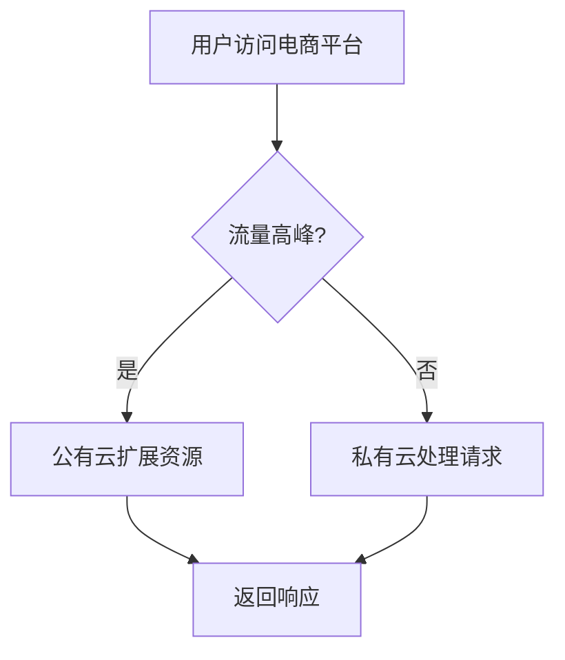

## 什么是混合云部署？

混合云部署是一种结合了**公有云**和**私有云**的计算环境。它允许企业在私有云中运行敏感或关键任务的工作负载，同时在公有云中扩展资源以满足临时需求。这种部署方式提供了灵活性、成本效益和安全性，是现代企业架构的重要组成部分。

:::note
**公有云**：由第三方云服务提供商（如 AWS、Azure、Google Cloud）管理的云基础设施，按需付费。<br />
**私有云**：由企业自己管理的云基础设施，通常位于本地数据中心或专用服务器上。
:::

## 混合云的优势

1. **灵活性**：可以根据需求动态扩展或缩减资源。
2. **成本效益**：仅在需要时使用公有云资源，避免过度投资。
3. **安全性**：敏感数据可以保留在私有云中，同时利用公有云的计算能力。
4. **灾难恢复**：通过跨云备份，提高业务的连续性和可靠性。

## 混合云部署的核心组件

混合云部署通常包括以下组件：

1. **私有云**：用于托管关键任务和敏感数据。
2. **公有云**：用于扩展计算资源或托管非敏感数据。
3. **网络连接**：通过 VPN 或专线连接私有云和公有云。
4. **管理工具**：用于统一管理和监控混合云环境。

## 混合云部署的实际案例

### 案例：电商平台的混合云部署

假设你正在运营一个电商平台，以下是混合云部署的典型应用场景：

1. **私有云**：托管用户数据库、订单处理系统和支付网关等关键任务。
2. **公有云**：在促销活动期间扩展计算资源以应对流量高峰。
3. **网络连接**：通过 VPN 将私有云和公有云连接起来，确保数据同步和安全性。



## 代码示例：使用 Terraform 部署混合云

以下是一个简单的 Terraform 配置示例，用于在 AWS 公有云和本地私有云之间创建混合云环境。

```hcl
# 配置 AWS 提供者
provider "aws" {
  region = "us-west-2"
}

# 创建 VPC
resource "aws_vpc" "example" {
  cidr_block = "10.0.0.0/16"
}

# 创建子网
resource "aws_subnet" "example" {
  vpc_id     = aws_vpc.example.id
  cidr_block = "10.0.1.0/24"
}

# 创建 VPN 连接
resource "aws_vpn_connection" "example" {
  vpn_gateway_id = aws_vpn_gateway.example.id
  customer_gateway_id = aws_customer_gateway.example.id
}

# 本地私有云配置
resource "local_file" "private_cloud_config" {
  content  = "私有云配置内容"
  filename = "private_cloud_config.txt"
}
```

### 输入与输出

- **输入**：Terraform 配置文件。
- **输出**：在 AWS 中创建的 VPC、子网和 VPN 连接，以及本地私有云的配置文件。

## 总结

混合云部署为企业提供了灵活、安全和成本效益高的解决方案。通过结合公有云和私有云的优势，企业可以更好地应对业务需求的变化，同时确保数据的安全性和业务的连续性。

## 附加资源与练习

- **资源**：
  - [AWS 混合云解决方案](https://aws.amazon.com/hybrid/)
  - [Azure 混合云指南](https://azure.microsoft.com/zh-cn/solutions/hybrid-cloud/)
- **练习**：
  - 使用 Terraform 或 CloudFormation 创建一个简单的混合云环境。
  - 尝试在混合云环境中部署一个简单的 Web 应用，并测试其扩展性和安全性。
