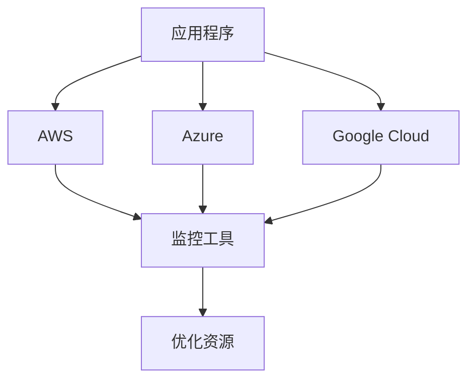

# 多云策略

## 介绍

在当今的云计算环境中，许多企业和组织选择采用**多云策略**来管理其 IT 基础设施。多云策略是指同时使用多个云服务提供商（如 AWS、Azure、Google Cloud 等）来满足不同的业务需求。这种策略可以帮助企业避免依赖单一供应商，提高系统的灵活性和可靠性，并优化成本。

:::note
**注意**：多云策略与混合云策略不同。混合云通常指的是将私有云和公有云结合使用，而多云策略则专注于使用多个公有云服务。
:::

## 为什么选择多云策略？

### 1. 避免供应商锁定
依赖单一云服务提供商可能会导致供应商锁定，使得迁移到其他平台变得困难且昂贵。多云策略可以降低这种风险。

### 2. 提高可靠性
通过将工作负载分布在多个云平台上，企业可以减少因某个云服务提供商故障而导致的服务中断。

### 3. 优化成本
不同的云服务提供商在不同类型的服务上可能有价格优势。多云策略允许企业选择最具成本效益的服务。

### 4. 满足合规性要求
某些行业或地区可能有特定的合规性要求，多云策略可以帮助企业选择符合这些要求的云服务提供商。

## 多云策略的实施

### 1. 评估需求
在实施多云策略之前，首先需要评估企业的业务需求和技术需求。这包括确定哪些应用程序适合迁移到云上，以及选择哪些云服务提供商。

### 2. 选择云服务提供商
根据需求选择合适的云服务提供商。常见的云服务提供商包括 AWS、Azure、Google Cloud、阿里云等。

### 3. 资源管理
使用多云管理工具（如 Terraform、Kubernetes 等）来统一管理多个云平台上的资源。

```bash
# 示例：使用 Terraform 管理多云资源
provider "aws" {
  region = "us-west-2"
}

provider "google" {
  project = "my-gcp-project"
  region  = "us-central1"
}

resource "aws_instance" "example" {
  ami           = "ami-0c55b159cbfafe1f0"
  instance_type = "t2.micro"
}

resource "google_compute_instance" "example" {
  name         = "example-instance"
  machine_type = "e2-medium"
  zone         = "us-central1-a"
}
```

### 4. 数据同步与备份
在多云环境中，确保数据在不同云平台之间的同步和备份至关重要。可以使用工具如 `rsync` 或云服务提供商自带的同步服务。

```bash
# 示例：使用 rsync 同步数据
rsync -avz /local/directory/ user@remote:/remote/directory/
```

### 5. 监控与优化
使用监控工具（如 Prometheus、Grafana 等）来监控多云环境中的资源使用情况，并根据需要进行优化。



## 实际案例

### 案例 1：全球电子商务平台
一家全球电子商务平台使用 AWS 和 Google Cloud 来托管其前端和后端服务。AWS 用于处理北美和欧洲的流量，而 Google Cloud 用于处理亚洲的流量。这种策略不仅提高了服务的响应速度，还降低了成本。

### 案例 2：金融服务公司
一家金融服务公司使用 Azure 和阿里云来满足不同地区的合规性要求。Azure 用于处理欧洲客户的数据，而阿里云用于处理中国客户的数据。这种策略确保了公司能够遵守各地的数据隐私法规。

## 总结

多云策略为企业提供了更大的灵活性和可靠性，同时帮助优化成本和满足合规性要求。通过合理评估需求、选择合适的云服务提供商、使用统一的管理工具以及实施有效的监控和优化措施，企业可以成功实施多云策略。

## 附加资源与练习

- **资源**：
  - [Terraform 官方文档](https://www.terraform.io/docs/index.html)
  - [Kubernetes 官方文档](https://kubernetes.io/docs/home/)
  - [AWS 多云管理指南](https://aws.amazon.com/multi-cloud/)

- **练习**：
  1. 使用 Terraform 创建一个简单的多云环境，包含 AWS 和 Google Cloud 的资源。
  2. 使用 Kubernetes 部署一个应用程序到多个云平台上，并监控其性能。
  3. 研究并比较不同云服务提供商的成本结构，找出最具成本效益的服务。

:::tip
**提示**：在实施多云策略时，务必进行充分的测试和评估，以确保系统的稳定性和性能。
:::