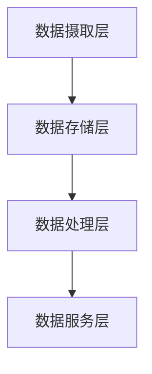
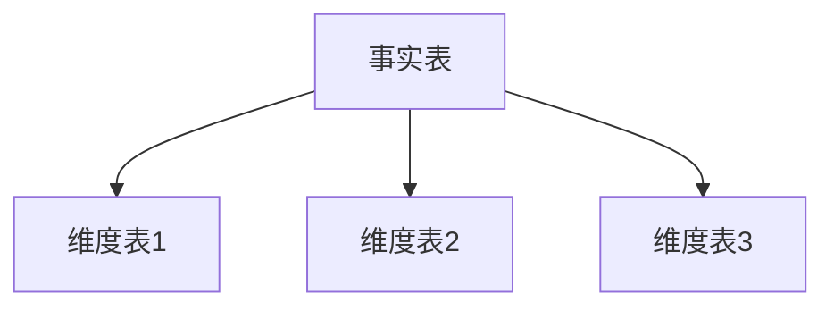

# Hive 应用架构模式

Hive 是一个基于 Hadoop 的数据仓库工具，用于处理大规模数据集。它提供了类似 SQL 的查询语言（HiveQL），使得开发人员可以使用熟悉的语法来查询和分析数据。然而，为了高效地使用 Hive，理解其应用架构模式至关重要。本文将介绍几种常见的 Hive 应用架构模式，并通过实际案例帮助你更好地掌握这些模式。

## 1. 什么是 Hive 应用架构模式？

Hive 应用架构模式是指在设计和实现 Hive 数据处理流程时所采用的结构化方法。这些模式帮助开发人员优化查询性能、提高数据处理效率，并确保系统的可扩展性和可维护性。

## 2. 常见的 Hive 应用架构模式

### 2.1 分层架构模式

分层架构模式是 Hive 中最常见的架构模式之一。它将数据处理流程分为多个层次，每个层次负责不同的任务。通常，分层架构包括以下几个层次：

1. **数据摄取层（Ingestion Layer）**：负责从各种数据源（如日志文件、数据库等）中提取数据，并将其加载到 Hive 中。
2. **数据存储层（Storage Layer）**：将数据存储在 Hive 表中，通常使用分区和分桶来优化查询性能。
3. **数据处理层（Processing Layer）**：使用 HiveQL 对数据进行转换、聚合和分析。
4. **数据服务层（Service Layer）**：将处理后的数据提供给其他应用程序或用户使用。



### 2.2 星型模式

星型模式是一种常见的数据仓库设计模式，特别适用于 Hive。在星型模式中，数据被组织成一个中心事实表（Fact Table）和多个维度表（Dimension Tables）。事实表包含度量数据（如销售额、数量等），而维度表包含描述性数据（如时间、地点、产品等）。



#### 示例：星型模式的实际应用

假设我们有一个电商平台，需要分析每天的销售额。我们可以设计如下星型模式：

- **事实表**：`sales_fact`，包含 `sale_id`, `product_id`, `customer_id`, `sale_date`, `amount` 等字段。
- **维度表**：
  - `product_dim`：包含 `product_id`, `product_name`, `category` 等字段。
  - `customer_dim`：包含 `customer_id`, `customer_name`, `city` 等字段。
  - `date_dim`：包含 `date`, `month`, `year` 等字段。

```sql
-- 创建事实表
CREATE TABLE sales_fact (
    sale_id INT,
    product_id INT,
    customer_id INT,
    sale_date STRING,
    amount DOUBLE
);

-- 创建维度表
CREATE TABLE product_dim (
    product_id INT,
    product_name STRING,
    category STRING
);

CREATE TABLE customer_dim (
    customer_id INT,
    customer_name STRING,
    city STRING
);

CREATE TABLE date_dim (
    date STRING,
    month STRING,
    year STRING
);
```

### 2.3 数据湖架构模式

数据湖架构模式是一种将原始数据存储在数据湖中，并根据需要对其进行处理的模式。Hive 可以与数据湖（如 Amazon S3、HDFS）集成，直接从数据湖中读取数据并进行处理。

#### 示例：数据湖架构的实际应用

假设我们有一个数据湖，存储了大量的日志文件。我们可以使用 Hive 直接从数据湖中读取这些日志文件，并进行数据分析。

```sql
-- 创建外部表，指向数据湖中的日志文件
CREATE EXTERNAL TABLE log_data (
    log_id STRING,
    timestamp STRING,
    user_id STRING,
    action STRING
)
LOCATION 's3://my-data-lake/logs/';

-- 查询日志数据
SELECT user_id, COUNT(*) as action_count
FROM log_data
GROUP BY user_id;
```

## 3. 实际案例：电商平台数据分析

假设我们有一个电商平台，需要分析用户的购买行为。我们可以采用分层架构模式和星型模式来设计数据处理流程。

1. **数据摄取层**：从数据库中提取用户购买记录，并将其加载到 Hive 中。
2. **数据存储层**：将数据存储在 `sales_fact` 表和相关的维度表中。
3. **数据处理层**：使用 HiveQL 对数据进行聚合分析，生成每日销售额报告。
4. **数据服务层**：将分析结果提供给业务部门使用。

```sql
-- 查询每日销售额
SELECT d.date, SUM(s.amount) as total_sales
FROM sales_fact s
JOIN date_dim d ON s.sale_date = d.date
GROUP BY d.date;
```

## 4. 总结

Hive 应用架构模式是设计和优化 Hive 数据处理流程的关键。通过分层架构模式、星型模式和数据湖架构模式，开发人员可以有效地管理和分析大规模数据集。在实际项目中，选择合适的架构模式可以显著提高数据处理效率和查询性能。

## 5. 附加资源与练习

- **附加资源**：
  - [Hive 官方文档](https://hive.apache.org/)
  - [Hive 性能优化指南](https://cwiki.apache.org/confluence/display/Hive/Performance+Optimization)

- **练习**：
  1. 设计一个星型模式，用于分析某零售商的销售数据。
  2. 使用 Hive 查询数据湖中的日志文件，并生成用户行为分析报告。

通过不断实践和探索，你将能够更好地掌握 Hive 应用架构模式，并在实际项目中灵活运用。