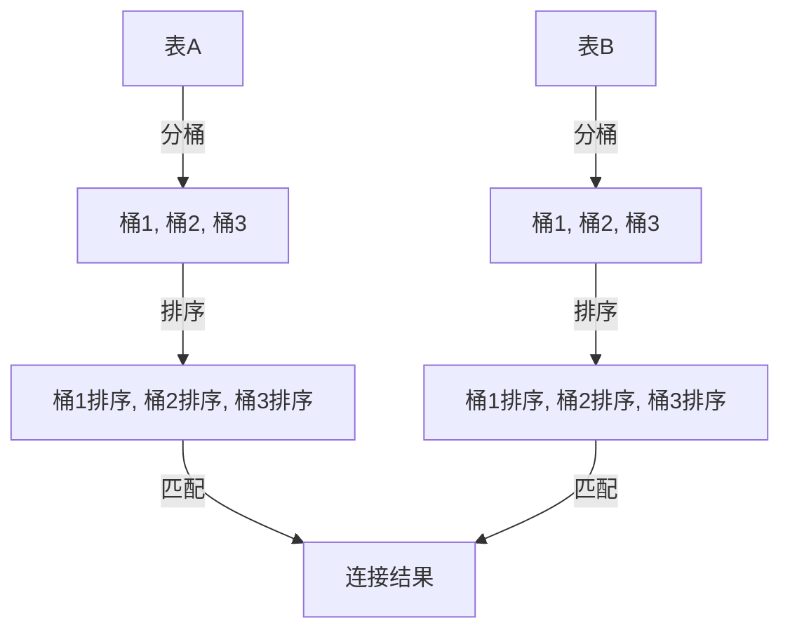

# SMB JOIN (Sort-Merge-Bucket Join)

在 Hive 中，SMB JOIN（Sort-Merge-Bucket Join）是一种高效的表连接方式，特别适用于大数据场景。它通过预先对数据进行排序和分桶，减少了连接操作时的数据移动和计算开销。本文将详细介绍 SMB JOIN 的工作原理、使用场景以及如何在实际中应用。

## 什么是 SMB JOIN？

SMB JOIN 是一种基于排序和分桶的优化连接策略。它的核心思想是：**将参与连接的表按照相同的键进行排序和分桶，然后在连接时直接对桶进行匹配**。这样可以避免全表扫描和大量的数据移动，从而提高连接效率。

:::note
SMB JOIN 的前提是参与连接的表必须已经按照连接键进行了排序和分桶。
:::

### 为什么使用 SMB JOIN？

在大数据场景中，传统的连接操作（如 MapReduce Join）可能会因为数据量大而导致性能瓶颈。SMB JOIN 通过以下方式优化连接性能：
1. **减少数据移动**：数据已经预先排序和分桶，连接时只需匹配对应的桶。
2. **并行处理**：每个桶可以独立处理，充分利用集群资源。
3. **减少 I/O 开销**：避免了全表扫描，降低了磁盘和网络 I/O。

---

## SMB JOIN 的工作原理

SMB JOIN 的工作流程可以分为以下几个步骤：

1. **数据分桶**：将参与连接的表按照连接键进行分桶，确保相同键的数据落在同一个桶中。
2. **数据排序**：在每个桶内，数据按照连接键进行排序。
3. **桶匹配**：连接时，直接对相同编号的桶进行匹配，无需全表扫描。



---

## 如何使用 SMB JOIN？

要使用 SMB JOIN，需要满足以下条件：
1. 参与连接的表必须已经按照连接键进行了分桶。
2. 分桶的数量必须相同。
3. 每个桶内的数据必须按照连接键排序。

### 示例：创建分桶表

假设我们有两个表 `orders` 和 `customers`，我们希望按照 `customer_id` 进行连接。

```sql
-- 创建 orders 表并分桶
CREATE TABLE orders (
    order_id INT,
    customer_id INT,
    order_date STRING
)
CLUSTERED BY (customer_id) INTO 4 BUCKETS
SORTED BY (customer_id);

-- 创建 customers 表并分桶
CREATE TABLE customers (
    customer_id INT,
    customer_name STRING
)
CLUSTERED BY (customer_id) INTO 4 BUCKETS
SORTED BY (customer_id);
```

### 示例：执行 SMB JOIN

```sql
-- 执行 SMB JOIN
SELECT o.order_id, c.customer_name
FROM orders o
JOIN customers c
ON o.customer_id = c.customer_id;
```

:::tip
确保在创建表时指定了正确的分桶数量和排序键，否则 SMB JOIN 无法生效。
:::

---

## 实际应用场景

SMB JOIN 特别适用于以下场景：
1. **大表连接**：当两个表都非常大时，SMB JOIN 可以显著减少连接时间。
2. **频繁连接**：如果某些表需要频繁连接，可以预先对其进行分桶和排序。
3. **数据仓库**：在数据仓库中，SMB JOIN 常用于事实表和维度表的连接。

### 案例：电商订单分析

假设我们有一个电商平台，需要分析每个客户的订单情况。我们可以使用 SMB JOIN 将 `orders` 表和 `customers` 表连接起来，快速获取每个客户的订单信息。

---

## 总结

SMB JOIN 是 Hive 中一种高效的连接方式，特别适合大数据场景。通过预先对数据进行分桶和排序，SMB JOIN 可以显著减少连接操作的开销。要使用 SMB JOIN，必须确保参与连接的表已经按照连接键进行了分桶和排序。

---

## 附加资源与练习

1. **练习**：尝试在 Hive 中创建两个分桶表，并使用 SMB JOIN 进行连接。
2. **深入学习**：阅读 Hive 官方文档，了解更多关于分桶和排序的细节。
3. **扩展阅读**：了解其他优化连接策略，如 Map Join 和 Reduce Join。

:::caution
在实际使用中，确保数据分布均匀，避免数据倾斜导致性能问题。
:::