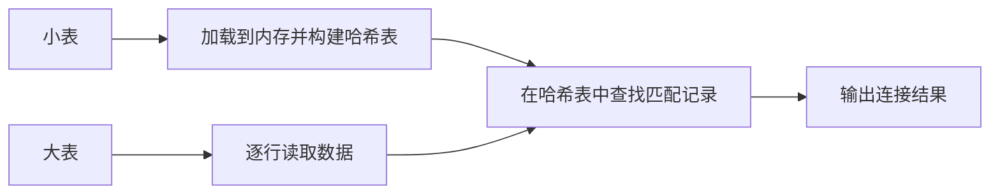

# MAP JOIN 优化

在 Hive 中，表连接（JOIN）是数据处理中常见的操作。然而，当连接的表大小差异较大时，传统的 JOIN 操作可能会导致性能瓶颈。为了解决这个问题，Hive 提供了 **MAP JOIN 优化**，也称为 **Map-Side Join**。本文将详细介绍 MAP JOIN 的概念、工作原理、适用场景以及如何在实际中使用它。

---

## 什么是 MAP JOIN？

MAP JOIN 是一种优化技术，用于在 Hive 中加速表连接操作。它的核心思想是将较小的表（通常称为“小表”）加载到内存中，并在 Map 阶段直接与大表进行连接，从而避免 Reduce 阶段的额外开销。

:::note
**小表**：通常指数据量较小的表，能够完全加载到内存中。
:::

### 为什么需要 MAP JOIN？

在传统的 JOIN 操作中，Hive 会将两个表的数据分发到 Reduce 阶段进行连接。如果其中一个表非常大，而另一个表非常小，这种分发过程可能会导致大量的网络传输和磁盘 I/O，从而降低性能。MAP JOIN 通过将小表加载到内存中，直接在 Map 阶段完成连接，避免了这些开销。

---

## MAP JOIN 的工作原理

1. **小表加载**：Hive 将小表的数据加载到内存中，并构建一个哈希表（Hash Table）。
2. **大表处理**：在 Map 阶段，Hive 逐行读取大表的数据，并在内存中的哈希表中查找匹配的记录。
3. **连接结果**：如果找到匹配的记录，则将连接结果输出。



---

## 如何使用 MAP JOIN？

在 Hive 中，MAP JOIN 可以通过以下方式启用：

1. **自动 MAP JOIN**：Hive 会自动判断是否可以使用 MAP JOIN。如果小表的大小小于 `hive.auto.convert.join` 参数设置的值（默认 25MB），Hive 会自动启用 MAP JOIN。
2. **手动 MAP JOIN**：可以通过在查询中显式指定 `/*+ MAPJOIN(small_table) */` 提示来强制使用 MAP JOIN。

### 示例代码

假设我们有两个表：`orders`（大表）和 `customers`（小表）。我们希望根据 `customer_id` 连接这两个表。

```sql
-- 自动 MAP JOIN
SELECT o.order_id, o.order_date, c.customer_name
FROM orders o
JOIN customers c
ON o.customer_id = c.customer_id;

-- 手动 MAP JOIN
SELECT /*+ MAPJOIN(c) */ o.order_id, o.order_date, c.customer_name
FROM orders o
JOIN customers c
ON o.customer_id = c.customer_id;
```

### 输入和输出

- **输入**：
  - `orders` 表：包含 `order_id`、`order_date` 和 `customer_id`。
  - `customers` 表：包含 `customer_id` 和 `customer_name`。
- **输出**：
  - 连接后的结果，包含 `order_id`、`order_date` 和 `customer_name`。

---

## 实际案例

### 场景描述

假设我们有一个电商平台，每天生成数百万条订单记录（`orders` 表），而客户信息（`customers` 表）只有几千条记录。我们需要根据 `customer_id` 连接这两个表，以生成包含客户名称的订单报告。

### 解决方案

使用 MAP JOIN 可以显著提升查询性能，因为 `customers` 表足够小，可以完全加载到内存中。

```sql
-- 启用自动 MAP JOIN
SET hive.auto.convert.join=true;

-- 执行查询
SELECT o.order_id, o.order_date, c.customer_name
FROM orders o
JOIN customers c
ON o.customer_id = c.customer_id;
```

:::tip
在实际生产环境中，可以通过调整 `hive.auto.convert.join` 参数的值来优化 MAP JOIN 的使用。
:::

---

## 总结

MAP JOIN 是 Hive 中一种高效的 JOIN 优化技术，特别适用于小表与大表连接的场景。通过将小表加载到内存中，MAP JOIN 避免了 Reduce 阶段的开销，从而显著提升了查询性能。

### 附加资源

- [Hive 官方文档](https://cwiki.apache.org/confluence/display/Hive/LanguageManual+Joins)
- [Hive 性能调优指南](https://cwiki.apache.org/confluence/display/Hive/Performance+Optimization)

### 练习

1. 创建一个包含少量数据的表和一个包含大量数据的表，尝试使用 MAP JOIN 连接它们。
2. 调整 `hive.auto.convert.join` 参数的值，观察查询性能的变化。

希望本文能帮助你理解并掌握 MAP JOIN 优化技术！如果你有任何问题，欢迎在评论区留言。