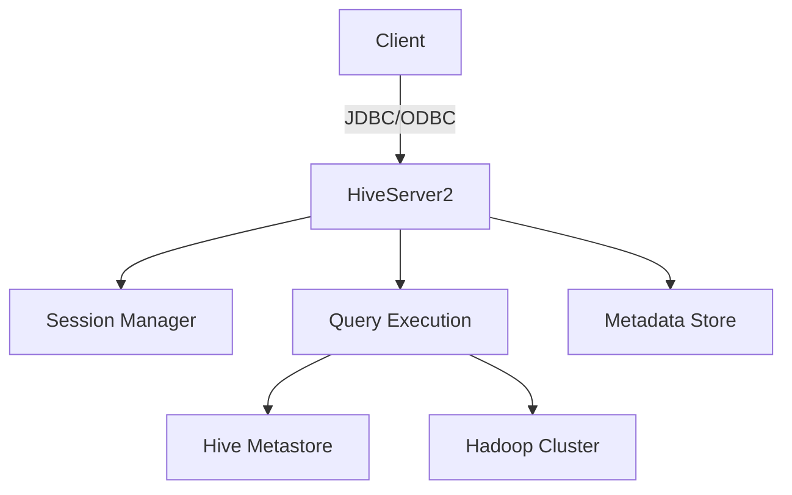

# Hive Server2详解

HiveServer2 是 Apache Hive 的一个关键组件，它允许客户端通过 JDBC 或 ODBC 连接与 Hive 进行交互。与早期的 HiveServer 相比，HiveServer2 提供了更好的并发性、安全性和可扩展性。本文将详细介绍 HiveServer2 的工作原理、配置方法以及实际应用场景。

## 什么是 HiveServer2？

HiveServer2 是一个服务端进程，允许多个客户端并发地执行 HiveQL 查询。它支持 JDBC 和 ODBC 连接，并且提供了更好的安全性和并发性。HiveServer2 的主要功能包括：

- 支持多客户端并发访问
- 提供身份验证和授权机制
- 支持会话管理和查询执行
- 提供更好的性能和可扩展性

## Hive Server2 的架构

HiveServer2 的架构可以分为以下几个主要组件：

1. **Thrift Server**: HiveServer2 使用 Thrift 协议与客户端通信。
2. **Session Manager**: 管理客户端会话，包括会话的创建、销毁和状态维护。
3. **Query Execution**: 负责解析和执行 HiveQL 查询。
4. **Metadata Store**: 存储 Hive 的元数据信息。



## 配置 HiveServer2

要启动 HiveServer2，您需要在 Hive 的配置文件中进行一些基本配置。以下是一个典型的 `hive-site.xml` 配置示例：

```xml
<configuration>
    <property>
        <name>hive.server2.thrift.port</name>
        <value>10000</value>
    </property>
    <property>
        <name>hive.server2.authentication</name>
        <value>NONE</value>
    </property>
    <property>
        <name>hive.server2.enable.doAs</name>
        <value>true</value>
    </property>
</configuration>
```

启动 HiveServer2 的命令如下：

```bash
$ hive --service hiveserver2
```

## 使用 JDBC 连接 HiveServer2

以下是一个使用 JDBC 连接 HiveServer2 并执行查询的 Java 示例代码：

```java
import java.sql.Connection;
import java.sql.DriverManager;
import java.sql.ResultSet;
import java.sql.Statement;

public class HiveJdbcClient {
    private static String driverName = "org.apache.hive.jdbc.HiveDriver";

    public static void main(String[] args) throws Exception {
        Class.forName(driverName);
        Connection con = DriverManager.getConnection("jdbc:hive2://localhost:10000/default", "", "");
        Statement stmt = con.createStatement();
        ResultSet res = stmt.executeQuery("SELECT * FROM my_table");
        while (res.next()) {
            System.out.println(res.getString(1));
        }
        con.close();
    }
}
```

:::note
确保在运行上述代码之前，HiveServer2 已经启动，并且 `my_table` 表已经存在。
:::

## 实际应用场景

### 数据仓库查询

HiveServer2 常用于数据仓库环境中，允许数据分析师通过 JDBC 或 ODBC 连接执行复杂的查询操作。例如，一个数据分析师可能需要从多个表中提取数据并生成报告，HiveServer2 可以高效地处理这些查询。

### 大数据集成

在大数据生态系统中，HiveServer2 可以作为数据集成的一部分，允许其他系统（如 Spark、Presto）通过 JDBC 连接访问 Hive 中的数据。这种集成方式可以简化数据管道的构建和维护。

## 总结

HiveServer2 是 Apache Hive 中一个强大的组件，它提供了并发性、安全性和可扩展性，使得客户端能够高效地执行 HiveQL 查询。通过本文的介绍，您应该对 HiveServer2 的架构、配置和使用有了全面的了解。

## 附加资源

- [Apache Hive 官方文档](https://hive.apache.org/)
- [HiveServer2 配置指南](https://cwiki.apache.org/confluence/display/Hive/Setting+Up+HiveServer2)
- [JDBC 编程指南](https://docs.oracle.com/javase/tutorial/jdbc/)

## 练习

1. 配置并启动 HiveServer2，确保它能够接受 JDBC 连接。
2. 使用 Java 编写一个简单的 JDBC 客户端，连接到 HiveServer2 并执行一个查询。
3. 尝试在 HiveServer2 中启用身份验证，并配置一个用户进行连接测试。

通过完成这些练习，您将更深入地理解 HiveServer2 的工作原理和使用方法。