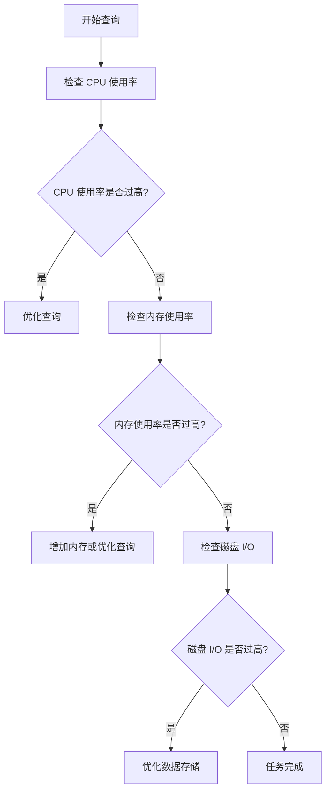

## 介绍

在 Hive 集群中，监控是确保系统高效运行的关键步骤。通过监控，您可以实时了解集群的资源使用情况、任务执行状态以及潜在的性能瓶颈。对于初学者来说，掌握集群监控的基本概念和工具是优化 Hive 性能的第一步。

## 为什么需要集群监控？

集群监控的主要目的是：
1. **确保系统稳定性**：通过实时监控，可以及时发现并解决潜在问题，避免系统崩溃。
2. **优化资源利用**：了解资源使用情况，合理分配计算和存储资源。
3. **提高任务执行效率**：通过分析任务执行情况，优化查询性能。

## 监控的关键指标

在 Hive 集群中，以下指标是监控的重点：
1. **CPU 使用率**：反映集群的计算资源使用情况。
2. **内存使用率**：监控内存使用情况，避免内存溢出。
3. **磁盘 I/O**：了解磁盘读写性能，避免 I/O 瓶颈。
4. **网络带宽**：监控网络流量，确保数据传输顺畅。
5. **任务执行时间**：分析任务的执行时间，找出性能瓶颈。

## 监控工具

Hive 集群监控通常使用以下工具：
1. **Ganglia**：一个分布式监控系统，适用于大规模集群。
2. **Nagios**：一个开源的监控工具，支持多种插件。
3. **Prometheus**：一个强大的监控和报警工具，适用于动态环境。
4. **Grafana**：一个可视化工具，通常与 Prometheus 结合使用。

## 实际案例

假设我们有一个 Hive 集群，运行一个复杂的查询任务。通过监控工具，我们可以实时查看以下信息：



通过上述流程图，我们可以逐步分析查询任务的执行情况，并针对性地进行优化。

## 代码示例

以下是一个使用 Prometheus 监控 Hive 集群的示例：

```yaml
# prometheus.yml
global:
  scrape_interval: 15s

scrape_configs:
  - job_name: 'hive'
    static_configs:
      - targets: ['hive-node1:9090', 'hive-node2:9090']
```

在 Prometheus 中，我们可以通过以下查询语句查看 CPU 使用率：

```promql
100 - (avg by (instance) (irate(node_cpu_seconds_total{mode="idle"}[1m])) * 100)
```

## 总结

集群监控是确保 Hive 集群高效运行的关键步骤。通过监控关键指标和使用合适的工具，您可以及时发现并解决潜在问题，优化系统性能。对于初学者来说，掌握这些基本概念和工具是迈向高级调优的第一步。

## 附加资源

1. [Prometheus 官方文档](https://prometheus.io/docs/)
2. [Grafana 官方文档](https://grafana.com/docs/)
3. [Hive 性能调优指南](https://hive.apache.org/)

## 练习

1. 使用 Prometheus 监控您的 Hive 集群，并尝试分析 CPU 和内存使用情况。
2. 使用 Grafana 创建一个仪表盘，可视化您的监控数据。
3. 尝试优化一个复杂查询，并通过监控工具验证优化效果。
