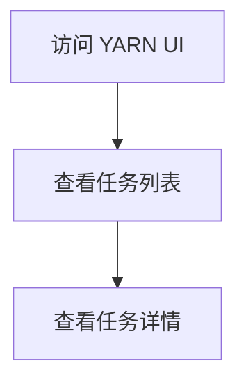

# 任务监控工具

在 Hive 中，任务监控工具是帮助开发者和运维人员实时跟踪任务执行状态、资源使用情况以及性能瓶颈的关键工具。通过监控工具，您可以更好地理解任务的运行情况，从而进行优化和调整。

## 什么是任务监控工具？

任务监控工具是一类用于收集、分析和展示任务执行过程中各项指标的工具。这些指标包括但不限于任务的执行时间、资源消耗（如 CPU、内存、磁盘 I/O）、数据吞吐量以及任务的进度等。通过这些工具，您可以快速定位任务中的性能瓶颈，并采取相应的优化措施。

## 常见的任务监控工具

在 Hive 生态系统中，常见的任务监控工具包括：

1. **Hive Web UI**：Hive 提供了一个基于 Web 的用户界面，可以查看任务的执行状态、日志以及资源使用情况。
2. **YARN ResourceManager UI**：YARN 是 Hadoop 的资源管理器，通过其 Web UI 可以查看集群中所有任务的资源分配和使用情况。
3. **Ganglia**：一个分布式监控系统，用于监控集群中的资源使用情况。
4. **Ambari**：一个用于管理和监控 Hadoop 集群的工具，提供了丰富的监控功能。

## 使用 Hive Web UI 监控任务

Hive Web UI 是 Hive 自带的监控工具，您可以通过它查看任务的执行状态和日志。以下是如何使用 Hive Web UI 的步骤：

1. **启动 Hive Web UI**：在 Hive 配置文件中启用 Web UI，并启动 Hive 服务。
2. **访问 Web UI**：在浏览器中输入 Hive Web UI 的地址（通常是 `http://<hive-server-host>:10002`）。
3. **查看任务状态**：在 Web UI 中，您可以查看当前正在执行的任务、已完成的任务以及任务的详细日志。

:::tip
确保 Hive 服务已正确配置并启动，否则无法访问 Web UI。
:::

## 使用 YARN ResourceManager UI 监控任务

YARN ResourceManager UI 提供了更全面的集群资源监控功能。以下是使用 YARN ResourceManager UI 的步骤：

1. **访问 YARN UI**：在浏览器中输入 YARN ResourceManager UI 的地址（通常是 `http://<yarn-resourcemanager-host>:8088`）。
2. **查看任务列表**：在 YARN UI 中，您可以查看所有正在运行的任务及其资源使用情况。
3. **查看任务详情**：点击某个任务，您可以查看该任务的详细日志、资源分配情况以及执行进度。

## 实际案例：监控 Hive 任务的资源使用情况

假设您有一个 Hive 查询任务，执行时间较长，您希望通过监控工具找出性能瓶颈。以下是具体步骤：

1. **提交 Hive 查询**：在 Hive CLI 或 Beeline 中提交查询任务。
2. **访问 YARN UI**：在 YARN UI 中查找该任务，查看其资源使用情况。
3. **分析资源使用情况**：如果发现某个节点的 CPU 或内存使用率过高，可能是该节点成为了性能瓶颈。
4. **优化查询**：根据监控结果，调整查询语句或增加资源分配。

:::caution
在优化查询时，务必确保不会对其他任务造成资源竞争。
:::

## 总结

任务监控工具是 Hive 任务优化和性能调优的重要辅助工具。通过 Hive Web UI 和 YARN ResourceManager UI，您可以实时监控任务的执行状态和资源使用情况，从而快速定位并解决性能瓶颈。

## 附加资源

- [Hive 官方文档](https://cwiki.apache.org/confluence/display/Hive/Home)
- [YARN 官方文档](https://hadoop.apache.org/docs/current/hadoop-yarn/hadoop-yarn-site/YARN.html)
- [Ganglia 官方文档](http://ganglia.sourceforge.net/)

## 练习

1. 尝试在您的 Hive 环境中启用 Hive Web UI，并查看一个查询任务的执行状态。
2. 使用 YARN ResourceManager UI 监控一个 Hive 任务的资源使用情况，并分析是否存在性能瓶颈。
3. 根据监控结果，尝试优化一个 Hive 查询任务，并观察优化后的效果。