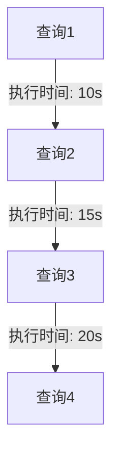

## 介绍

日志分析是 Hive 调优与监控中的重要环节。通过分析日志，我们可以了解系统的运行状态、发现潜在的性能瓶颈，并优化查询性能。Hive 日志记录了查询的执行过程、资源使用情况以及错误信息，是调优和监控的重要数据来源。

本文将逐步讲解如何分析 Hive 日志，并通过实际案例展示日志分析在调优与监控中的应用。

---

## 日志分析的基础

### 1. Hive 日志的类型

Hive 日志主要分为以下几类：

- **查询日志**：记录查询的执行过程，包括查询计划、执行时间等。
- **错误日志**：记录查询执行过程中出现的错误信息。
- **资源使用日志**：记录查询执行过程中资源的使用情况，如 CPU、内存、磁盘 I/O 等。

### 2. 日志的存储位置

Hive 日志通常存储在以下位置：

- **本地文件系统**：日志文件通常位于 Hive 安装目录下的 `logs` 文件夹中。
- **HDFS**：如果 Hive 配置为将日志存储在 HDFS 中，日志文件将存储在指定的 HDFS 路径下。

### 3. 日志的格式

Hive 日志通常以文本文件的形式存储，每行记录一个事件。日志的格式可能因配置不同而有所差异，但通常包含以下信息：

- **时间戳**：记录事件发生的时间。
- **日志级别**：如 INFO、WARN、ERROR 等，表示事件的严重程度。
- **线程名称**：记录执行事件的线程名称。
- **日志内容**：记录事件的详细信息。

---

## 日志分析的步骤

### 1. 收集日志

首先，我们需要收集相关的日志文件。可以通过以下方式获取日志：

- **本地文件系统**：直接访问 Hive 安装目录下的 `logs` 文件夹。
- **HDFS**：使用 Hadoop 命令从 HDFS 中下载日志文件。

### 2. 解析日志

日志文件通常包含大量信息，我们需要解析日志以提取有用的信息。可以使用以下工具进行日志解析：

- **grep**：用于查找特定关键词的日志行。
- **awk**：用于提取特定字段的日志信息。
- **Python**：编写脚本进行更复杂的日志解析。

以下是一个使用 `grep` 查找错误日志的示例：

```bash
grep "ERROR" hive.log
```

### 3. 分析日志

解析日志后，我们需要分析日志以发现潜在的问题。常见的分析内容包括：

- **查询执行时间**：分析查询的执行时间，找出执行时间较长的查询。
- **资源使用情况**：分析查询执行过程中资源的使用情况，找出资源消耗较大的查询。
- **错误信息**：分析错误日志，找出常见的错误类型及其原因。

以下是一个使用 `awk` 提取查询执行时间的示例：

```bash
awk '/Query Execution Time:/ {print $0}' hive.log
```

### 4. 可视化日志

为了更直观地分析日志，我们可以将日志数据可视化。常见的可视化工具包括：

- **Grafana**：用于创建仪表盘，实时监控日志数据。
- **Kibana**：用于日志数据的搜索、分析和可视化。

以下是一个使用 Grafana 创建查询执行时间图表的示例：



---

## 实际案例

### 案例：优化慢查询

假设我们有一个查询执行时间较长的 Hive 查询，我们可以通过日志分析找出问题所在。

1. **收集日志**：从 Hive 日志中提取该查询的日志信息。
2. **解析日志**：使用 `grep` 和 `awk` 提取查询的执行时间和资源使用情况。
3. **分析日志**：发现查询在执行过程中存在大量的磁盘 I/O 操作，导致执行时间较长。
4. **优化查询**：通过调整查询计划，减少磁盘 I/O 操作，优化查询性能。

---

## 总结

日志分析是 Hive 调优与监控中的重要环节。通过分析日志，我们可以了解系统的运行状态、发现潜在的性能瓶颈，并优化查询性能。本文介绍了日志分析的基础知识、分析步骤以及实际案例，帮助初学者掌握日志分析的技巧。

---

## 附加资源

- [Hive 官方文档](https://hive.apache.org/)
- [Grafana 官方文档](https://grafana.com/docs/)
- [Kibana 官方文档](https://www.elastic.co/guide/en/kibana/current/index.html)

---

## 练习

1. 使用 `grep` 和 `awk` 从 Hive 日志中提取所有错误日志。
2. 使用 Grafana 创建一个查询执行时间的仪表盘。
3. 分析一个慢查询的日志，找出性能瓶颈并提出优化建议。