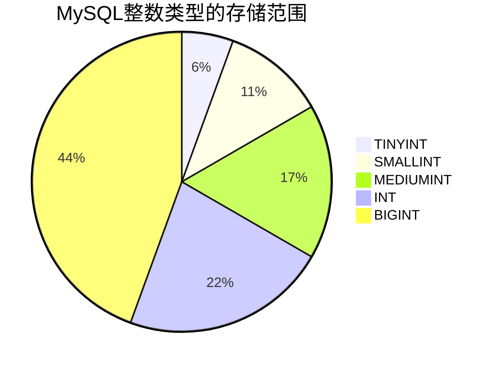

# MySQL 整数类型

在MySQL中，整数类型是最常用的数据类型之一。它们用于存储没有小数部分的数字，例如年龄、数量或ID等。MySQL提供了多种整数类型，每种类型都有不同的存储范围和占用空间。了解这些类型及其特点，可以帮助你更高效地设计数据库表。

## 整数类型的分类

MySQL支持以下五种整数类型：

1. **TINYINT**  
2. **SMALLINT**  
3. **MEDIUMINT**  
4. **INT**  
5. **BIGINT**  

每种类型的存储范围和占用空间如下表所示：



| 类型      | 存储大小（字节） | 有符号范围（Signed）         | 无符号范围（Unsigned）       |
|-----------|------------------|------------------------------|------------------------------|
| TINYINT   | 1                | -128 到 127                  | 0 到 255                     |
| SMALLINT  | 2                | -32,768 到 32,767            | 0 到 65,535                  |
| MEDIUMINT | 3                | -8,388,608 到 8,388,607       | 0 到 16,777,215              |
| INT       | 4                | -2,147,483,648 到 2,147,483,647 | 0 到 4,294,967,295          |
| BIGINT    | 8                | -9,223,372,036,854,775,808 到 9,223,372,036,854,775,807 | 0 到 18,446,744,073,709,551,615 |

:::tip
**有符号（Signed）和无符号（Unsigned）的区别**  
- 有符号类型可以存储正数和负数。  
- 无符号类型只能存储非负数（0和正数）。  
:::

## 实际应用场景

### 1. 存储用户年龄（TINYINT）
假设我们需要存储用户的年龄，年龄通常不会超过127岁，因此可以使用 `TINYINT` 类型。

```sql
CREATE TABLE users (
    id INT PRIMARY KEY,
    name VARCHAR(50),
    age TINYINT UNSIGNED
);
```

:::note
**解释**  
- `TINYINT UNSIGNED` 表示年龄字段只能存储0到255之间的整数。  
- 如果尝试插入负数或超过255的值，MySQL会报错。  
:::

### 2. 存储订单数量（INT）
假设我们需要存储订单的数量，订单数量可能较大，因此使用 `INT` 类型。

```sql
CREATE TABLE orders (
    order_id INT PRIMARY KEY,
    product_name VARCHAR(100),
    quantity INT UNSIGNED
);
```

:::caution
**注意**  
- 如果订单数量可能超过 `INT` 的范围（例如超过40亿），则需要使用 `BIGINT`。  
:::

### 3. 存储唯一ID（BIGINT）
在大型系统中，可能需要存储非常大的唯一ID，例如用户ID或订单ID。此时可以使用 `BIGINT`。

```sql
CREATE TABLE large_system (
    id BIGINT UNSIGNED PRIMARY KEY,
    data VARCHAR(255)
);
```

:::warning
**警告**  
- 使用 `BIGINT` 时，确保你的应用程序和数据库能够处理如此大的数字。  
:::

## 总结

MySQL的整数类型提供了多种选择，每种类型都有其特定的存储范围和适用场景。选择合适的整数类型不仅可以节省存储空间，还能提高查询效率。以下是选择整数类型时的几点建议：

1. 如果数据范围较小（例如年龄、状态码），使用 `TINYINT` 或 `SMALLINT`。  
2. 对于中等范围的数据（例如订单数量），使用 `INT`。  
3. 对于非常大的数据（例如唯一ID），使用 `BIGINT`。  
4. 如果数据不需要负数，使用无符号类型（`UNSIGNED`）以扩大正数范围。

## 附加资源与练习

### 练习
1. 创建一个表，用于存储学生的成绩（0到100），选择合适的整数类型。  
2. 尝试插入超出范围的值，观察MySQL的行为。  

### 进一步学习
- 阅读MySQL官方文档中关于[数值类型](https://dev.mysql.com/doc/refman/8.0/en/numeric-types.html)的部分。  
- 学习如何优化数据库表的存储空间和性能。  

通过掌握MySQL的整数类型，你将能够更高效地设计和操作数据库表。继续学习其他数据类型，以全面掌握MySQL的基础知识！