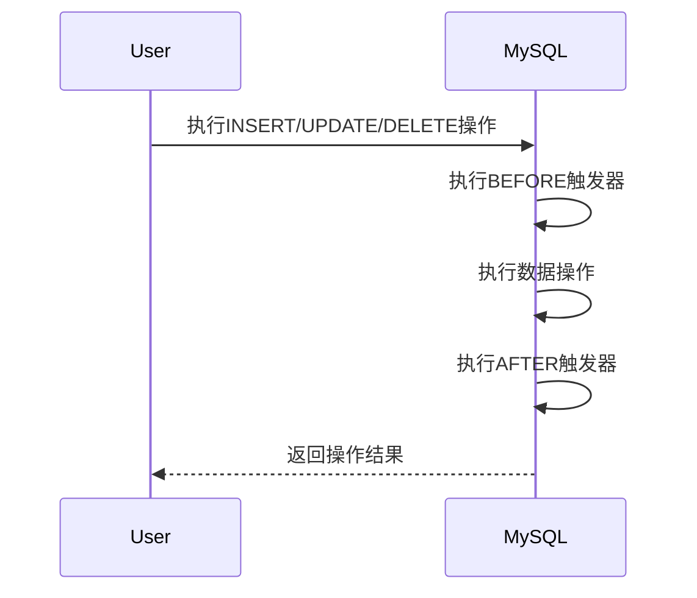

# MySQL 触发器时间点

MySQL触发器（Trigger）是一种特殊的存储过程，它在特定事件（如插入、更新或删除）发生时自动执行。触发器的时间点决定了它在事件发生之前（BEFORE）还是之后（AFTER）执行。理解触发器的时间点是掌握触发器的关键之一。

## 触发器的时间点简介

触发器的时间点分为两种：
1. **BEFORE**：在事件发生之前执行触发器。
2. **AFTER**：在事件发生之后执行触发器。

这两种时间点决定了触发器在数据操作过程中的执行顺序。例如，`BEFORE INSERT`触发器会在插入数据之前执行，而`AFTER UPDATE`触发器会在更新数据之后执行。

## 触发器时间点的语法

触发器的基本语法如下：

```sql
CREATE TRIGGER trigger_name
{BEFORE | AFTER} {INSERT | UPDATE | DELETE}
ON table_name
FOR EACH ROW
BEGIN
    -- 触发器逻辑
END;
```

- `trigger_name`：触发器的名称。
- `BEFORE` 或 `AFTER`：触发器的时间点。
- `INSERT`、`UPDATE` 或 `DELETE`：触发器关联的事件。
- `table_name`：触发器关联的表。
- `FOR EACH ROW`：表示触发器对每一行数据都会执行。

## 触发器时间点的实际应用

### 案例1：BEFORE INSERT 触发器

假设我们有一个用户表 `users`，希望在插入新用户之前自动将用户名转换为大写。我们可以使用 `BEFORE INSERT` 触发器来实现：

```sql
CREATE TRIGGER before_insert_user
BEFORE INSERT
ON users
FOR EACH ROW
BEGIN
    SET NEW.username = UPPER(NEW.username);
END;
```

**输入：**
```sql
INSERT INTO users (username, email) VALUES ('john_doe', 'john@example.com');
```

**输出：**
```sql
SELECT * FROM users;
-- 结果：username 为 'JOHN_DOE'
```

在这个例子中，触发器在插入数据之前将用户名转换为大写。

### 案例2：AFTER UPDATE 触发器

假设我们有一个订单表 `orders`，希望在更新订单状态后记录日志。我们可以使用 `AFTER UPDATE` 触发器来实现：

```sql
CREATE TRIGGER after_update_order
AFTER UPDATE
ON orders
FOR EACH ROW
BEGIN
    INSERT INTO order_logs (order_id, old_status, new_status, updated_at)
    VALUES (OLD.id, OLD.status, NEW.status, NOW());
END;
```

**输入：**
```sql
UPDATE orders SET status = 'shipped' WHERE id = 1;
```

**输出：**
```sql
SELECT * FROM order_logs;
-- 结果：记录了一条日志，包含订单ID、旧状态、新状态和更新时间
```

在这个例子中，触发器在更新订单状态后记录了一条日志。

## 触发器时间点的执行顺序

理解触发器的时间点还需要了解它们在数据操作过程中的执行顺序。以下是一个典型的执行顺序：



1. 用户执行数据操作（如插入、更新或删除）。
2. MySQL首先执行 `BEFORE` 触发器。
3. MySQL执行实际的数据操作。
4. MySQL执行 `AFTER` 触发器。
5. 返回操作结果给用户。

## 总结

MySQL触发器的时间点决定了触发器在数据操作过程中的执行时机。`BEFORE` 触发器在事件发生之前执行，适合用于数据验证或预处理；`AFTER` 触发器在事件发生之后执行，适合用于日志记录或后续处理。通过实际案例，我们可以更好地理解触发器时间点的应用场景。

## 附加资源与练习

- **练习1**：创建一个 `BEFORE UPDATE` 触发器，确保用户表中的电子邮件地址始终为小写。
- **练习2**：创建一个 `AFTER DELETE` 触发器，在删除用户时将其信息记录到日志表中。

通过练习，您可以进一步巩固对MySQL触发器时间点的理解。