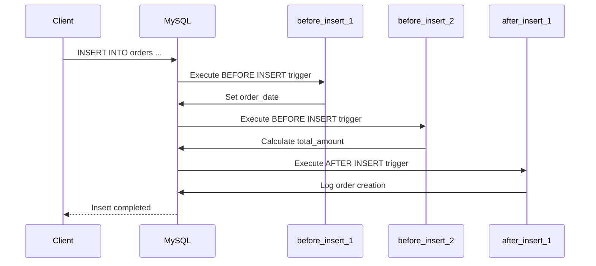

# MySQL 触发器顺序

在MySQL中，触发器（Trigger）是一种特殊的存储过程，它会在特定的数据库事件（如INSERT、UPDATE或DELETE）发生时自动执行。触发器的执行顺序是一个重要的概念，尤其是在多个触发器绑定到同一个事件时。本文将详细介绍MySQL触发器的执行顺序，并通过示例帮助你理解其工作原理。

## 什么是触发器顺序？

触发器顺序指的是当多个触发器绑定到同一个表上的同一个事件时，MySQL如何决定它们的执行顺序。MySQL允许为同一个事件定义多个触发器，但这些触发器的执行顺序并不是随机的，而是由它们的创建时间和类型决定的。

### 触发器的类型

MySQL触发器分为两种类型：
1. **BEFORE触发器**：在事件发生之前执行。
2. **AFTER触发器**：在事件发生之后执行。

对于同一个事件，BEFORE触发器总是优先于AFTER触发器执行。然而，如果有多个BEFORE触发器或多个AFTER触发器绑定到同一个事件，它们的执行顺序则由它们的创建时间决定。

## 触发器顺序的规则

MySQL触发器的执行顺序遵循以下规则：
1. **BEFORE触发器**优先于**AFTER触发器**执行。
2. 对于同一类型的触发器（例如多个BEFORE INSERT触发器），它们的执行顺序按照创建时间的先后顺序执行。

### 示例：触发器顺序的实际应用

假设我们有一个名为`orders`的表，并且我们为该表的`INSERT`事件定义了多个触发器。以下是触发器的定义：

```sql
-- 创建第一个BEFORE INSERT触发器
CREATE TRIGGER before_insert_1
BEFORE INSERT ON orders
FOR EACH ROW
BEGIN
    SET NEW.order_date = NOW();
END;

-- 创建第二个BEFORE INSERT触发器
CREATE TRIGGER before_insert_2
BEFORE INSERT ON orders
FOR EACH ROW
BEGIN
    SET NEW.total_amount = NEW.quantity * NEW.unit_price;
END;

-- 创建AFTER INSERT触发器
CREATE TRIGGER after_insert_1
AFTER INSERT ON orders
FOR EACH ROW
BEGIN
    INSERT INTO order_logs (order_id, action) VALUES (NEW.id, 'Order created');
END;
```

在这个例子中，当我们向`orders`表插入一条新记录时，触发器的执行顺序如下：
1. `before_insert_1`触发器首先执行，设置`order_date`字段为当前时间。
2. `before_insert_2`触发器接着执行，计算`total_amount`字段的值。
3. 最后，`after_insert_1`触发器执行，将新订单的记录插入到`order_logs`表中。

### 触发器顺序的可视化

我们可以使用Mermaid图表来可视化触发器的执行顺序：



## 实际案例：订单处理系统

假设我们正在开发一个订单处理系统，需要在订单插入时执行以下操作：
1. 在插入之前，自动设置订单的创建时间。
2. 在插入之前，计算订单的总金额。
3. 在插入之后，记录订单的创建日志。

通过定义多个触发器，我们可以轻松实现这些功能。以下是一个完整的示例：

```sql
-- 创建orders表
CREATE TABLE orders (
    id INT AUTO_INCREMENT PRIMARY KEY,
    order_date DATETIME,
    quantity INT,
    unit_price DECIMAL(10, 2),
    total_amount DECIMAL(10, 2)
);

-- 创建order_logs表
CREATE TABLE order_logs (
    id INT AUTO_INCREMENT PRIMARY KEY,
    order_id INT,
    action VARCHAR(255),
    log_time DATETIME
);

-- 创建BEFORE INSERT触发器1：设置订单日期
CREATE TRIGGER before_insert_1
BEFORE INSERT ON orders
FOR EACH ROW
BEGIN
    SET NEW.order_date = NOW();
END;

-- 创建BEFORE INSERT触发器2：计算总金额
CREATE TRIGGER before_insert_2
BEFORE INSERT ON orders
FOR EACH ROW
BEGIN
    SET NEW.total_amount = NEW.quantity * NEW.unit_price;
END;

-- 创建AFTER INSERT触发器：记录订单日志
CREATE TRIGGER after_insert_1
AFTER INSERT ON orders
FOR EACH ROW
BEGIN
    INSERT INTO order_logs (order_id, action, log_time)
    VALUES (NEW.id, 'Order created', NOW());
END;
```

当我们执行以下插入操作时：

```sql
INSERT INTO orders (quantity, unit_price) VALUES (5, 10.00);
```

MySQL将按照触发器的顺序依次执行：
1. `before_insert_1`触发器设置`order_date`。
2. `before_insert_2`触发器计算`total_amount`。
3. `after_insert_1`触发器将订单日志插入到`order_logs`表中。

## 总结

MySQL触发器的执行顺序是一个重要的概念，尤其是在多个触发器绑定到同一个事件时。通过理解BEFORE和AFTER触发器的执行顺序，你可以更好地设计和调试数据库中的触发器逻辑。

在实际应用中，触发器顺序可以帮助你实现复杂的业务逻辑，例如自动计算字段值、记录操作日志等。通过合理使用触发器，你可以减少应用程序中的冗余代码，并提高数据库操作的效率。

## 附加资源与练习

- **练习1**：尝试为`orders`表定义一个`BEFORE UPDATE`触发器，在更新订单时自动更新`order_date`字段。
- **练习2**：为`orders`表定义一个`AFTER DELETE`触发器，在删除订单时将删除记录插入到`order_logs`表中。

通过实践这些练习，你将更深入地理解MySQL触发器的执行顺序及其应用场景。