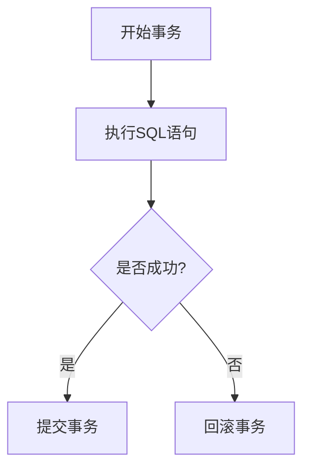

# MySQL 提交事务

在MySQL中，**事务**是一组SQL语句的集合，这些语句要么全部成功执行，要么全部失败回滚。事务的提交（`COMMIT`）是事务处理中的一个关键步骤，它标志着事务的结束，并将所有修改永久保存到数据库中。

## 什么是提交事务？

提交事务是指将事务中的所有操作永久保存到数据库中。一旦事务被提交，所有的更改将不可逆转，并且对其他用户可见。如果事务没有被提交，所有的更改将被回滚（撤销），数据库将恢复到事务开始之前的状态。

### 事务的基本流程

1. **开始事务**：使用 `START TRANSACTION` 或 `BEGIN` 语句开始一个新的事务。
2. **执行SQL语句**：在事务中执行一系列的SQL语句，如 `INSERT`、`UPDATE`、`DELETE` 等。
3. **提交事务**：使用 `COMMIT` 语句提交事务，将更改永久保存到数据库。
4. **回滚事务**：如果在事务执行过程中发生错误，可以使用 `ROLLBACK` 语句回滚事务，撤销所有更改。

## 提交事务的语法

在MySQL中，提交事务的语法非常简单：

```sql
COMMIT;
```

### 示例

假设我们有一个名为 `accounts` 的表，其中包含用户的账户余额信息。我们想要从一个账户转账到另一个账户，并确保这两个操作要么全部成功，要么全部失败。

```sql
START TRANSACTION;

-- 从账户1扣除100元
UPDATE accounts SET balance = balance - 100 WHERE id = 1;

-- 向账户2增加100元
UPDATE accounts SET balance = balance + 100 WHERE id = 2;

-- 提交事务
COMMIT;
```

在这个例子中，如果两个 `UPDATE` 语句都成功执行，事务将被提交，账户1的余额减少100元，账户2的余额增加100元。如果其中任何一个 `UPDATE` 语句失败，事务将被回滚，两个账户的余额都不会发生变化。

## 实际应用场景

### 银行转账

银行转账是一个典型的事务应用场景。假设用户A向用户B转账100元，这个操作需要从用户A的账户中扣除100元，并将100元增加到用户B的账户中。这两个操作必须作为一个整体执行，要么全部成功，要么全部失败。

```sql
START TRANSACTION;

-- 从用户A的账户扣除100元
UPDATE accounts SET balance = balance - 100 WHERE id = 'A';

-- 向用户B的账户增加100元
UPDATE accounts SET balance = balance + 100 WHERE id = 'B';

-- 提交事务
COMMIT;
```

### 订单处理

在电商平台中，订单处理通常涉及多个步骤，如扣减库存、生成订单、更新用户积分等。这些操作必须作为一个事务来处理，以确保数据的一致性。

```sql
START TRANSACTION;

-- 扣减库存
UPDATE products SET stock = stock - 1 WHERE id = 'product_id';

-- 生成订单
INSERT INTO orders (user_id, product_id, quantity) VALUES ('user_id', 'product_id', 1);

-- 更新用户积分
UPDATE users SET points = points + 10 WHERE id = 'user_id';

-- 提交事务
COMMIT;
```

## 总结

提交事务是MySQL中确保数据一致性和完整性的重要机制。通过使用 `COMMIT` 语句，我们可以将事务中的所有更改永久保存到数据库中。在实际应用中，事务通常用于处理需要多个步骤的操作，如银行转账、订单处理等。

:::tip
在实际开发中，务必确保在事务中处理所有相关的操作，并在操作完成后及时提交事务，以避免数据不一致的问题。
:::

## 附加资源与练习

1. **练习**：尝试在一个事务中执行多个 `INSERT` 和 `UPDATE` 操作，并在最后提交事务。观察事务提交前后数据库的变化。
2. **进一步学习**：了解MySQL中的事务隔离级别及其对并发操作的影响。



通过以上内容，你应该对MySQL中的提交事务有了全面的了解。继续练习并探索更多关于事务的高级特性，以提升你的数据库操作技能。