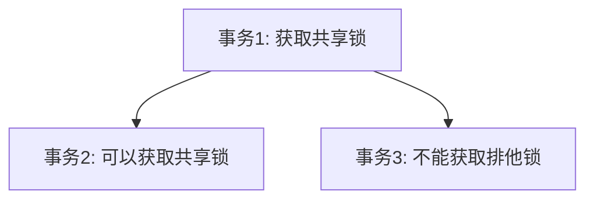

# MySQL 共享锁

在MySQL中，**共享锁（Shared Lock）**是一种用于控制并发访问的锁机制。它允许多个事务同时读取同一资源，但阻止任何事务对该资源进行写操作。共享锁的主要目的是确保数据的一致性，同时允许多个读取操作并发执行。

## 什么是共享锁？

共享锁是一种**读锁**，它允许多个事务同时获取同一资源的锁，以便读取数据。当一个事务持有共享锁时，其他事务也可以获取共享锁来读取数据，但不能获取**排他锁（Exclusive Lock）**来修改数据。

:::note
共享锁的特点是：
- 允许多个事务同时读取同一资源。
- 阻止任何事务对该资源进行写操作。
:::

## 共享锁的工作原理

当一个事务需要对某个资源进行读取操作时，它会请求一个共享锁。如果该资源没有被其他事务以排他锁锁定，那么共享锁将被授予。此时，其他事务也可以请求共享锁来读取同一资源。

```sql
-- 示例：在事务中获取共享锁
START TRANSACTION;
SELECT * FROM employees WHERE id = 1 LOCK IN SHARE MODE;
COMMIT;
```

在上面的示例中，`LOCK IN SHARE MODE` 语句用于获取共享锁。事务在执行 `SELECT` 语句时，会锁定 `id = 1` 的记录，允许其他事务读取该记录，但阻止任何事务修改它。

## 共享锁的使用场景

共享锁通常用于以下场景：

1. **并发读取**：当多个事务需要同时读取同一数据时，共享锁可以确保数据的一致性，同时允许多个读取操作并发执行。
2. **防止脏读**：共享锁可以防止其他事务在读取数据时修改数据，从而避免脏读问题。

:::tip
在实际应用中，共享锁常用于报表生成、数据分析等需要读取大量数据但不需要修改数据的场景。
:::

## 实际案例

假设我们有一个员工表 `employees`，多个事务需要同时读取某个员工的信息，但不需要修改它。我们可以使用共享锁来确保数据的一致性。

```sql
-- 事务1：获取共享锁并读取数据
START TRANSACTION;
SELECT * FROM employees WHERE id = 1 LOCK IN SHARE MODE;
-- 事务1可以读取数据，但不能修改
COMMIT;

-- 事务2：获取共享锁并读取数据
START TRANSACTION;
SELECT * FROM employees WHERE id = 1 LOCK IN SHARE MODE;
-- 事务2也可以读取数据，但不能修改
COMMIT;
```

在这个案例中，两个事务都可以同时读取 `id = 1` 的员工信息，但任何事务都不能修改该记录，直到所有共享锁被释放。

## 共享锁与排他锁的关系

共享锁和排他锁是互斥的。当一个事务持有共享锁时，其他事务可以获取共享锁，但不能获取排他锁。反之，当一个事务持有排他锁时，其他事务既不能获取共享锁，也不能获取排他锁。



## 总结

共享锁是MySQL中用于控制并发读取的重要机制。它允许多个事务同时读取同一资源，但阻止任何事务对该资源进行写操作。通过合理使用共享锁，可以确保数据的一致性，同时提高系统的并发性能。

:::caution
需要注意的是，过度使用共享锁可能会导致锁争用问题，从而影响系统性能。因此，在实际应用中，应根据具体需求合理使用共享锁。
:::

## 附加资源与练习

- **练习**：尝试在一个事务中使用共享锁读取数据，并在另一个事务中尝试修改同一数据，观察MySQL的行为。
- **进一步学习**：了解MySQL中的其他锁机制，如排他锁、意向锁等，并掌握它们的使用场景。

通过本文的学习，你应该对MySQL中的共享锁有了初步的了解。继续深入学习其他锁机制，将有助于你更好地掌握MySQL的并发控制技术。