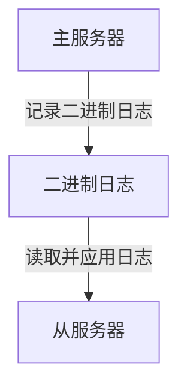

# MySQL 复制概述

MySQL复制是MySQL数据库中的一项重要功能，它允许数据从一个MySQL服务器（称为主服务器）复制到一个或多个MySQL服务器（称为从服务器）。复制的主要目的是提高数据的可用性、可靠性和性能。通过复制，你可以实现负载均衡、数据备份、灾难恢复以及数据分析等功能。

## 什么是MySQL复制？

MySQL复制是一种将数据从一个数据库服务器（主服务器）复制到一个或多个数据库服务器（从服务器）的过程。复制是异步的，这意味着从服务器不需要实时与主服务器保持连接。主服务器上的数据更改会被记录在二进制日志（Binary Log）中，从服务器通过读取这些日志来应用相同的更改。

### 复制的工作原理

MySQL复制的基本工作原理如下：

1. **主服务器**：主服务器负责处理所有的写操作（如INSERT、UPDATE、DELETE等），并将这些操作记录在二进制日志中。
2. **从服务器**：从服务器连接到主服务器，并请求二进制日志的内容。从服务器读取这些日志，并在本地应用相同的操作，从而保持与主服务器的数据一致。



### 复制的类型

MySQL支持多种复制类型，包括：

1. **基于语句的复制（Statement-Based Replication, SBR）**：主服务器将执行的SQL语句记录在二进制日志中，从服务器执行相同的SQL语句。
2. **基于行的复制（Row-Based Replication, RBR）**：主服务器将每一行数据的更改记录在二进制日志中，从服务器直接应用这些更改。
3. **混合复制（Mixed-Based Replication, MBR）**：结合了SBR和RBR的优点，MySQL会根据情况自动选择最佳的复制方式。

:::tip
在实际应用中，混合复制（MBR）通常是默认的推荐选项，因为它结合了基于语句和基于行复制的优点。
:::

## 如何配置MySQL复制

### 1. 配置主服务器

首先，你需要在主服务器上启用二进制日志，并创建一个用于复制的用户。

```sql
-- 在主服务器上启用二进制日志
SET GLOBAL log_bin = ON;

-- 创建一个用于复制的用户
CREATE USER 'replica_user'@'%' IDENTIFIED BY 'password';
GRANT REPLICATION SLAVE ON *.* TO 'replica_user'@'%';
FLUSH PRIVILEGES;
```

### 2. 配置从服务器

接下来，在从服务器上配置复制。

```sql
-- 在从服务器上配置复制
CHANGE MASTER TO
    MASTER_HOST='主服务器IP',
    MASTER_USER='replica_user',
    MASTER_PASSWORD='password',
    MASTER_LOG_FILE='mysql-bin.000001',
    MASTER_LOG_POS=4;

-- 启动复制
START SLAVE;
```

### 3. 检查复制状态

你可以通过以下命令检查从服务器的复制状态：

```sql
SHOW SLAVE STATUS\G;
```

在输出中，确保 `Slave_IO_Running` 和 `Slave_SQL_Running` 的值都为 `Yes`，这表示复制正在正常运行。

## 实际应用场景

### 1. 负载均衡

通过将读操作分散到多个从服务器上，可以减轻主服务器的负载，从而提高系统的整体性能。

### 2. 数据备份

从服务器可以作为主服务器的实时备份。如果主服务器发生故障，可以快速切换到从服务器，减少数据丢失的风险。

### 3. 灾难恢复

在灾难发生时，从服务器可以作为备用服务器，确保业务的连续性。

### 4. 数据分析

从服务器可以用于运行分析查询，而不会影响主服务器的性能。

## 总结

MySQL复制是提高数据库可用性、可靠性和性能的重要工具。通过复制，你可以实现负载均衡、数据备份、灾难恢复以及数据分析等功能。本文介绍了MySQL复制的基本概念、工作原理、配置步骤以及实际应用场景。

:::note
如果你想深入了解MySQL复制的更多细节，可以参考MySQL官方文档或相关的在线教程。
:::

## 附加资源

- [MySQL官方文档 - 复制](https://dev.mysql.com/doc/refman/8.0/en/replication.html)
- [MySQL复制配置指南](https://www.digitalocean.com/community/tutorials/how-to-set-up-replication-in-mysql)

## 练习

1. 在你的本地环境中配置一个简单的MySQL复制环境，并验证复制是否正常工作。
2. 尝试在主服务器上插入一些数据，并检查从服务器是否同步了这些数据。
3. 研究并比较基于语句的复制和基于行的复制的优缺点。