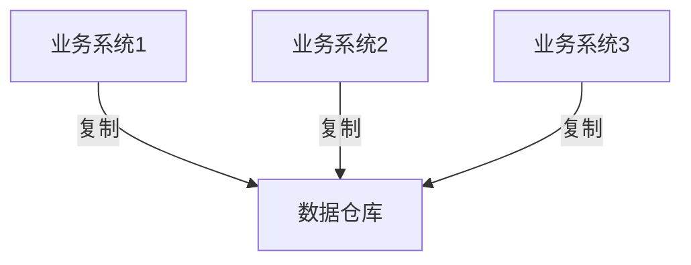

# MySQL 多源复制

MySQL多源复制（Multi-Source Replication）是MySQL 5.7及以上版本引入的一项高级复制功能。它允许一个从服务器（Slave）同时从多个主服务器（Master）复制数据。这种机制在需要将多个数据源的数据汇总到一个中心数据库的场景中非常有用。

## 什么是多源复制？

在传统的MySQL复制中，一个从服务器只能从一个主服务器复制数据。而多源复制打破了这一限制，使得一个从服务器可以同时从多个主服务器接收数据。每个主服务器的数据会被复制到从服务器的不同通道（Channel）中，从而避免了数据冲突。

:::tip
多源复制适用于需要将多个独立数据库的数据汇总到一个中心数据库的场景，例如数据仓库、报表系统等。
:::

## 多源复制的配置步骤

### 1. 配置主服务器

首先，确保每个主服务器都已启用二进制日志（Binary Log），并且配置了唯一的服务器ID。以下是主服务器的基本配置示例：

```ini
[mysqld]
server-id=1
log-bin=mysql-bin
```

### 2. 配置从服务器

在从服务器上，需要为每个主服务器配置一个独立的复制通道。以下是配置多源复制的步骤：

1. **停止从服务器的复制进程**：

    ```sql
    STOP SLAVE;
    ```

2. **配置每个主服务器的连接信息**：

    ```sql
    CHANGE MASTER TO
    MASTER_HOST='master1_host',
    MASTER_USER='replication_user',
    MASTER_PASSWORD='replication_password',
    MASTER_LOG_FILE='mysql-bin.000001',
    MASTER_LOG_POS=4
    FOR CHANNEL 'master1_channel';
    ```

    重复上述步骤，为每个主服务器配置不同的通道。

3. **启动复制进程**：

    ```sql
    START SLAVE FOR CHANNEL 'master1_channel';
    ```

### 3. 验证复制状态

使用以下命令可以查看每个通道的复制状态：

```sql
SHOW SLAVE STATUS FOR CHANNEL 'master1_channel'\G
```

## 实际应用场景

### 数据仓库

在多源复制的典型应用场景中，企业可能有多个独立的业务系统，每个系统都有自己的数据库。为了进行统一的数据分析和报表生成，可以将这些数据库的数据通过多源复制汇总到一个中心数据仓库中。



### 分布式系统

在分布式系统中，多个节点可能各自维护一部分数据。通过多源复制，可以将这些数据汇总到一个中心节点，以便进行全局查询和分析。

## 总结

MySQL多源复制是一项强大的功能，特别适用于需要将多个数据源的数据汇总到一个中心数据库的场景。通过合理配置，可以轻松实现数据的集中管理和分析。

:::caution
在多源复制中，确保每个主服务器的数据不会发生冲突是非常重要的。通常可以通过为每个主服务器分配不同的数据库或表来实现数据隔离。
:::

## 附加资源与练习

- **官方文档**：阅读MySQL官方文档中关于多源复制的详细说明。
- **练习**：尝试在自己的测试环境中配置多源复制，并验证数据的正确性。

通过本文的学习，你应该已经掌握了MySQL多源复制的基本概念和配置方法。希望你能在实际项目中灵活运用这一技术，提升数据管理的效率。