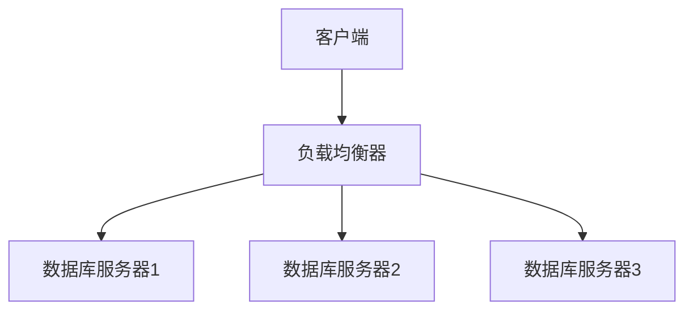

# MySQL 负载均衡

在现代应用程序中，数据库的性能和可用性是至关重要的。随着用户数量的增加，单个数据库服务器可能无法处理所有的请求，从而导致性能下降甚至服务中断。为了解决这个问题，我们可以使用**负载均衡**技术来分散数据库的负载，从而提高系统的性能和可靠性。

## 什么是MySQL负载均衡？

MySQL负载均衡是一种将数据库请求分发到多个数据库服务器的技术。通过这种方式，可以避免单个服务器过载，同时提高系统的响应速度和可用性。负载均衡可以在多个层次上实现，包括应用层、中间件层和数据库层。

## 为什么需要MySQL负载均衡？

1. **提高性能**：通过将请求分发到多个服务器，可以减少单个服务器的负载，从而提高整体性能。
2. **提高可用性**：如果其中一个服务器出现故障，负载均衡器可以将请求转发到其他健康的服务器，从而保证服务的连续性。
3. **扩展性**：随着业务的增长，可以轻松地添加更多的服务器来处理增加的负载。

## MySQL 负载均衡的实现方式

### 1. 应用层负载均衡

在应用层实现负载均衡是最常见的方式。应用程序可以通过配置多个数据库连接，并使用轮询、随机或加权算法来选择要连接的数据库服务器。

```python
import random

# 假设我们有三个数据库服务器
db_servers = ['db1.example.com', 'db2.example.com', 'db3.example.com']

def get_db_connection():
    # 随机选择一个数据库服务器
    selected_server = random.choice(db_servers)
    print(f"Connecting to {selected_server}")
    # 这里可以添加实际的数据库连接代码
    return selected_server

# 示例调用
get_db_connection()
```

**输出示例：**
```
Connecting to db2.example.com
```

### 2. 中间件层负载均衡

中间件层负载均衡通常使用专门的负载均衡器（如HAProxy、Nginx）来分发数据库请求。这些负载均衡器可以根据服务器的负载情况动态调整请求的分发策略。



### 3. 数据库层负载均衡

在数据库层，MySQL本身提供了一些负载均衡的功能。例如，MySQL Router可以根据查询的类型将请求分发到不同的服务器。

```sql
-- 假设我们有一个主服务器和两个从服务器
-- 写操作会被路由到主服务器
INSERT INTO users (name, email) VALUES ('Alice', 'alice@example.com');

-- 读操作会被路由到从服务器
SELECT * FROM users;
```

## 实际案例

假设我们有一个电商网站，每天有数百万的用户访问。为了确保数据库能够处理这些请求，我们决定使用MySQL负载均衡。

1. **应用层负载均衡**：我们在应用程序中配置了三个数据库服务器，并使用轮询算法来选择要连接的服务器。
2. **中间件层负载均衡**：我们使用HAProxy作为负载均衡器，根据服务器的负载情况动态调整请求的分发策略。
3. **数据库层负载均衡**：我们使用MySQL Router将写操作路由到主服务器，读操作路由到从服务器。

通过这种方式，我们成功地分散了数据库的负载，提高了系统的性能和可用性。

## 总结

MySQL负载均衡是提高数据库性能和可用性的重要技术。通过应用层、中间件层和数据库层的负载均衡，我们可以有效地分散数据库的负载，确保系统在高负载下仍能稳定运行。

## 附加资源

- [MySQL官方文档](https://dev.mysql.com/doc/)
- [HAProxy官方文档](https://www.haproxy.org/)
- [MySQL Router官方文档](https://dev.mysql.com/doc/mysql-router/en/)

## 练习

1. 尝试在本地环境中配置一个简单的MySQL负载均衡系统，使用HAProxy作为负载均衡器。
2. 编写一个Python脚本，模拟应用层负载均衡，并测试其效果。

通过以上学习和实践，你将能够更好地理解和应用MySQL负载均衡技术。