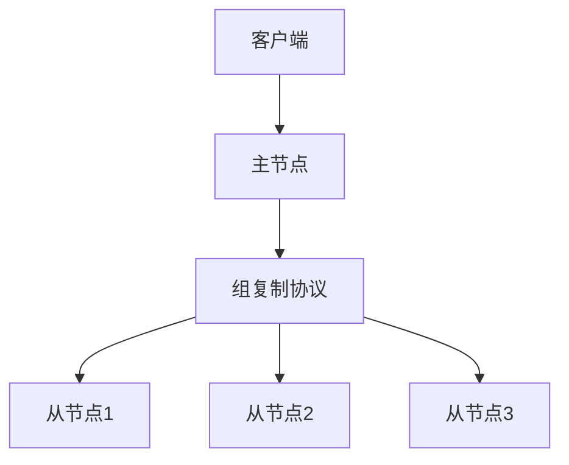

# MySQL 组复制

MySQL组复制（Group Replication）是MySQL提供的一种高可用性和高扩展性的数据库复制技术。它基于分布式一致性协议（如Paxos），允许多个MySQL实例组成一个组，组内的每个实例都可以读写数据，并且数据会自动同步到其他实例。组复制的主要目标是提供高可用性和数据一致性。

## 什么是MySQL组复制？

MySQL组复制是一种基于组的复制技术，它允许多个MySQL服务器实例组成一个组，组内的每个实例都可以读写数据。组复制的核心思想是通过分布式一致性协议来确保数据在组内的一致性。当某个实例写入数据时，组复制会自动将数据同步到其他实例，从而保证数据的一致性。

:::note
MySQL组复制是MySQL 5.7.17版本引入的新特性，适用于需要高可用性和数据一致性的场景。
:::

## MySQL 组复制的工作原理

MySQL组复制的核心是分布式一致性协议。组内的每个实例都会参与到数据的复制和一致性维护中。当一个实例写入数据时，它会将数据变更发送给组内的其他实例。其他实例会通过一致性协议来确认是否接受该变更。只有当大多数实例同意接受该变更时，数据才会被提交。



在上图中，客户端将数据写入主节点，主节点通过组复制协议将数据同步到其他从节点。只有当大多数节点确认接受该数据变更后，数据才会被提交。

## 配置MySQL组复制

要配置MySQL组复制，首先需要确保所有MySQL实例都启用了组复制插件。以下是一个简单的配置步骤：

1. **安装组复制插件**：
   在每个MySQL实例上执行以下命令来安装组复制插件：
   ```sql
   INSTALL PLUGIN group_replication SONAME 'group_replication.so';
   ```

2. **配置组复制**：
   在每个MySQL实例的配置文件中添加以下配置：
   ```ini
   [mysqld]
   server_id=1
   gtid_mode=ON
   enforce_gtid_consistency=ON
   master_info_repository=TABLE
   relay_log_info_repository=TABLE
   binlog_checksum=NONE
   log_slave_updates=ON
   log_bin=binlog
   binlog_format=ROW
   transaction_write_set_extraction=XXHASH64
   loose-group_replication_group_name="aaaaaaaa-aaaa-aaaa-aaaa-aaaaaaaaaaaa"
   loose-group_replication_start_on_boot=off
   loose-group_replication_local_address= "127.0.0.1:24901"
   loose-group_replication_group_seeds= "127.0.0.1:24901,127.0.0.1:24902,127.0.0.1:24903"
   loose-group_replication_bootstrap_group=off
   ```

3. **启动组复制**：
   在主节点上执行以下命令来启动组复制：
   ```sql
   SET GLOBAL group_replication_bootstrap_group=ON;
   START GROUP_REPLICATION;
   SET GLOBAL group_replication_bootstrap_group=OFF;
   ```

4. **加入其他节点**：
   在其他节点上执行以下命令来加入组复制：
   ```sql
   START GROUP_REPLICATION;
   ```

## 实际应用场景

MySQL组复制适用于需要高可用性和数据一致性的场景，例如：

- **金融系统**：金融系统对数据的一致性和可用性要求非常高，组复制可以确保数据在多个节点之间的一致性。
- **电子商务平台**：电子商务平台需要处理大量的并发请求，组复制可以提供高可用性和扩展性。
- **分布式系统**：在分布式系统中，组复制可以确保数据在多个节点之间的一致性，从而提高系统的可靠性。

## 总结

MySQL组复制是一种强大的高可用性和数据一致性解决方案，适用于需要高可用性和数据一致性的场景。通过分布式一致性协议，组复制可以确保数据在多个节点之间的一致性，从而提高系统的可靠性和扩展性。

:::tip
如果你对MySQL组复制感兴趣，可以尝试在自己的环境中配置一个组复制集群，并测试其高可用性和数据一致性。
:::

## 附加资源

- [MySQL官方文档 - 组复制](https://dev.mysql.com/doc/refman/8.0/en/group-replication.html)
- [MySQL组复制配置指南](https://dev.mysql.com/doc/refman/8.0/en/group-replication-configuring.html)
- [MySQL组复制实战](https://dev.mysql.com/doc/refman/8.0/en/group-replication-deploying.html)
