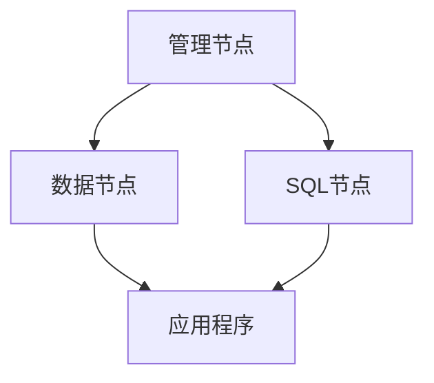

# MySQL 集群概述

MySQL集群是一种高可用性、高性能的数据库解决方案，旨在通过分布式架构实现数据的冗余存储和负载均衡。它允许多个MySQL服务器协同工作，以提供更高的可靠性和扩展性。对于初学者来说，理解MySQL集群的基本概念是掌握数据库管理的重要一步。

## 什么是MySQL集群？

MySQL集群（MySQL Cluster）是MySQL数据库的一种分布式实现，它通过将数据分布在多个节点上来实现高可用性和高性能。集群中的每个节点都可以独立处理请求，同时与其他节点保持数据同步。这种架构不仅提高了系统的容错能力，还支持水平扩展，能够应对大规模数据存储和高并发访问的需求。

### 核心组件

MySQL集群主要由以下几个核心组件组成：

1. **管理节点（Management Node）**：负责集群的配置和管理，监控其他节点的状态。
2. **数据节点（Data Node）**：存储实际的数据，并处理数据的读写请求。
3. **SQL节点（SQL Node）**：提供SQL接口，允许应用程序通过标准的SQL语句访问数据。



## MySQL 集群的工作原理

MySQL集群通过**数据分片（Sharding）**和**数据复制（Replication）**来实现高可用性和负载均衡。数据分片将数据分布到多个数据节点上，而数据复制则确保每个数据节点都有数据的副本，以防止单点故障。

### 数据分片

数据分片是将数据库中的数据分割成多个部分，每个部分存储在不同的数据节点上。这种方式可以提高查询性能，因为每个节点只需处理部分数据。

### 数据复制

数据复制是将数据在多个节点之间同步，以确保即使某个节点发生故障，数据仍然可用。MySQL集群通常采用**主从复制（Master-Slave Replication）**或**多主复制（Multi-Master Replication）**来实现数据的高可用性。

## 实际应用场景

MySQL集群在许多实际应用场景中都有广泛的应用，特别是在需要高可用性和高性能的系统中。以下是一些常见的应用场景：

1. **电子商务平台**：在高并发的购物季，MySQL集群可以确保订单数据的快速处理和存储。
2. **社交媒体应用**：用户生成的内容（如帖子、评论）需要实时存储和检索，MySQL集群可以满足这种需求。
3. **金融系统**：交易数据的高可用性和一致性是金融系统的核心需求，MySQL集群可以提供可靠的解决方案。

## 代码示例

以下是一个简单的MySQL集群配置示例，展示如何设置一个包含管理节点、数据节点和SQL节点的集群。

```sql
# 管理节点配置
[ndb_mgmd]
hostname=management_node
datadir=/var/lib/mysql-cluster

# 数据节点配置
[ndbd]
hostname=data_node1
datadir=/var/lib/mysql-cluster

[ndbd]
hostname=data_node2
datadir=/var/lib/mysql-cluster

# SQL节点配置
[mysqld]
hostname=sql_node1

[mysqld]
hostname=sql_node2
```

## 总结

MySQL集群是一种强大的数据库解决方案，能够通过分布式架构实现高可用性和高性能。通过数据分片和数据复制，MySQL集群可以有效地应对大规模数据存储和高并发访问的需求。对于初学者来说，理解MySQL集群的基本概念和工作原理是掌握数据库管理的重要一步。

## 附加资源与练习

- **官方文档**：[MySQL Cluster Documentation](https://dev.mysql.com/doc/refman/8.0/en/mysql-cluster.html)
- **练习**：尝试在本地环境中配置一个简单的MySQL集群，包含一个管理节点、两个数据节点和一个SQL节点。

:::tip
在配置MySQL集群时，务必确保所有节点的网络连接稳定，以避免数据同步问题。
:::