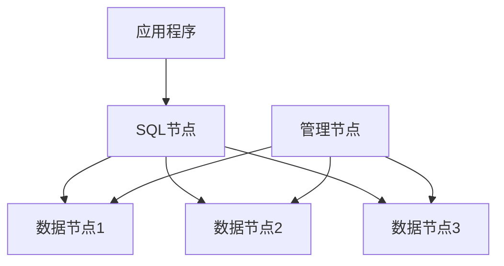

# MySQL NDB集群

MySQL NDB集群（也称为MySQL Cluster）是MySQL提供的一种高可用性、高扩展性的数据库解决方案。它基于NDB（Network Database）存储引擎，专为需要高吞吐量和低延迟的应用场景设计。NDB集群通过分布式架构实现数据的冗余和负载均衡，确保系统的高可用性和容错能力。

## 什么是MySQL NDB集群？

MySQL NDB集群是一个分布式数据库系统，它将数据分布在多个节点上，并通过自动分片（sharding）和复制（replication）来提供高可用性和高性能。NDB集群的核心组件包括：

1. **数据节点（Data Nodes）**：存储实际数据，并负责数据的读写操作。
2. **管理节点（Management Nodes）**：负责集群的配置和管理。
3. **SQL节点（SQL Nodes）**：提供SQL接口，允许应用程序通过标准的MySQL协议访问集群。

NDB集群的设计目标是实现无单点故障（SPOF），并通过数据冗余和自动故障转移来确保系统的高可用性。

## NDB集群的架构

NDB集群的架构可以分为以下几个部分：

1. **数据节点**：数据节点是集群的核心，负责存储数据。每个数据节点都保存了部分数据的分片，并且这些分片会在多个节点之间进行复制，以确保数据的冗余和高可用性。
2. **管理节点**：管理节点负责集群的配置和监控。它存储了集群的元数据，并负责协调数据节点和SQL节点之间的通信。
3. **SQL节点**：SQL节点是应用程序与集群之间的接口。它们通过标准的MySQL协议与应用程序通信，并将查询请求转发给数据节点。



## 配置MySQL NDB集群

要配置一个简单的NDB集群，您需要至少一个管理节点、两个数据节点和一个SQL节点。以下是一个基本的配置步骤：

1. **安装MySQL NDB集群软件**：首先，您需要在所有节点上安装MySQL NDB集群软件。您可以从MySQL官方网站下载适用于您操作系统的安装包。

2. **配置管理节点**：在管理节点上，创建一个配置文件 `config.ini`，内容如下：

    ```ini
    [ndb_mgmd]
    hostname=management_node_host
    datadir=/path/to/data

    [ndbd]
    hostname=data_node1_host
    datadir=/path/to/data

    [ndbd]
    hostname=data_node2_host
    datadir=/path/to/data

    [mysqld]
    hostname=sql_node_host
    ```

3. **启动管理节点**：在管理节点上运行以下命令来启动管理节点：

    ```bash
    ndb_mgmd --config-file=/path/to/config.ini
    ```

4. **启动数据节点**：在每个数据节点上运行以下命令来启动数据节点：

    ```bash
    ndbd
    ```

5. **启动SQL节点**：在SQL节点上启动MySQL服务器：

    ```bash
    mysqld --ndbcluster
    ```

6. **验证集群状态**：您可以使用 `ndb_mgm` 工具来检查集群的状态：

    ```bash
    ndb_mgm -e "SHOW"
    ```

    如果一切正常，您应该看到所有节点的状态为 `STARTED`。

## 实际应用场景

MySQL NDB集群适用于需要高可用性和高吞吐量的应用场景，例如：

- **电信行业**：用于处理大量的实时数据，如通话记录和短信。
- **在线游戏**：用于存储玩家数据和游戏状态，确保低延迟和高可用性。
- **金融行业**：用于处理交易数据和实时分析。

:::tip
在实际应用中，NDB集群可以通过添加更多的数据节点来扩展存储容量和处理能力，而无需停机。
:::

## 总结

MySQL NDB集群是一个强大的分布式数据库解决方案，适用于需要高可用性和高吞吐量的应用场景。通过分布式架构和数据冗余，NDB集群能够确保系统的高可用性和容错能力。本文介绍了NDB集群的基本概念、架构、配置方法以及实际应用场景，帮助初学者快速掌握这一技术。

## 附加资源

- [MySQL官方文档：NDB集群](https://dev.mysql.com/doc/refman/8.0/en/mysql-cluster.html)
- [MySQL NDB集群配置指南](https://dev.mysql.com/doc/refman/8.0/en/mysql-cluster-installation.html)

## 练习

1. 尝试在本地环境中配置一个简单的NDB集群，包含一个管理节点、两个数据节点和一个SQL节点。
2. 使用 `ndb_mgm` 工具检查集群状态，并尝试在集群中插入和查询数据。
3. 模拟一个数据节点故障，观察集群如何自动恢复。

通过实践，您将更深入地理解MySQL NDB集群的工作原理和应用场景。