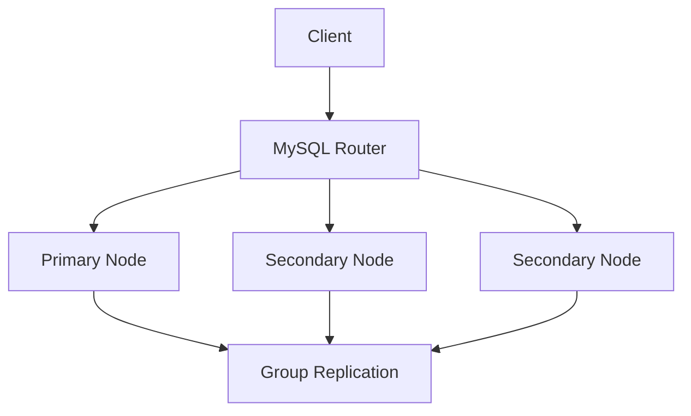

# MySQL InnoDB集群

MySQL InnoDB集群是MySQL官方提供的一种高可用性解决方案，它通过将多个MySQL服务器实例组合成一个集群，提供自动故障转移、数据复制和负载均衡功能。对于初学者来说，理解InnoDB集群的工作原理和配置方法，是掌握MySQL高可用性技术的重要一步。

## 什么是MySQL InnoDB集群？

MySQL InnoDB集群是基于MySQL Group Replication和MySQL Shell构建的解决方案。它允许你将多个MySQL服务器实例组合成一个集群，确保数据的高可用性和一致性。InnoDB集群的主要特点包括：

- **高可用性**：当集群中的某个节点发生故障时，系统会自动切换到其他可用节点，确保服务不中断。
- **数据一致性**：通过Group Replication技术，确保集群中的所有节点保持数据同步。
- **负载均衡**：通过MySQL Router，可以将客户端请求分发到集群中的不同节点，实现负载均衡。

## InnoDB集群的架构

InnoDB集群的核心组件包括：

1. **MySQL Server**：运行MySQL数据库的实例。
2. **Group Replication**：用于在集群节点之间同步数据的插件。
3. **MySQL Shell**：用于管理和配置InnoDB集群的工具。
4. **MySQL Router**：用于将客户端请求路由到集群中的适当节点。

以下是一个简单的InnoDB集群架构图：



## 配置MySQL InnoDB集群

### 1. 安装MySQL Server和MySQL Shell

首先，确保在所有节点上安装MySQL Server和MySQL Shell。你可以通过以下命令安装：

```bash
sudo apt-get update
sudo apt-get install mysql-server mysql-shell
```

### 2. 配置Group Replication

在每个MySQL实例上，启用Group Replication插件并配置相关参数。以下是一个示例配置：

```sql
INSTALL PLUGIN group_replication SONAME 'group_replication.so';
SET GLOBAL group_replication_bootstrap_group=ON;
START GROUP_REPLICATION;
SET GLOBAL group_replication_bootstrap_group=OFF;
```

### 3. 创建InnoDB集群

使用MySQL Shell连接到其中一个节点，并创建InnoDB集群：

```javascript
var cluster = dba.createCluster('myCluster');
```

### 4. 添加其他节点

将其他节点添加到集群中：

```javascript
cluster.addInstance('user@node2:3306');
cluster.addInstance('user@node3:3306');
```

### 5. 配置MySQL Router

安装并配置MySQL Router，以便将客户端请求路由到集群中的适当节点：

```bash
mysqlrouter --bootstrap user@node1:3306 --directory myrouter
mysqlrouter -c myrouter/mysqlrouter.conf &
```

## 实际应用场景

### 场景1：电商网站的高可用性

假设你正在运营一个电商网站，需要确保数据库的高可用性。通过使用InnoDB集群，即使某个数据库节点发生故障，网站仍然可以正常运行，因为系统会自动切换到其他可用节点。

### 场景2：数据分析和报告

在一个数据分析系统中，你可能需要从多个数据源读取数据并生成报告。通过InnoDB集群，你可以将读取请求分发到不同的节点，从而提高查询性能并减少单个节点的负载。

## 总结

MySQL InnoDB集群是一个强大的高可用性解决方案，适合需要确保数据一致性和服务连续性的应用场景。通过Group Replication和MySQL Shell，你可以轻松地配置和管理一个InnoDB集群。对于初学者来说，掌握这些技术将为未来的数据库管理打下坚实的基础。

## 附加资源

- [MySQL官方文档：InnoDB集群](https://dev.mysql.com/doc/refman/8.0/en/innodb-cluster.html)
- [MySQL Group Replication指南](https://dev.mysql.com/doc/refman/8.0/en/group-replication.html)
- [MySQL Shell教程](https://dev.mysql.com/doc/mysql-shell/8.0/en/)

## 练习

1. 尝试在本地环境中配置一个包含三个节点的InnoDB集群。
2. 模拟一个节点故障，观察集群如何自动切换到其他节点。
3. 使用MySQL Router将客户端请求分发到不同的节点，并测试负载均衡效果。