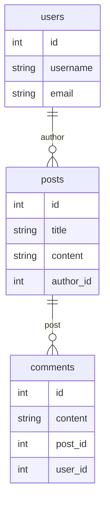

# MySQL 集成开发环境

MySQL集成开发环境（IDE）是专门为MySQL数据库开发设计的工具，它集成了代码编辑、调试、数据库管理和查询优化等功能。对于初学者来说，使用IDE可以显著提高开发效率，减少错误，并帮助你更好地理解数据库操作。

## 什么是MySQL集成开发环境？

MySQL集成开发环境（IDE）是一种软件应用程序，它提供了一个统一的界面来管理MySQL数据库。通过IDE，你可以轻松地执行SQL查询、管理数据库对象（如表、视图、存储过程等）、调试代码以及优化查询性能。

:::note
IDE通常还支持版本控制、代码自动补全和语法高亮等功能，这些功能对于初学者来说非常有用。
:::

## 常见的MySQL IDE工具

以下是一些常见的MySQL IDE工具：

1. **MySQL Workbench**：这是MySQL官方提供的IDE工具，支持数据库设计、SQL开发、数据库管理和性能优化。
2. **HeidiSQL**：一个轻量级的MySQL管理工具，支持Windows操作系统，界面简洁易用。
3. **DBeaver**：一个开源的通用数据库工具，支持多种数据库，包括MySQL。
4. **phpMyAdmin**：一个基于Web的MySQL管理工具，适合通过浏览器管理数据库。

## MySQL Workbench 使用示例

MySQL Workbench 是最常用的MySQL IDE之一。以下是一个简单的使用示例，展示如何创建一个数据库并执行查询。

### 1. 创建数据库

首先，打开MySQL Workbench并连接到你的MySQL服务器。然后，执行以下SQL语句来创建一个新的数据库：

```sql
CREATE DATABASE my_database;
```

### 2. 创建表

接下来，在新建的数据库中创建一个表：

```sql
USE my_database;

CREATE TABLE users (
    id INT AUTO_INCREMENT PRIMARY KEY,
    username VARCHAR(50) NOT NULL,
    email VARCHAR(100) NOT NULL
);
```

### 3. 插入数据

然后，向表中插入一些数据：

```sql
INSERT INTO users (username, email) VALUES ('alice', 'alice@example.com');
INSERT INTO users (username, email) VALUES ('bob', 'bob@example.com');
```

### 4. 查询数据

最后，执行一个查询来检索表中的数据：

```sql
SELECT * FROM users;
```

输出结果如下：

| id | username | email           |
|----|----------|-----------------|
| 1  | alice    | alice@example.com |
| 2  | bob      | bob@example.com   |

:::tip
在MySQL Workbench中，你可以使用“执行”按钮来运行SQL语句，并在结果面板中查看输出。
:::

## 实际应用场景

假设你正在开发一个博客系统，你需要管理用户、文章和评论等数据。使用MySQL IDE可以帮助你轻松地创建和管理这些数据库对象。

### 1. 设计数据库结构

你可以使用MySQL Workbench的“模型”功能来设计数据库结构。例如，创建一个包含用户、文章和评论的表结构：



### 2. 执行复杂查询

假设你想查询某个用户的所有文章及其评论，可以使用以下SQL语句：

```sql
SELECT 
    u.username, 
    p.title, 
    p.content, 
    c.content AS comment
FROM 
    users u
JOIN 
    posts p ON u.id = p.author_id
LEFT JOIN 
    comments c ON p.id = c.post_id
WHERE 
    u.username = 'alice';
```

这个查询将返回用户“alice”的所有文章及其相关评论。

## 总结

MySQL集成开发环境（IDE）是数据库开发中不可或缺的工具，尤其是对于初学者来说，它可以帮助你更高效地管理和操作数据库。通过本文的介绍，你应该已经了解了MySQL IDE的基本概念、常见工具以及如何使用它们进行数据库开发。

:::caution
在使用IDE时，务必注意数据库的安全性，避免在生产环境中直接使用默认的root账户。
:::

## 附加资源与练习

- **练习1**：尝试使用MySQL Workbench创建一个包含多个表的数据库，并执行一些复杂的查询。
- **练习2**：探索其他MySQL IDE工具（如HeidiSQL或DBeaver），比较它们的功能和用户体验。
- **资源**：访问[MySQL官方文档](https://dev.mysql.com/doc/)了解更多关于MySQL和MySQL Workbench的详细信息。

通过不断练习和探索，你将能够熟练掌握MySQL IDE的使用，并在数据库开发中游刃有余。