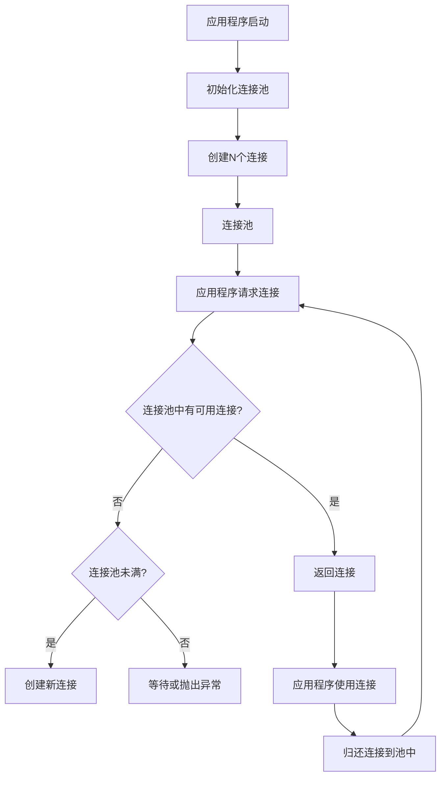

# MySQL 连接池

## 介绍

在开发数据库驱动的应用程序时，频繁地创建和关闭数据库连接会消耗大量资源，并可能导致性能瓶颈。为了解决这个问题，**连接池**应运而生。连接池是一种管理数据库连接的技术，它通过预先创建并维护一组数据库连接，供应用程序在需要时复用，从而减少连接创建和销毁的开销。

MySQL连接池的核心思想是：**复用连接**。通过连接池，应用程序可以从池中获取一个连接，使用完毕后将其归还到池中，而不是直接关闭连接。这样，后续的请求可以复用这些连接，从而提升性能。

## 连接池的工作原理

连接池的工作原理可以用以下步骤概括：

1. **初始化连接池**：在应用程序启动时，连接池会预先创建一定数量的数据库连接，并将它们放入池中。
2. **获取连接**：当应用程序需要与数据库交互时，它会从连接池中请求一个连接。如果池中有可用连接，则直接返回；如果没有可用连接且池未满，则创建新连接。
3. **使用连接**：应用程序使用连接执行数据库操作。
4. **归还连接**：操作完成后，应用程序将连接归还到连接池中，而不是关闭它。
5. **连接复用**：后续的请求可以复用这些连接，从而减少创建和销毁连接的开销。



## 代码示例

以下是一个使用Python的`mysql-connector-python`库实现MySQL连接池的简单示例：

```python
import mysql.connector
from mysql.connector import pooling

# 创建连接池
dbconfig = {
    "host": "localhost",
    "user": "root",
    "password": "password",
    "database": "testdb"
}

connection_pool = mysql.connector.pooling.MySQLConnectionPool(
    pool_name="my_pool",
    pool_size=5,
    **dbconfig
)

# 从连接池中获取连接
connection = connection_pool.get_connection()

# 使用连接执行查询
cursor = connection.cursor()
cursor.execute("SELECT * FROM users")
result = cursor.fetchall()
for row in result:
    print(row)

# 归还连接
cursor.close()
connection.close()
```

:::note
**注意**：在实际应用中，确保在使用完连接后将其归还到连接池中，以避免连接泄漏。
:::

## 实际应用场景

### 1. Web应用程序

在Web应用程序中，每个HTTP请求可能需要与数据库交互。如果每次请求都创建和关闭连接，会导致性能下降。使用连接池可以显著减少连接创建的开销，提升响应速度。

### 2. 高并发系统

在高并发系统中，数据库连接可能成为瓶颈。通过连接池，可以有效地管理连接资源，避免因连接过多而导致数据库崩溃。

### 3. 微服务架构

在微服务架构中，多个服务可能需要访问同一个数据库。使用连接池可以确保每个服务都能高效地获取和释放连接，从而提升整体系统的性能。

## 总结

MySQL连接池是一种优化数据库连接管理的技术，通过复用连接减少资源消耗，提升应用程序的性能。它特别适用于需要频繁与数据库交互的场景，如Web应用程序、高并发系统和微服务架构。

通过本文，你应该已经了解了连接池的基本概念、工作原理以及如何在实际应用中使用它。希望这些知识能帮助你在开发中更好地管理数据库连接。

## 附加资源

- [MySQL官方文档](https://dev.mysql.com/doc/)
- [Python MySQL Connector/Pooling](https://dev.mysql.com/doc/connector-python/en/connector-python-example-connecting-pooling.html)
- [数据库连接池详解](https://www.baeldung.com/java-connection-pooling)

## 练习

1. 尝试在本地环境中实现一个简单的MySQL连接池，并测试其性能。
2. 修改连接池的大小，观察其对应用程序性能的影响。
3. 研究其他编程语言（如Java、Node.js）中的连接池实现，并比较它们的异同。
