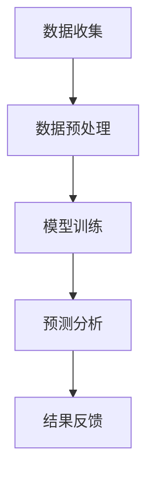

## 介绍

MySQL 是全球最流行的开源关系型数据库管理系统之一，广泛应用于 Web 应用程序、数据分析和企业级系统中。随着技术的不断进步，MySQL 也在持续演进，以满足现代应用的需求。本文将探讨 MySQL 的未来发展方向，帮助初学者了解 MySQL 的新特性和技术趋势。

## MySQL 的未来发展方向

### 1. 云原生支持

随着云计算的普及，MySQL 正在加强其云原生支持。未来的 MySQL 版本将更好地与云平台集成，提供更高效的资源管理和自动扩展功能。

:::tip
云原生支持意味着 MySQL 将能够更好地适应云环境，提供更高的可用性和可扩展性。
:::

### 2. 性能优化

MySQL 团队一直在致力于提升数据库的性能。未来的版本可能会引入更多的性能优化技术，如更高效的查询执行计划、更快的索引构建和更智能的缓存管理。

```sql
-- 示例：优化查询性能
EXPLAIN SELECT * FROM users WHERE age > 30;
```

### 3. 安全性增强

安全性是数据库管理的核心问题之一。未来的 MySQL 版本将进一步加强安全性，包括更强大的加密算法、更细粒度的访问控制和更完善的审计功能。

```sql
-- 示例：创建加密表
CREATE TABLE secure_data (
    id INT PRIMARY KEY,
    data VARBINARY(255) ENCRYPTED
);
```

### 4. 人工智能和机器学习集成

随着人工智能和机器学习的兴起，MySQL 可能会引入更多的 AI/ML 功能，如自动查询优化、异常检测和预测分析。



### 5. 多模型数据库支持

未来的 MySQL 可能会支持更多的数据模型，如文档存储、图形数据库和时序数据库，以满足不同应用场景的需求。

:::note
多模型数据库支持将使 MySQL 能够处理更复杂的数据类型和结构。
:::

### 6. 分布式数据库

随着数据量的增长，分布式数据库成为趋势。MySQL 可能会引入更多的分布式数据库功能，如分片、复制和一致性协议。

```sql
-- 示例：创建分片表
CREATE SHARDED TABLE sharded_data (
    id INT PRIMARY KEY,
    data VARCHAR(255)
) SHARD BY (id);
```

## 实际案例

### 案例 1：云原生应用

假设你正在开发一个云原生应用，需要处理大量用户数据。未来的 MySQL 版本将提供更好的云原生支持，帮助你轻松管理数据库资源，实现自动扩展和高可用性。

### 案例 2：AI 驱动的数据分析

在一个数据分析项目中，你可以利用 MySQL 的 AI/ML 功能，自动优化查询性能，检测数据异常，并进行预测分析，从而提高数据分析的效率和准确性。

## 总结

MySQL 的未来发展方向涵盖了云原生支持、性能优化、安全性增强、AI/ML 集成、多模型数据库支持和分布式数据库等多个方面。这些趋势将帮助 MySQL 更好地适应现代应用的需求，提供更高效、更安全的数据库解决方案。

## 附加资源

- [MySQL 官方文档](https://dev.mysql.com/doc/)
- [MySQL 性能优化指南](https://dev.mysql.com/doc/refman/8.0/en/optimization.html)
- [云原生数据库实践](https://cloud.google.com/sql/docs/mysql/)

## 练习

1. 尝试在 MySQL 中创建一个加密表，并插入一些数据。
2. 使用 `EXPLAIN` 命令分析一个复杂查询的执行计划。
3. 研究 MySQL 的分片功能，并尝试创建一个分片表。

通过本文的学习，你应该对 MySQL 的未来发展方向有了更深入的了解。继续探索和实践，你将能够更好地利用 MySQL 的强大功能，应对未来的数据库挑战。