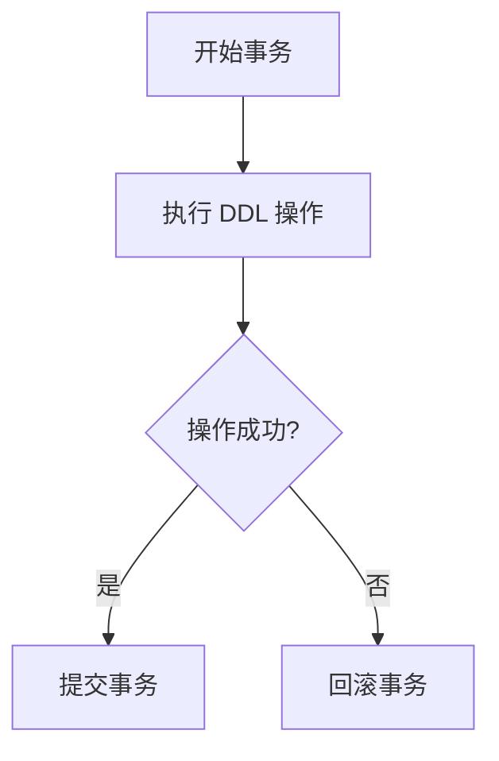

## 介绍

在 MySQL 8.0 中，原子 DDL（Data Definition Language）是一个重要的新特性。它确保了 DDL 操作的原子性，即 DDL 语句要么完全执行成功，要么完全失败回滚，不会留下部分执行的结果。这对于数据库的稳定性和一致性至关重要。

在 MySQL 8.0 之前，DDL 操作在某些情况下可能会导致部分执行的结果，例如在创建表时，如果发生错误，可能会留下一个不完整的表结构。原子 DDL 解决了这个问题，确保了 DDL 操作的完整性。

## 原子 DDL 的工作原理

原子 DDL 的实现依赖于 MySQL 8.0 引入的新的数据字典（Data Dictionary）。数据字典是一个集中存储数据库元数据的系统表，它取代了之前版本中使用的 `.frm` 文件。通过数据字典，MySQL 能够更好地管理 DDL 操作的状态，从而确保其原子性。

### 原子 DDL 的执行流程

1. **开始事务**：MySQL 在执行 DDL 操作时，首先会启动一个事务。
2. **执行 DDL 操作**：在事务中执行 DDL 操作，例如创建表、修改表结构等。
3. **提交或回滚**：如果 DDL 操作成功，事务会被提交；如果操作失败，事务会被回滚，所有更改都会被撤销。



## 代码示例

以下是一个简单的示例，展示了如何使用原子 DDL 创建一个表：

```sql
CREATE TABLE employees (
    id INT PRIMARY KEY,
    name VARCHAR(100),
    age INT
);
```

如果 `CREATE TABLE` 语句执行成功，表 `employees` 将被创建。如果执行失败（例如由于语法错误或权限问题），MySQL 会自动回滚操作，不会留下任何部分创建的表结构。

## 实际应用场景

### 场景 1：创建表时发生错误

假设你在创建表时不小心写错了列的数据类型：

```sql
CREATE TABLE employees (
    id INT PRIMARY KEY,
    name VARCHAR(100),
    age STRING  -- 错误的类型
);
```

在 MySQL 8.0 之前，这个错误可能会导致表被部分创建，留下一个不完整的表结构。而在 MySQL 8.0 中，由于原子 DDL 的特性，整个操作会被回滚，不会留下任何表结构。

### 场景 2：并发 DDL 操作

在并发环境中，多个用户可能会同时执行 DDL 操作。原子 DDL 确保了这些操作不会相互干扰。例如，如果两个用户同时尝试删除同一个表，MySQL 会确保只有一个操作成功，另一个操作会被回滚。

## 总结

MySQL 8.0 的原子 DDL 特性极大地提高了数据库的稳定性和一致性。通过确保 DDL 操作的原子性，MySQL 避免了部分执行的结果，减少了数据库维护的复杂性。对于初学者来说，理解原子 DDL 的工作原理和应用场景是非常重要的。

## 附加资源与练习

- **练习 1**：尝试在 MySQL 8.0 中执行一个错误的 DDL 语句，观察 MySQL 如何处理。
- **练习 2**：在并发环境中模拟多个 DDL 操作，观察 MySQL 如何确保操作的原子性。

:::tip
建议初学者在实际操作中多尝试不同的 DDL 语句，以加深对原子 DDL 的理解。
:::