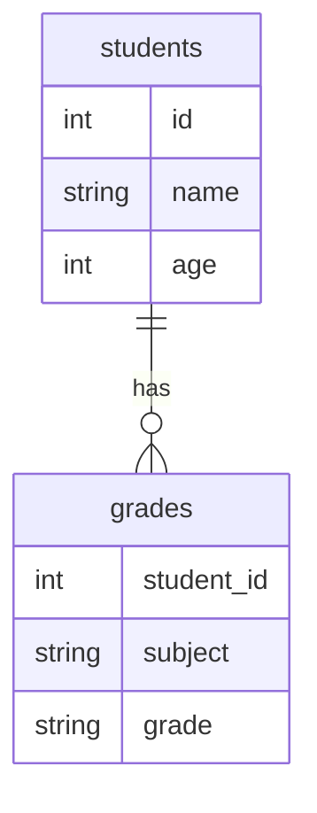

# MySQL 数据查询

在MySQL中，数据查询是最常用的操作之一。通过查询，我们可以从数据库中检索出所需的数据，并根据需要进行过滤、排序和聚合。本文将逐步介绍MySQL中的数据查询操作，帮助初学者掌握这一核心技能。

## 1. 基本查询：SELECT语句

`SELECT`语句是MySQL中最基本的查询语句，用于从表中检索数据。其基本语法如下：

```sql
SELECT 列名1, 列名2, ...
FROM 表名;
```

### 示例：查询所有列

假设我们有一个名为`students`的表，包含以下数据：

| id  | name   | age | grade |
|-----|--------|-----|-------|
| 1   | Alice  | 20  | A     |
| 2   | Bob    | 22  | B     |
| 3   | Charlie| 21  | A     |

要查询所有列的数据，可以使用以下语句：

```sql
SELECT * FROM students;
```

**输出：**

| id  | name   | age | grade |
|-----|--------|-----|-------|
| 1   | Alice  | 20  | A     |
| 2   | Bob    | 22  | B     |
| 3   | Charlie| 21  | A     |

### 示例：查询特定列

如果只想查询`name`和`grade`列，可以使用以下语句：

```sql
SELECT name, grade FROM students;
```

**输出：**

| name   | grade |
|--------|-------|
| Alice  | A     |
| Bob    | B     |
| Charlie| A     |

## 2. 条件查询：WHERE子句

`WHERE`子句用于过滤查询结果，只返回满足指定条件的记录。其基本语法如下：

```sql
SELECT 列名1, 列名2, ...
FROM 表名
WHERE 条件;
```

### 示例：查询年龄大于20的学生

```sql
SELECT * FROM students
WHERE age > 20;
```

**输出：**

| id  | name   | age | grade |
|-----|--------|-----|-------|
| 2   | Bob    | 22  | B     |
| 3   | Charlie| 21  | A     |

### 示例：查询成绩为A的学生

```sql
SELECT * FROM students
WHERE grade = 'A';
```

**输出：**

| id  | name   | age | grade |
|-----|--------|-----|-------|
| 1   | Alice  | 20  | A     |
| 3   | Charlie| 21  | A     |

## 3. 排序：ORDER BY子句

`ORDER BY`子句用于对查询结果进行排序。默认情况下，排序是升序（ASC），但也可以指定降序（DESC）。

### 示例：按年龄升序排序

```sql
SELECT * FROM students
ORDER BY age ASC;
```

**输出：**

| id  | name   | age | grade |
|-----|--------|-----|-------|
| 1   | Alice  | 20  | A     |
| 3   | Charlie| 21  | A     |
| 2   | Bob    | 22  | B     |

### 示例：按年龄降序排序

```sql
SELECT * FROM students
ORDER BY age DESC;
```

**输出：**

| id  | name   | age | grade |
|-----|--------|-----|-------|
| 2   | Bob    | 22  | B     |
| 3   | Charlie| 21  | A     |
| 1   | Alice  | 20  | A     |

## 4. 分组与聚合：GROUP BY和聚合函数

`GROUP BY`子句用于将查询结果按某一列或多列进行分组，通常与聚合函数（如`COUNT`、`SUM`、`AVG`、`MAX`、`MIN`等）一起使用。

### 示例：统计每个成绩等级的学生人数

```sql
SELECT grade, COUNT(*) AS student_count
FROM students
GROUP BY grade;
```

**输出：**

| grade | student_count |
|-------|---------------|
| A     | 2             |
| B     | 1             |

### 示例：计算每个成绩等级的平均年龄

```sql
SELECT grade, AVG(age) AS average_age
FROM students
GROUP BY grade;
```

**输出：**

| grade | average_age |
|-------|-------------|
| A     | 20.5        |
| B     | 22.0        |

## 5. 实际案例：学生成绩管理系统

假设我们有一个学生成绩管理系统，包含以下表结构：



### 示例：查询每个学生的平均成绩

```sql
SELECT s.name, AVG(g.grade) AS average_grade
FROM students s
JOIN grades g ON s.id = g.student_id
GROUP BY s.name;
```

**输出：**

| name   | average_grade |
|--------|---------------|
| Alice  | 85.0          |
| Bob    | 78.5          |
| Charlie| 90.0          |

## 6. 总结

通过本文，我们学习了MySQL中的基本数据查询操作，包括`SELECT`语句、`WHERE`子句、`ORDER BY`子句、`GROUP BY`子句以及聚合函数的使用。这些操作是MySQL中最常用的查询技巧，掌握它们将帮助你更好地管理和分析数据库中的数据。

## 7. 附加资源与练习

- **练习1**：创建一个包含`id`、`name`、`age`和`salary`的`employees`表，并插入一些数据。编写查询语句，找出工资高于50000的员工，并按工资降序排序。
- **练习2**：在`employees`表中，统计每个年龄段的员工人数，并计算每个年龄段的平均工资。

:::tip
建议初学者在本地安装MySQL并创建一些示例表，通过实际操作来巩固所学知识。
:::