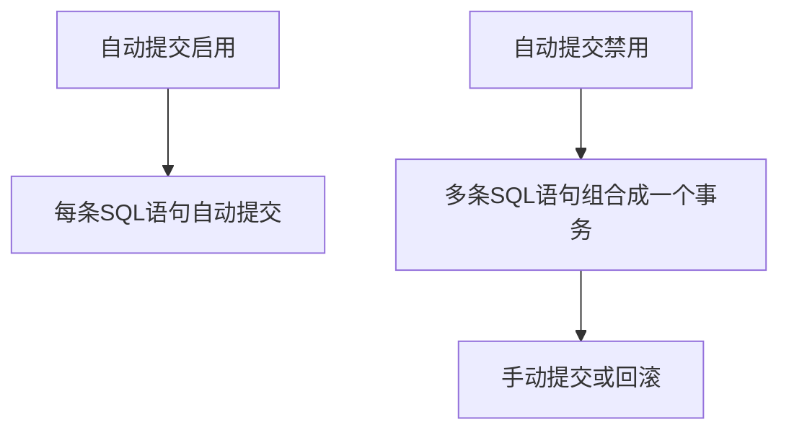

# MySQL 自动提交

在MySQL中，**自动提交**（Autocommit）是一个重要的概念，它决定了数据库是否在每条SQL语句执行后自动提交事务。理解自动提交的工作原理对于管理数据库事务至关重要。本文将详细介绍自动提交的概念、如何启用或禁用它，以及它在实际应用中的使用场景。

## 什么是自动提交？

默认情况下，MySQL启用了**自动提交**模式。这意味着每当你执行一条SQL语句（如`INSERT`、`UPDATE`或`DELETE`），MySQL会自动将该语句视为一个独立的事务，并立即提交。换句话说，每条SQL语句都会立即生效，无法回滚。

例如，如果你执行以下语句：

```sql
UPDATE users SET name = 'Alice' WHERE id = 1;
```

在自动提交模式下，这条语句会立即生效，数据库会立即更新`users`表中的数据。

## 如何查看和修改自动提交设置？

你可以通过以下SQL语句查看当前的自动提交设置：

```sql
SHOW VARIABLES LIKE 'autocommit';
```

输出可能如下：

```
+---------------+-------+
| Variable_name | Value |
+---------------+-------+
| autocommit    | ON    |
+---------------+-------+
```

如果`Value`为`ON`，表示自动提交已启用；如果为`OFF`，则表示自动提交已禁用。

### 启用或禁用自动提交

你可以通过以下语句启用或禁用自动提交：

```sql
SET autocommit = 1; -- 启用自动提交
SET autocommit = 0; -- 禁用自动提交
```

:::note
禁用自动提交后，你需要手动提交事务，否则更改不会生效。
:::

## 自动提交的实际应用场景

### 场景1：批量插入数据

假设你需要向数据库中插入大量数据。如果启用自动提交，每条`INSERT`语句都会立即提交，这可能会导致性能问题。为了提高效率，你可以禁用自动提交，并在所有插入操作完成后手动提交事务。

```sql
SET autocommit = 0;

INSERT INTO orders (order_id, product_name) VALUES (1, 'Laptop');
INSERT INTO orders (order_id, product_name) VALUES (2, 'Phone');
INSERT INTO orders (order_id, product_name) VALUES (3, 'Tablet');

COMMIT;
```

### 场景2：事务回滚

在某些情况下，你可能希望在一系列操作中保持数据的一致性。如果其中任何一步失败，你可以回滚整个事务。禁用自动提交是实现这一目标的关键。

```sql
SET autocommit = 0;

START TRANSACTION;

UPDATE accounts SET balance = balance - 100 WHERE user_id = 1;
UPDATE accounts SET balance = balance + 100 WHERE user_id = 2;

-- 如果一切正常，提交事务
COMMIT;

-- 如果出现问题，回滚事务
ROLLBACK;
```

:::caution
禁用自动提交后，务必记得手动提交事务，否则更改将不会保存到数据库中。
:::

## 自动提交与事务的关系

自动提交和事务是密切相关的。当自动提交启用时，每条SQL语句都是一个独立的事务。当自动提交禁用时，你可以将多条SQL语句组合成一个事务，并在需要时提交或回滚。



## 总结

- **自动提交**是MySQL的默认行为，每条SQL语句都会立即提交。
- 你可以通过`SET autocommit`语句启用或禁用自动提交。
- 禁用自动提交后，需要手动提交事务，否则更改不会生效。
- 自动提交的禁用通常用于批量操作或需要事务回滚的场景。

## 附加资源与练习

### 练习1
1. 创建一个名为`test_table`的表，包含`id`和`name`两列。
2. 禁用自动提交，插入3条数据，然后手动提交事务。
3. 尝试回滚事务，观察数据的变化。

### 练习2
1. 启用自动提交，插入一条数据。
2. 尝试回滚事务，观察数据是否回滚。

通过这些练习，你将更好地理解自动提交的工作原理及其在实际中的应用。