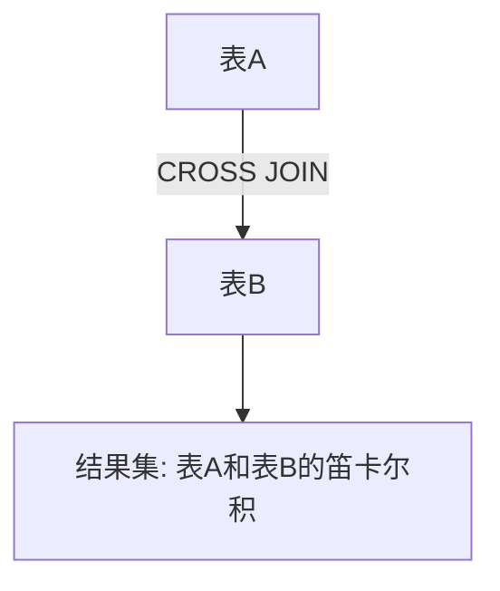

# MySQL 交叉连接

在MySQL中，**交叉连接（CROSS JOIN）** 是一种用于生成两个表之间所有可能组合的连接方式。它不需要任何条件来匹配行，而是简单地将第一个表的每一行与第二个表的每一行进行组合。交叉连接的结果集是两个表的笛卡尔积。

## 什么是交叉连接？

交叉连接是SQL中最简单的连接类型之一。它不依赖于任何条件，而是将两个表中的每一行进行组合。假设表A有`m`行，表B有`n`行，那么交叉连接的结果将包含`m * n`行。

### 语法

交叉连接的基本语法如下：

```sql
SELECT 列名
FROM 表1
CROSS JOIN 表2;
```

或者，你也可以使用以下等效语法：

```sql
SELECT 列名
FROM 表1, 表2;
```

:::note
虽然第二种语法更简洁，但为了代码的可读性和明确性，建议使用`CROSS JOIN`关键字。
:::

## 交叉连接的工作原理

为了更好地理解交叉连接的工作原理，让我们通过一个简单的例子来说明。

假设我们有两个表：`students` 和 `subjects`。

```sql
-- 表: students
+----+----------+
| id | name     |
+----+----------+
| 1  | Alice    |
| 2  | Bob      |
| 3  | Charlie  |
+----+----------+

-- 表: subjects
+----+-----------+
| id | subject   |
+----+-----------+
| 1  | Math      |
| 2  | Science   |
| 3  | History   |
+----+-----------+
```

如果我们对这两个表执行交叉连接，结果将是：

```sql
SELECT students.name, subjects.subject
FROM students
CROSS JOIN subjects;
```

输出结果如下：

```sql
+----------+-----------+
| name     | subject   |
+----------+-----------+
| Alice    | Math      |
| Alice    | Science   |
| Alice    | History   |
| Bob      | Math      |
| Bob      | Science   |
| Bob      | History   |
| Charlie  | Math      |
| Charlie  | Science   |
| Charlie  | History   |
+----------+-----------+
```

可以看到，`students`表中的每一行都与`subjects`表中的每一行进行了组合，生成了9行结果。

## 实际应用场景

虽然交叉连接在实际应用中不如其他连接类型（如内连接、左连接等）常见，但在某些情况下，它仍然非常有用。

### 场景1：生成所有可能的组合

假设你正在开发一个电子商务网站，需要为每个用户生成所有可能的产品推荐组合。你可以使用交叉连接来实现这一点。

```sql
SELECT users.username, products.product_name
FROM users
CROSS JOIN products;
```

这将为每个用户生成所有产品的推荐列表。

### 场景2：生成测试数据

在测试环境中，你可能需要生成大量的组合数据来测试系统的性能。交叉连接可以帮助你快速生成这些数据。

```sql
SELECT test_data1.value, test_data2.value
FROM test_data1
CROSS JOIN test_data2;
```

## 注意事项

:::caution
交叉连接会生成大量的数据，尤其是在表中有大量行的情况下。因此，在使用交叉连接时，务必谨慎，确保不会对数据库性能产生负面影响。
:::

## 总结

交叉连接是MySQL中一种简单但功能强大的连接方式，它能够生成两个表之间的所有可能组合。虽然在实际应用中不如其他连接类型常见，但在某些特定场景下（如生成组合数据或测试数据）非常有用。

## 附加资源与练习

为了巩固你对交叉连接的理解，可以尝试以下练习：

1. 创建两个表，分别包含不同的数据，然后使用交叉连接生成它们的笛卡尔积。
2. 尝试在实际项目中找到一个适合使用交叉连接的场景，并实现它。

如果你对交叉连接还有疑问，可以参考MySQL官方文档或相关教程进一步学习。



希望这篇内容能帮助你更好地理解MySQL中的交叉连接！继续加油学习吧！