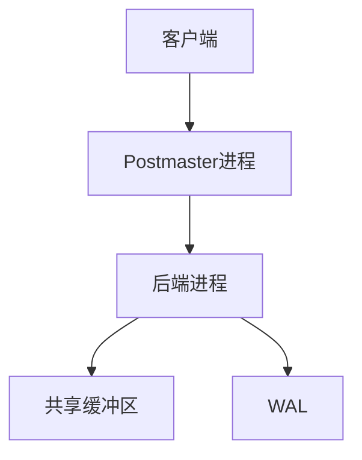

## 什么是PostgreSQL？

PostgreSQL（通常简称为Postgres）是一个功能强大的开源关系型数据库管理系统（RDBMS）。它以其可靠性、功能丰富性和性能而闻名，广泛应用于各种规模的项目中。PostgreSQL支持SQL标准，并提供了许多高级功能，如复杂查询、事务、触发器、视图和存储过程。

:::note
PostgreSQL是一个开源项目，这意味着它的源代码是公开的，任何人都可以自由使用、修改和分发。
:::

## PostgreSQL 的特点

PostgreSQL具有以下主要特点：

1. **开源且免费**：PostgreSQL是完全开源的，用户可以免费使用和修改。
2. **高度可扩展**：支持自定义数据类型、函数和操作符。
3. **ACID兼容**：确保数据的原子性、一致性、隔离性和持久性。
4. **支持复杂查询**：提供强大的查询优化器，支持复杂的SQL查询。
5. **多版本并发控制（MVCC）**：允许多个用户同时访问数据库，而不会相互干扰。
6. **丰富的扩展性**：通过插件和扩展，可以轻松扩展PostgreSQL的功能。

## PostgreSQL 的基本架构

PostgreSQL的架构可以分为以下几个主要组件：

1. **Postmaster进程**：负责管理数据库的启动、关闭和连接。
2. **后端进程**：每个客户端连接都会创建一个后端进程，处理该连接的请求。
3. **共享缓冲区**：用于缓存数据页，减少磁盘I/O操作。
4. **WAL（Write-Ahead Logging）**：确保数据的持久性和一致性。



## 安装PostgreSQL

在开始使用PostgreSQL之前，您需要先安装它。以下是在Linux系统上安装PostgreSQL的简单步骤：

```bash
# 更新包管理器
sudo apt-get update

# 安装PostgreSQL
sudo apt-get install postgresql postgresql-contrib
```

安装完成后，您可以通过以下命令启动PostgreSQL服务：

```bash
sudo service postgresql start
```

## 连接到PostgreSQL

安装完成后，您可以使用`psql`命令行工具连接到PostgreSQL数据库。默认情况下，PostgreSQL会创建一个名为`postgres`的超级用户。

```bash
sudo -u postgres psql
```

连接成功后，您将看到类似以下的提示符：

```bash
postgres=#
```

## 创建数据库和表

在PostgreSQL中，您可以使用SQL语句来创建数据库和表。以下是一个简单的示例：

```sql
-- 创建一个名为mydb的数据库
CREATE DATABASE mydb;

-- 连接到mydb数据库
\c mydb

-- 创建一个名为users的表
CREATE TABLE users (
    id SERIAL PRIMARY KEY,
    username VARCHAR(50) NOT NULL,
    email VARCHAR(100) NOT NULL
);
```

## 插入和查询数据

创建表后，您可以插入数据并查询它。以下是一些基本的SQL操作：

```sql
-- 插入数据
INSERT INTO users (username, email) VALUES ('alice', 'alice@example.com');
INSERT INTO users (username, email) VALUES ('bob', 'bob@example.com');

-- 查询数据
SELECT * FROM users;
```

执行上述查询后，您将看到类似以下的输出：

```bash
 id | username |       email        
----+----------+-------------------
  1 | alice    | alice@example.com
  2 | bob      | bob@example.com
(2 rows)
```

## 实际应用场景

PostgreSQL广泛应用于各种场景，包括：

1. **Web应用程序**：许多流行的Web框架（如Django、Ruby on Rails）都支持PostgreSQL作为后端数据库。
2. **数据分析**：PostgreSQL支持复杂的查询和分析操作，适合用于数据仓库和商业智能应用。
3. **地理信息系统（GIS）**：通过PostGIS扩展，PostgreSQL可以处理地理空间数据。

## 总结

PostgreSQL是一个功能强大且灵活的开源关系型数据库管理系统，适合各种规模的项目。通过本文，您已经了解了PostgreSQL的基本概念、特点以及如何安装和使用它。希望这些知识能帮助您在编程学习中迈出坚实的一步。

## 附加资源

- [PostgreSQL官方文档](https://www.postgresql.org/docs/)
- [PostgreSQL教程](https://www.postgresqltutorial.com/)
- [PostgreSQL练习](https://pgexercises.com/)

:::tip
建议您通过实际操作来巩固所学知识。尝试创建一个简单的数据库，并执行一些基本的SQL操作。
:::