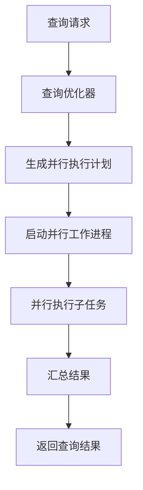

# PostgreSQL 并行查询

PostgreSQL是一个功能强大的开源关系型数据库管理系统，支持多种高级特性，其中之一就是**并行查询**。并行查询允许PostgreSQL利用多核CPU的能力，将查询任务分解为多个子任务并行执行，从而显著提升查询性能。本文将详细介绍PostgreSQL并行查询的工作原理、配置方法以及实际应用场景。

## 什么是并行查询？

并行查询是指数据库系统将单个查询任务分解为多个子任务，并在多个CPU核心上同时执行这些子任务。通过这种方式，PostgreSQL可以充分利用现代多核CPU的计算能力，加速查询的执行速度。

:::note
并行查询特别适用于处理大量数据的查询操作，例如全表扫描、聚合操作和排序等。
:::

## 并行查询的工作原理

PostgreSQL的并行查询功能依赖于以下几个关键组件：

1. **并行执行计划**：PostgreSQL的查询优化器会生成一个并行执行计划，将查询任务分解为多个并行子任务。
2. **并行工作进程**：PostgreSQL会启动多个工作进程（worker processes），每个进程负责执行一个子任务。
3. **并行协调器**：并行协调器负责管理所有工作进程，并汇总它们的结果。



## 配置并行查询

要启用并行查询，首先需要确保PostgreSQL的配置参数已正确设置。以下是一些关键参数：

- `max_parallel_workers_per_gather`：控制每个查询可以使用的最大并行工作进程数。默认值为2，可以根据CPU核心数进行调整。
- `parallel_setup_cost` 和 `parallel_tuple_cost`：这两个参数影响查询优化器是否选择并行执行计划。通常不需要手动调整。

```sql
-- 查看当前配置
SHOW max_parallel_workers_per_gather;

-- 设置最大并行工作进程数为4
SET max_parallel_workers_per_gather = 4;
```

## 并行查询的实际应用

假设我们有一个包含数百万条记录的表 `sales`，我们希望计算每个产品的总销售额。以下是一个使用并行查询的示例：

```sql
-- 创建示例表
CREATE TABLE sales (
    product_id INT,
    sale_date DATE,
    amount NUMERIC
);

-- 插入大量数据
INSERT INTO sales (product_id, sale_date, amount)
SELECT generate_series(1, 1000000), 
       '2023-01-01'::date + (random() * 365)::int,
       random() * 1000;

-- 启用并行查询
SET max_parallel_workers_per_gather = 4;

-- 执行并行查询
EXPLAIN ANALYZE
SELECT product_id, SUM(amount) AS total_sales
FROM sales
GROUP BY product_id;
```

在执行上述查询时，PostgreSQL会启动多个工作进程，并行计算每个产品的总销售额。通过 `EXPLAIN ANALYZE`，我们可以看到查询的执行计划和实际执行时间。

:::tip
在实际应用中，可以通过调整 `max_parallel_workers_per_gather` 参数来优化查询性能。
:::

## 总结

PostgreSQL的并行查询功能可以显著提升大数据量查询的性能，特别是在多核CPU环境下。通过合理配置并行查询参数，并结合实际应用场景，可以充分发挥PostgreSQL的性能优势。

## 附加资源

- [PostgreSQL官方文档 - 并行查询](https://www.postgresql.org/docs/current/parallel-query.html)
- [PostgreSQL性能调优指南](https://www.postgresql.org/docs/current/performance-tips.html)

## 练习

1. 尝试在本地PostgreSQL实例中创建一个包含大量数据的表，并启用并行查询功能。
2. 调整 `max_parallel_workers_per_gather` 参数，观察查询性能的变化。
3. 使用 `EXPLAIN ANALYZE` 分析不同并行配置下的查询执行计划。

通过以上练习，你将更深入地理解PostgreSQL并行查询的工作原理和应用场景。