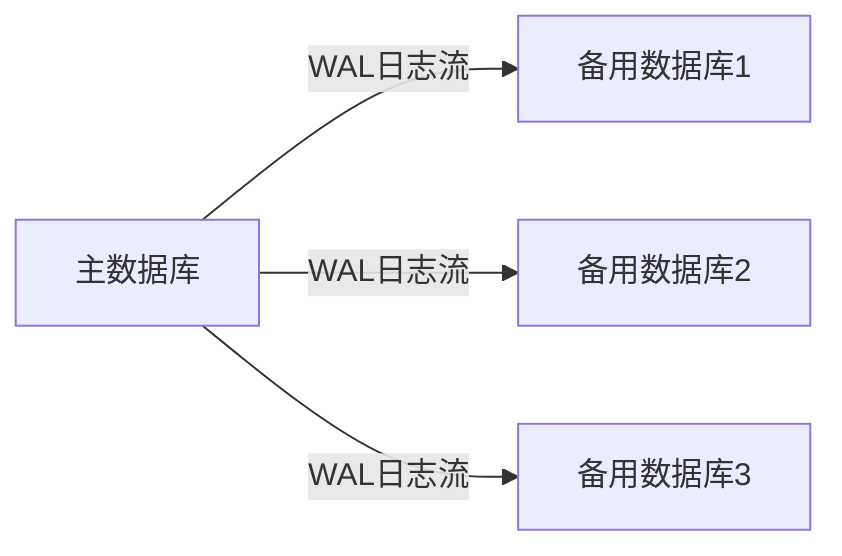

# PostgreSQL 流复制

PostgreSQL流复制（Streaming Replication）是PostgreSQL提供的一种高可用性和数据冗余的解决方案。它允许主数据库（Primary）将数据实时复制到一个或多个备用数据库（Standby），从而实现数据的实时同步和故障切换。流复制是PostgreSQL中实现数据库集群和灾难恢复的核心技术之一。

## 流复制的工作原理

流复制的核心思想是通过WAL（Write-Ahead Logging）日志将主数据库的更改实时传输到备用数据库。WAL日志记录了数据库的所有更改操作，备用数据库通过读取这些日志并将其应用到本地数据库，从而实现与主数据库的同步。



### 主数据库与备用数据库的角色

- **主数据库（Primary）**：负责处理所有的写操作，并将这些操作的WAL日志实时传输给备用数据库。
- **备用数据库（Standby）**：接收主数据库传输的WAL日志，并将其应用到本地数据库，保持与主数据库的同步。

## 配置流复制

### 1. 配置主数据库

首先，在主数据库的配置文件 `postgresql.conf` 中启用流复制：

```plaintext
wal_level = replica
max_wal_senders = 5
wal_keep_segments = 32
```

- `wal_level`：设置为 `replica`，表示启用WAL日志的复制功能。
- `max_wal_senders`：设置允许的最大WAL发送进程数，通常设置为备用数据库的数量。
- `wal_keep_segments`：设置保留的WAL日志段数，确保备用数据库有足够的时间接收日志。

接下来，在 `pg_hba.conf` 中配置允许备用数据库连接的规则：

```plaintext
host replication rep_user 192.168.1.0/24 md5
```

- `replication`：表示允许备用数据库以复制模式连接。
- `rep_user`：用于复制的用户。
- `192.168.1.0/24`：允许连接的IP地址范围。

### 2. 配置备用数据库

在备用数据库上，首先需要从主数据库获取基础备份。可以使用 `pg_basebackup` 工具来完成：

```bash
pg_basebackup -h 主数据库IP -U rep_user -D /var/lib/pgsql/12/data -Fp -Xs -P -R
```

- `-h`：指定主数据库的IP地址。
- `-U`：指定用于复制的用户。
- `-D`：指定备用数据库的数据目录。
- `-Fp`：指定备份格式为普通格式。
- `-Xs`：启用流复制模式。
- `-P`：显示进度。
- `-R`：自动生成 `recovery.conf` 文件。

在备用数据库的 `postgresql.conf` 中，确保以下配置：

```plaintext
hot_standby = on
```

- `hot_standby`：启用备用数据库的只读模式。

### 3. 启动备用数据库

配置完成后，启动备用数据库：

```bash
pg_ctl start -D /var/lib/pgsql/12/data
```

备用数据库将开始接收主数据库的WAL日志，并实时应用这些日志。

## 实际应用场景

### 高可用性

流复制最常见的应用场景是实现数据库的高可用性。当主数据库发生故障时，可以快速将备用数据库提升为新的主数据库，从而减少系统停机时间。

### 负载均衡

备用数据库可以配置为只读模式，用于处理查询请求，从而分担主数据库的负载。这对于读密集型应用非常有用。

### 灾难恢复

通过将备用数据库部署在不同的地理位置，可以实现灾难恢复。即使主数据库所在的数据中心发生故障，备用数据库仍然可以继续提供服务。

## 总结

PostgreSQL流复制是一种强大的数据复制技术，能够实现数据库的高可用性、负载均衡和灾难恢复。通过配置主数据库和备用数据库，可以确保数据的实时同步和系统的持续运行。

## 附加资源与练习

- **官方文档**：[PostgreSQL Streaming Replication](https://www.postgresql.org/docs/current/warm-standby.html)
- **练习**：尝试在本地环境中配置一个主数据库和一个备用数据库，并测试流复制的功能。
- **进一步学习**：探索PostgreSQL的逻辑复制和物理复制的区别，了解它们在不同场景下的应用。