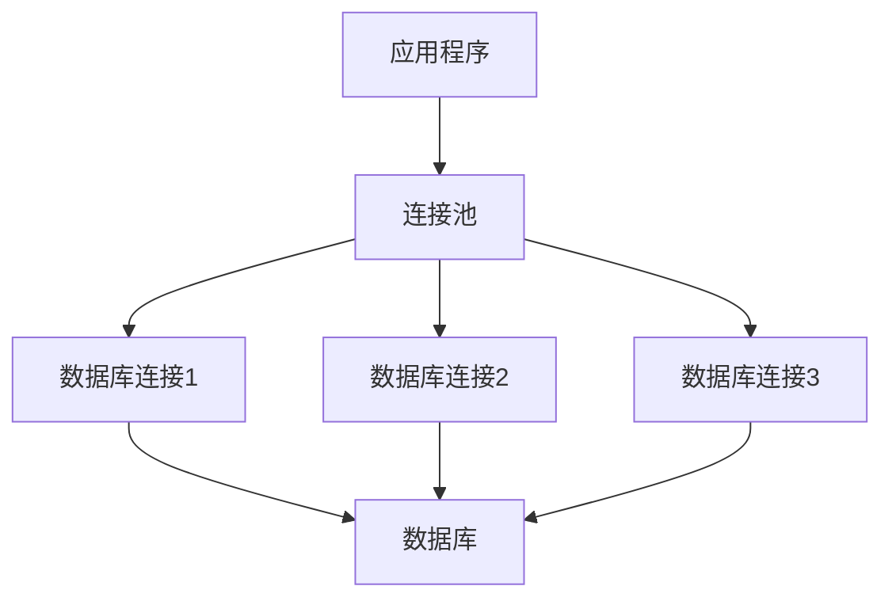

# PostgreSQL 连接池

在现代应用程序中，数据库连接的管理是一个关键的性能优化点。PostgreSQL连接池是一种技术，用于管理和复用数据库连接，从而减少连接创建和销毁的开销，提高应用程序的性能和响应速度。本文将详细介绍PostgreSQL连接池的概念、工作原理以及如何在实际应用中使用它。

## 什么是连接池？

连接池（Connection Pool）是一种数据库连接管理技术。它通过预先创建一定数量的数据库连接，并将这些连接保存在一个“池”中，供应用程序使用。当应用程序需要与数据库交互时，它可以从连接池中获取一个连接，使用完毕后将连接归还给连接池，而不是直接关闭连接。这样可以避免频繁地创建和销毁连接，从而减少系统开销。

:::note
连接池的主要目的是减少数据库连接的创建和销毁开销，提高应用程序的性能。
:::

## 为什么需要连接池？

在传统的数据库访问模式中，每次应用程序需要与数据库交互时，都会创建一个新的连接，使用完毕后关闭连接。这种方式在高并发场景下会导致以下问题：

1. **连接创建和销毁的开销大**：每次创建和销毁连接都需要消耗系统资源，尤其是在高并发场景下，这种开销会显著增加。
2. **连接数限制**：数据库服务器通常对同时连接的客户端数量有限制，过多的连接请求可能导致数据库服务器崩溃。
3. **响应时间变长**：频繁的连接创建和销毁会导致应用程序的响应时间变长，影响用户体验。

连接池通过复用连接，解决了上述问题，从而提高了应用程序的性能和稳定性。

## PostgreSQL 连接池的工作原理

PostgreSQL连接池的核心思想是**复用连接**。连接池在应用程序启动时创建一定数量的数据库连接，并将这些连接保存在一个池中。当应用程序需要与数据库交互时，它从连接池中获取一个连接，使用完毕后将连接归还给连接池，而不是关闭连接。



在上图中，应用程序通过连接池与数据库交互。连接池中预先创建了多个数据库连接，应用程序可以从连接池中获取连接，使用完毕后将连接归还给连接池。

## 如何使用PostgreSQL连接池？

在PostgreSQL中，常用的连接池工具有 `pgbouncer` 和 `pgpool-II`。下面以 `pgbouncer` 为例，介绍如何在PostgreSQL中使用连接池。

### 安装pgbouncer

首先，我们需要安装 `pgbouncer`。在Ubuntu系统中，可以使用以下命令安装：

```bash
sudo apt-get install pgbouncer
```

### 配置pgbouncer

安装完成后，我们需要配置 `pgbouncer`。配置文件通常位于 `/etc/pgbouncer/pgbouncer.ini`。以下是一个简单的配置示例：

```ini
[databases]
mydb = host=127.0.0.1 port=5432 dbname=mydb

[pgbouncer]
listen_addr = 127.0.0.1
listen_port = 6432
auth_type = md5
auth_file = /etc/pgbouncer/userlist.txt
pool_mode = session
max_client_conn = 100
default_pool_size = 20
```

在这个配置中，`mydb` 是我们要连接的数据库，`pgbouncer` 监听在 `127.0.0.1:6432`，并使用 `md5` 认证方式。`pool_mode` 设置为 `session`，表示每个客户端会话使用一个连接。`max_client_conn` 和 `default_pool_size` 分别设置了最大客户端连接数和默认的连接池大小。

### 启动pgbouncer

配置完成后，可以使用以下命令启动 `pgbouncer`：

```bash
sudo systemctl start pgbouncer
```

### 在应用程序中使用连接池

在应用程序中，我们可以通过连接 `pgbouncer` 来使用连接池。以下是一个使用 `psycopg2` 连接 `pgbouncer` 的Python示例：

```python
import psycopg2

# 连接到pgbouncer
conn = psycopg2.connect(
    host="127.0.0.1",
    port=6432,
    dbname="mydb",
    user="myuser",
    password="mypassword"
)

# 执行查询
cursor = conn.cursor()
cursor.execute("SELECT * FROM mytable")
rows = cursor.fetchall()

# 打印结果
for row in rows:
    print(row)

# 关闭连接
cursor.close()
conn.close()
```

在这个示例中，我们通过 `pgbouncer` 连接到PostgreSQL数据库，并执行了一个简单的查询。由于使用了连接池，应用程序的性能得到了提升。

## 实际应用场景

连接池在实际应用中有广泛的使用场景，特别是在高并发的Web应用程序中。以下是一些常见的应用场景：

1. **Web应用程序**：在高并发的Web应用程序中，连接池可以显著减少数据库连接的开销，提高应用程序的响应速度。
2. **微服务架构**：在微服务架构中，每个服务可能需要频繁地与数据库交互，连接池可以帮助管理这些连接，减少资源消耗。
3. **批处理任务**：在批处理任务中，连接池可以复用连接，减少任务执行时间。

## 总结

PostgreSQL连接池是一种重要的性能优化技术，它通过复用数据库连接，减少了连接创建和销毁的开销，提高了应用程序的性能和稳定性。本文介绍了连接池的概念、工作原理以及如何使用 `pgbouncer` 在PostgreSQL中实现连接池。希望本文能帮助你更好地理解和使用PostgreSQL连接池。

## 附加资源

- [pgbouncer官方文档](https://www.pgbouncer.org/)
- [pgpool-II官方文档](https://www.pgpool.net/docs/)
- [PostgreSQL官方文档](https://www.postgresql.org/docs/)

## 练习

1. 在你的本地环境中安装并配置 `pgbouncer`，并尝试在应用程序中使用它。
2. 修改 `pgbouncer` 的配置，尝试不同的 `pool_mode`（如 `transaction` 和 `statement`），观察其对性能的影响。
3. 编写一个简单的Web应用程序，使用连接池与PostgreSQL数据库交互，测试其在高并发场景下的性能。