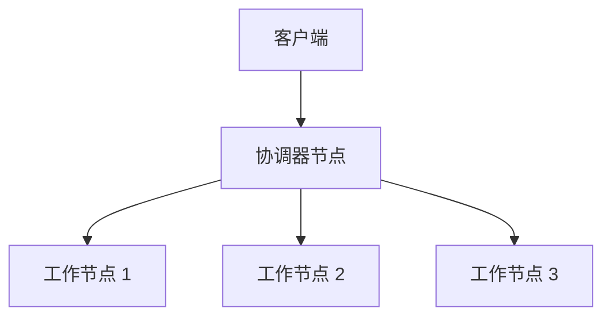

# PostgreSQL Citus

## 什么是 PostgreSQL Citus？

PostgreSQL Citus 是一个开源的 PostgreSQL 扩展，旨在将 PostgreSQL 数据库从单节点扩展到分布式环境。通过 Citus，您可以将数据分布在多个节点上，从而处理大规模数据集和高并发查询。Citus 特别适用于需要横向扩展（scale-out）的应用场景，例如实时分析、多租户应用和时间序列数据存储。

Citus 的核心思想是将数据分片（sharding）并分布到多个 PostgreSQL 节点上。每个节点独立处理其分片的数据，而 Citus 协调器节点负责将查询分发到适当的节点并汇总结果。

:::note
Citus 是 PostgreSQL 的扩展，因此它与 PostgreSQL 完全兼容。您可以使用现有的 PostgreSQL 工具和客户端与 Citus 集群进行交互。
:::

## 安装与配置

### 安装 Citus

要使用 Citus，首先需要在 PostgreSQL 中安装 Citus 扩展。以下是安装步骤：

1. 下载并安装 Citus 扩展包。您可以从 [Citus 官方网站](https://www.citusdata.com/) 获取安装包，或者使用包管理器安装。

2. 在 PostgreSQL 中启用 Citus 扩展：

   ```sql
   CREATE EXTENSION citus;
   ```

3. 配置 Citus 集群。您需要指定协调器节点和工作节点。以下是一个简单的配置示例：

   ```sql
   -- 在协调器节点上添加工作节点
   SELECT citus_add_node('worker1.example.com', 5432);
   SELECT citus_add_node('worker2.example.com', 5432);
   ```

### 创建分布式表

安装并配置 Citus 后，您可以将表分布到多个节点上。以下是一个简单的示例：

```sql
-- 创建一个分布式表
CREATE TABLE events (
    event_id serial PRIMARY KEY,
    event_time timestamptz DEFAULT now(),
    user_id int,
    event_type text
);

-- 将表分布到 user_id 列上
SELECT create_distributed_table('events', 'user_id');
```

:::tip
`create_distributed_table` 函数将表分布到多个节点上。您可以选择一个分布列（如 `user_id`），Citus 会根据该列的值将数据分布到不同的节点。
:::

## Citus 的工作原理

Citus 通过将数据分片并分布到多个节点上来实现横向扩展。以下是 Citus 的核心概念：

1. **分片（Shard）**：每个表被分成多个分片，每个分片存储在不同的节点上。
2. **分布列（Distribution Column）**：选择一个分布列，Citus 会根据该列的值将数据分布到不同的分片。
3. **协调器节点（Coordinator Node）**：负责接收查询并将其分发到适当的工作节点。
4. **工作节点（Worker Node）**：存储分片数据并执行查询。

以下是一个简单的示意图，展示了 Citus 的架构：



## 实际应用场景

### 实时分析

Citus 非常适合实时分析场景，例如网站流量分析或用户行为分析。通过将数据分布到多个节点上，Citus 可以并行处理大量数据，从而提供快速的查询响应时间。

```sql
-- 查询过去 24 小时内的事件数量
SELECT COUNT(*) FROM events WHERE event_time > now() - interval '24 hours';
```

### 多租户应用

在多租户应用中，每个租户的数据可以存储在不同的分片上。Citus 可以根据租户 ID 将数据分布到不同的节点上，从而实现高效的查询和隔离。

```sql
-- 查询特定租户的事件
SELECT * FROM events WHERE user_id = 123;
```

### 时间序列数据

Citus 也适用于存储和查询时间序列数据，例如传感器数据或日志数据。通过将数据按时间分片，Citus 可以高效地处理时间范围查询。

```sql
-- 查询过去一周的事件
SELECT * FROM events WHERE event_time > now() - interval '7 days';
```

## 总结

PostgreSQL Citus 是一个强大的工具，可以帮助您轻松扩展 PostgreSQL 数据库以处理大规模数据。通过将数据分片并分布到多个节点上，Citus 提供了高效的查询性能和横向扩展能力。无论是实时分析、多租户应用还是时间序列数据存储，Citus 都能满足您的需求。

## 附加资源

- [Citus 官方文档](https://docs.citusdata.com/)
- [PostgreSQL 官方文档](https://www.postgresql.org/docs/)
- [Citus GitHub 仓库](https://github.com/citusdata/citus)

## 练习

1. 安装 Citus 扩展并配置一个简单的 Citus 集群。
2. 创建一个分布式表并插入一些数据。
3. 编写一个查询，测试 Citus 的分布式查询功能。

通过完成这些练习，您将更好地理解 Citus 的工作原理和应用场景。