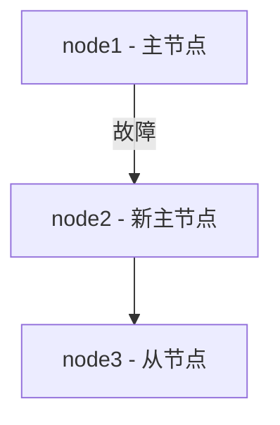

## 什么是 PostgreSQL Patroni？

PostgreSQL Patroni 是一个用于管理 PostgreSQL 高可用性（High Availability, HA）集群的开源工具。它通过自动化的故障转移和主从切换机制，确保数据库服务在出现故障时能够快速恢复，从而减少停机时间。Patroni 基于分布式一致性算法（如 etcd、ZooKeeper 或 Consul）来管理集群状态，并支持多种部署方式。

Patroni 的核心功能包括：
- **自动故障转移**：当主节点出现故障时，Patroni 会自动选举新的主节点。
- **配置管理**：通过分布式存储（如 etcd）集中管理集群配置。
- **健康检查**：定期检查节点的健康状态，确保集群的稳定性。

## 为什么需要 Patroni？

在传统的 PostgreSQL 高可用性方案中，手动管理主从切换和故障恢复是一项复杂且容易出错的任务。Patroni 通过自动化的方式简化了这一过程，使得数据库管理员可以专注于业务逻辑，而不是基础设施的管理。

## 安装与配置 Patroni

### 1. 安装 Patroni

首先，确保你的系统已经安装了 PostgreSQL 和 Python 3。然后，使用 `pip` 安装 Patroni：

```bash
pip install patroni
```

### 2. 配置 Patroni

Patroni 的配置文件通常是一个 YAML 文件。以下是一个简单的配置示例：

```yaml
scope: my_cluster
namespace: /service/
name: node1

restapi:
  listen: 0.0.0.0:8008
  connect_address: 127.0.0.1:8008

etcd:
  host: 127.0.0.1:2379

bootstrap:
  dcs:
    ttl: 30
    loop_wait: 10
    retry_timeout: 10
    maximum_lag_on_failover: 1048576
    postgresql:
      use_pg_rewind: true
      parameters:
        max_connections: 100
        shared_buffers: 128MB

postgresql:
  listen: 0.0.0.0:5432
  connect_address: 127.0.0.1:5432
  data_dir: /var/lib/postgresql/12/main
  bin_dir: /usr/lib/postgresql/12/bin
  pgpass: /var/lib/postgresql/.pgpass
  authentication:
    replication:
      username: replicator
      password: mypassword
    superuser:
      username: postgres
      password: mypassword
```

### 3. 启动 Patroni

配置完成后，可以通过以下命令启动 Patroni：

```bash
patroni /path/to/patroni.yml
```

## 实际应用场景

### 场景 1：自动故障转移

假设你有一个由三个节点组成的 PostgreSQL 集群：`node1`（主节点）、`node2` 和 `node3`（从节点）。当 `node1` 出现故障时，Patroni 会自动选举一个新的主节点（例如 `node2`），并将 `node3` 重新配置为新的从节点。



### 场景 2：配置管理

Patroni 通过 etcd 集中管理集群配置。当需要更改 PostgreSQL 参数时，只需更新 etcd 中的配置，Patroni 会自动将更改应用到所有节点。

```bash
etcdctl set /service/my_cluster/config '{"postgresql": {"parameters": {"max_connections": 200}}}'
```

## 总结

PostgreSQL Patroni 是一个强大的工具，能够显著简化 PostgreSQL 高可用性集群的管理。通过自动化的故障转移和配置管理，Patroni 确保了数据库服务的稳定性和可靠性。对于初学者来说，掌握 Patroni 的基本概念和配置方法是迈向高级数据库管理的重要一步。

## 附加资源与练习

- **官方文档**：[Patroni Documentation](https://patroni.readthedocs.io/en/latest/)
- **练习**：尝试在一个本地环境中部署一个三节点的 PostgreSQL 集群，并使用 Patroni 进行管理。观察当主节点出现故障时，Patroni 如何自动进行故障转移。

:::tip
如果你在配置过程中遇到问题，可以参考 Patroni 的官方文档或社区论坛，获取更多帮助。
:::