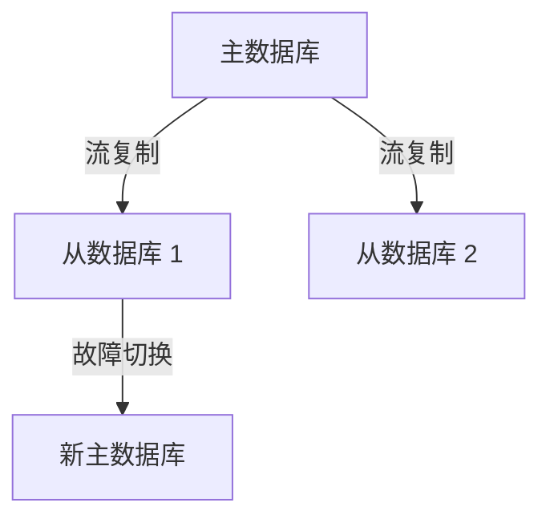

# PostgreSQL 企业级应用

PostgreSQL 是一个功能强大的开源关系型数据库管理系统（RDBMS），因其可靠性、扩展性和丰富的功能集，被广泛应用于企业级应用中。无论是处理大规模数据、支持复杂查询，还是满足高并发需求，PostgreSQL 都能胜任。本文将逐步介绍 PostgreSQL 在企业级应用中的核心场景，并通过实际案例帮助初学者理解其应用价值。

---

## 什么是企业级应用？

企业级应用通常指为大型组织或企业设计的软件系统，这些系统需要处理大量数据、支持高并发访问、具备高可用性和安全性。PostgreSQL 在这些场景中表现出色，主要得益于以下特性：

- **ACID 事务支持**：确保数据的一致性和完整性。
- **扩展性**：支持自定义数据类型、函数和存储过程。
- **高可用性**：通过主从复制、流复制等技术实现故障恢复。
- **安全性**：提供强大的访问控制和数据加密功能。

---

## PostgreSQL 在企业级应用中的核心场景

### 1. 数据仓库

数据仓库是企业用于存储和分析大量历史数据的系统。PostgreSQL 通过其强大的查询优化器和扩展插件（如 `pg_partman` 和 `citus`），能够高效地处理大规模数据。

#### 示例：分区表
分区表是数据仓库中常用的技术，用于将大表拆分为多个小表，从而提高查询性能。

```sql
-- 创建分区表
CREATE TABLE sales (
    id SERIAL PRIMARY KEY,
    sale_date DATE NOT NULL,
    amount NUMERIC NOT NULL
) PARTITION BY RANGE (sale_date);

-- 创建子分区
CREATE TABLE sales_2023 PARTITION OF sales
    FOR VALUES FROM ('2023-01-01') TO ('2024-01-01');

-- 插入数据
INSERT INTO sales (sale_date, amount) VALUES ('2023-10-01', 100.50);

-- 查询数据
SELECT * FROM sales WHERE sale_date BETWEEN '2023-01-01' AND '2023-12-31';
```

**输出：**
```
 id | sale_date  | amount
----+------------+--------
  1 | 2023-10-01 | 100.50
```

:::tip
分区表可以显著提高查询性能，尤其是在处理时间序列数据时。
:::

---

### 2. 高并发事务处理

企业级应用通常需要支持高并发事务处理，例如电商平台的订单系统。PostgreSQL 通过 MVCC（多版本并发控制）机制，确保在高并发场景下数据的一致性和隔离性。

#### 示例：事务处理
以下是一个简单的订单处理事务示例：

```sql
BEGIN;

-- 扣减库存
UPDATE products SET stock = stock - 1 WHERE id = 1;

-- 创建订单
INSERT INTO orders (product_id, quantity) VALUES (1, 1);

COMMIT;
```

:::caution
在高并发场景中，务必注意事务的隔离级别和锁机制，以避免死锁或性能问题。
:::

---

### 3. 地理信息系统（GIS）

PostgreSQL 通过扩展插件 `PostGIS`，支持地理空间数据的存储和查询。这在物流、地图服务等企业级应用中非常有用。

#### 示例：地理空间查询
以下是一个查询附近地点的示例：

```sql
-- 创建包含地理空间数据的表
CREATE TABLE locations (
    id SERIAL PRIMARY KEY,
    name TEXT NOT NULL,
    geom GEOMETRY(Point, 4326)
);

-- 插入数据
INSERT INTO locations (name, geom) VALUES
    ('Location A', ST_SetSRID(ST_MakePoint(-73.9857, 40.7484), 4326)),
    ('Location B', ST_SetSRID(ST_MakePoint(-74.0060, 40.7128), 4326));

-- 查询距离某个点 5 公里范围内的地点
SELECT name FROM locations
WHERE ST_DWithin(
    geom,
    ST_SetSRID(ST_MakePoint(-73.9857, 40.7484), 4326),
    5000
);
```

**输出：**
```
    name
------------
 Location A
```

---

### 4. 高可用性与灾难恢复

企业级应用需要确保系统的高可用性。PostgreSQL 通过流复制和逻辑复制技术，支持主从架构和故障切换。



:::note
流复制可以实时将主数据库的更改同步到从数据库，确保数据的高可用性。
:::

---

## 实际案例

### 案例 1：电商平台

某电商平台使用 PostgreSQL 作为其核心数据库，处理数百万用户的订单、库存和支付数据。通过分区表和流复制技术，平台实现了高效的数据管理和高可用性。

### 案例 2：物流管理系统

一家物流公司使用 PostgreSQL 和 PostGIS 扩展，管理其全球运输网络。通过地理空间查询，公司能够优化路线规划并实时跟踪货物位置。

---

## 总结

PostgreSQL 在企业级应用中展现了其强大的功能和灵活性。无论是数据仓库、高并发事务处理，还是地理信息系统，PostgreSQL 都能提供可靠的解决方案。通过本文的学习，您应该对 PostgreSQL 在企业级应用中的核心场景有了初步了解。

---

## 附加资源与练习

- **练习 1**：尝试在本地 PostgreSQL 中创建一个分区表，并插入大量数据，观察查询性能的变化。
- **练习 2**：使用 PostGIS 扩展，创建一个包含地理空间数据的表，并尝试查询附近的地点。
- **资源**：
  - [PostgreSQL 官方文档](https://www.postgresql.org/docs/)
  - [PostGIS 官方文档](https://postgis.net/documentation/)

:::warning
在实际生产环境中使用 PostgreSQL 时，请务必进行充分的测试和性能优化。
:::