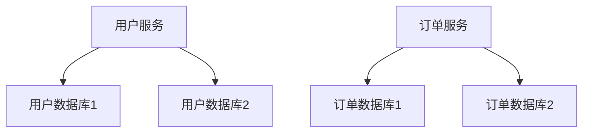

# PostgreSQL 微服务数据

在现代软件开发中，微服务架构已经成为一种流行的设计模式。微服务架构将应用程序拆分为多个小型、独立的服务，每个服务负责特定的功能。PostgreSQL 作为一种强大的关系型数据库，在微服务架构中扮演着重要的角色。本文将介绍如何在微服务架构中使用 PostgreSQL 管理数据，并通过实际案例展示其应用场景。

## 什么是微服务架构？

微服务架构是一种将应用程序拆分为多个小型、独立服务的设计模式。每个服务都可以独立开发、部署和扩展，通常通过 API 进行通信。这种架构的优势在于提高了系统的灵活性和可维护性。

## PostgreSQL 在微服务中的应用

在微服务架构中，每个服务通常都有自己的数据库。PostgreSQL 是一个功能丰富的关系型数据库，支持复杂的查询、事务处理和扩展性，非常适合用于微服务中的数据存储。

### 数据隔离

在微服务架构中，每个服务都有自己的数据库，这样可以实现数据的隔离。例如，用户服务可以有一个专门用于存储用户信息的 PostgreSQL 数据库，而订单服务可以有一个专门用于存储订单信息的 PostgreSQL 数据库。

```sql
-- 用户服务的数据库
CREATE TABLE users (
    id SERIAL PRIMARY KEY,
    username VARCHAR(50) NOT NULL,
    email VARCHAR(100) NOT NULL
);

-- 订单服务的数据库
CREATE TABLE orders (
    id SERIAL PRIMARY KEY,
    user_id INT REFERENCES users(id),
    order_date TIMESTAMP NOT NULL,
    total_amount DECIMAL(10, 2) NOT NULL
);
```

### 数据一致性

在微服务架构中，确保数据一致性是一个挑战。PostgreSQL 支持事务处理，可以在多个操作之间保持数据的一致性。例如，在创建订单时，可以同时更新用户表和订单表，确保数据的一致性。

```sql
BEGIN;

-- 在用户表中插入新用户
INSERT INTO users (username, email) VALUES ('john_doe', 'john@example.com');

-- 在订单表中插入新订单
INSERT INTO orders (user_id, order_date, total_amount) VALUES (1, NOW(), 100.00);

COMMIT;
```

### 数据分片

随着数据量的增加，单个数据库可能无法满足性能需求。PostgreSQL 支持数据分片，可以将数据分布到多个数据库实例中，从而提高系统的扩展性和性能。



## 实际应用场景

### 电子商务平台

在一个电子商务平台中，用户服务和订单服务是两个独立的微服务。用户服务负责管理用户信息，订单服务负责管理订单信息。每个服务都有自己的 PostgreSQL 数据库，确保数据的隔离和一致性。

```sql
-- 用户服务数据库
CREATE TABLE users (
    id SERIAL PRIMARY KEY,
    username VARCHAR(50) NOT NULL,
    email VARCHAR(100) NOT NULL
);

-- 订单服务数据库
CREATE TABLE orders (
    id SERIAL PRIMARY KEY,
    user_id INT REFERENCES users(id),
    order_date TIMESTAMP NOT NULL,
    total_amount DECIMAL(10, 2) NOT NULL
);
```

### 社交媒体平台

在一个社交媒体平台中，用户服务和帖子服务是两个独立的微服务。用户服务负责管理用户信息，帖子服务负责管理用户发布的帖子。每个服务都有自己的 PostgreSQL 数据库，确保数据的隔离和一致性。

```sql
-- 用户服务数据库
CREATE TABLE users (
    id SERIAL PRIMARY KEY,
    username VARCHAR(50) NOT NULL,
    email VARCHAR(100) NOT NULL
);

-- 帖子服务数据库
CREATE TABLE posts (
    id SERIAL PRIMARY KEY,
    user_id INT REFERENCES users(id),
    content TEXT NOT NULL,
    post_date TIMESTAMP NOT NULL
);
```

## 总结

PostgreSQL 在微服务架构中扮演着重要的角色，通过数据隔离、事务处理和数据分片等功能，确保了数据的一致性和系统的扩展性。本文通过实际案例展示了 PostgreSQL 在微服务中的应用场景，希望对初学者有所帮助。

## 附加资源

- [PostgreSQL 官方文档](https://www.postgresql.org/docs/)
- [微服务架构设计模式](https://microservices.io/)
- [PostgreSQL 事务处理](https://www.postgresql.org/docs/current/tutorial-transactions.html)

## 练习

1. 创建一个简单的微服务架构，包含用户服务和订单服务，每个服务都有自己的 PostgreSQL 数据库。
2. 在用户服务中插入一个新用户，并在订单服务中插入一个新订单，确保数据的一致性。
3. 尝试使用 PostgreSQL 的数据分片功能，将用户数据分布到多个数据库实例中。
