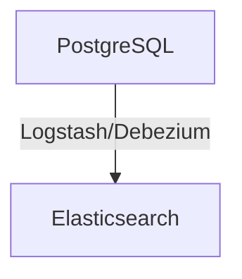

# PostgreSQL 与Elasticsearch对比

在现代应用程序开发中，选择合适的数据库技术至关重要。PostgreSQL和Elasticsearch是两种非常流行的数据库系统，但它们的设计目标和适用场景截然不同。本文将深入探讨它们的核心区别、适用场景以及如何在实际项目中结合使用它们。

## 介绍

### PostgreSQL
PostgreSQL是一个功能强大的开源关系型数据库管理系统（RDBMS）。它支持复杂的查询、事务处理、数据完整性约束以及多种数据类型。PostgreSQL以其稳定性、扩展性和标准兼容性而闻名，适合处理结构化数据。

### Elasticsearch
Elasticsearch是一个分布式搜索和分析引擎，专为处理非结构化或半结构化数据而设计。它基于Apache Lucene构建，提供了强大的全文搜索、实时分析和数据聚合功能。Elasticsearch通常用于日志分析、搜索引擎和实时数据分析等场景。

## 核心区别

### 数据模型
- **PostgreSQL**：基于关系模型，数据存储在表中，表之间通过外键关联。适合存储结构化数据。
- **Elasticsearch**：基于文档模型，数据以JSON文档的形式存储。适合存储非结构化或半结构化数据。

### 查询语言
- **PostgreSQL**：使用SQL（结构化查询语言）进行数据操作和查询。
- **Elasticsearch**：使用基于JSON的查询DSL（领域特定语言）进行数据搜索和分析。

### 事务支持
- **PostgreSQL**：支持ACID事务，确保数据的一致性和完整性。
- **Elasticsearch**：不支持传统的事务处理，但提供了近实时的搜索和分析能力。

### 扩展性
- **PostgreSQL**：通过分区、复制和集群技术实现扩展，但扩展性相对有限。
- **Elasticsearch**：天生分布式设计，支持水平扩展，适合处理大规模数据。

## 适用场景

### PostgreSQL
- 需要复杂事务处理的应用程序（如金融系统）。
- 需要严格数据一致性和完整性的场景。
- 结构化数据存储和查询。

### Elasticsearch
- 全文搜索和实时分析（如日志分析、搜索引擎）。
- 非结构化或半结构化数据的存储和查询。
- 需要高吞吐量和低延迟的场景。

## 实际案例

### 案例1：电商平台
在一个电商平台中，PostgreSQL可以用于存储用户信息、订单数据和库存信息，确保数据的一致性和完整性。而Elasticsearch可以用于实现商品搜索功能，提供快速、准确的搜索结果。

```sql
-- PostgreSQL示例：查询用户订单
SELECT * FROM orders WHERE user_id = 1;
```

```json
// Elasticsearch示例：搜索商品
{
  "query": {
    "match": {
      "product_name": "laptop"
    }
  }
}
```

### 案例2：日志分析系统
在一个日志分析系统中，Elasticsearch可以用于存储和查询大量的日志数据，提供实时的日志搜索和分析功能。而PostgreSQL可以用于存储系统配置和用户权限等结构化数据。

```json
// Elasticsearch示例：查询日志
{
  "query": {
    "range": {
      "timestamp": {
        "gte": "2023-01-01",
        "lte": "2023-01-31"
      }
    }
  }
}
```

```sql
-- PostgreSQL示例：查询系统配置
SELECT * FROM configurations WHERE key = 'log_level';
```

## 结合使用PostgreSQL和Elasticsearch

在实际项目中，PostgreSQL和Elasticsearch可以结合使用，以发挥各自的优势。例如，可以使用PostgreSQL存储结构化数据，同时使用Elasticsearch进行全文搜索和实时分析。

### 数据同步
为了实现数据同步，可以使用工具如Logstash或Debezium将PostgreSQL中的数据实时同步到Elasticsearch中。



## 总结

PostgreSQL和Elasticsearch各有其独特的优势和适用场景。PostgreSQL适合处理结构化数据和复杂事务，而Elasticsearch则擅长处理非结构化数据和实时搜索。在实际项目中，结合使用这两种技术可以充分发挥它们的优势，构建高效、可靠的应用程序。

## 附加资源

- [PostgreSQL官方文档](https://www.postgresql.org/docs/)
- [Elasticsearch官方文档](https://www.elastic.co/guide/en/elasticsearch/reference/current/index.html)
- [Logstash官方文档](https://www.elastic.co/guide/en/logstash/current/index.html)
- [Debezium官方文档](https://debezium.io/documentation/)

## 练习

1. 在PostgreSQL中创建一个用户表，并插入一些数据。然后使用SQL查询这些数据。
2. 在Elasticsearch中创建一个索引，并插入一些文档。然后使用Elasticsearch的查询DSL搜索这些文档。
3. 尝试使用Logstash或Debezium将PostgreSQL中的数据同步到Elasticsearch中。

:::tip
在实际项目中，选择合适的数据库技术需要根据具体的业务需求和数据特点进行权衡。希望本文能帮助你更好地理解PostgreSQL和Elasticsearch的区别和适用场景。
:::