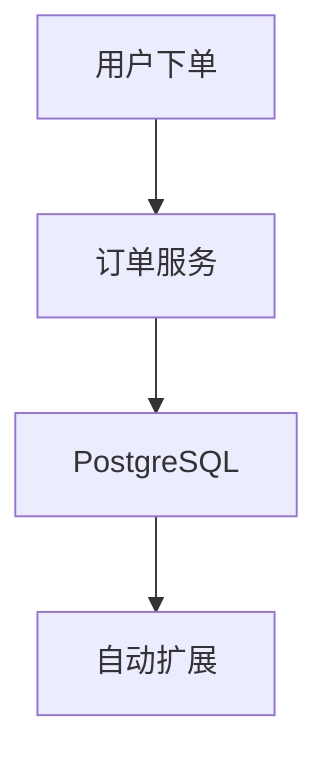
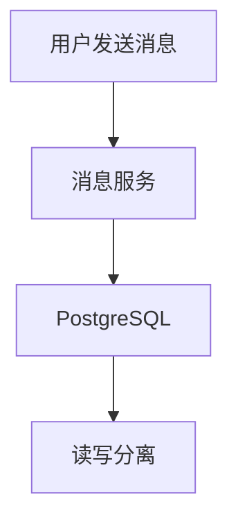

# PostgreSQL 云原生应用

## 介绍

云原生应用是指那些专为云环境设计和优化的应用程序。它们通常采用微服务架构、容器化部署和自动化管理。PostgreSQL作为一款强大的开源关系型数据库，在云原生环境中也得到了广泛应用。本文将介绍如何在云原生环境中使用PostgreSQL，并提供一些最佳实践和实际案例。

## 云原生环境中的PostgreSQL

### 容器化部署

在云原生环境中，容器化部署是最常见的做法。Docker和Kubernetes是两种常用的工具。以下是一个使用Docker部署PostgreSQL的示例：

```bash
docker run --name my-postgres -e POSTGRES_PASSWORD=mysecretpassword -d postgres
```

### 使用Kubernetes管理PostgreSQL

Kubernetes可以帮助你自动化管理PostgreSQL的部署、扩展和故障恢复。以下是一个简单的Kubernetes部署文件示例：

```yaml
apiVersion: apps/v1
kind: Deployment
metadata:
  name: postgres
spec:
  replicas: 1
  selector:
    matchLabels:
      app: postgres
  template:
    metadata:
      labels:
        app: postgres
    spec:
      containers:
      - name: postgres
        image: postgres:latest
        env:
        - name: POSTGRES_PASSWORD
          value: "mysecretpassword"
        ports:
        - containerPort: 5432
```

### 自动扩展

在云原生环境中，自动扩展是一个重要的特性。Kubernetes的Horizontal Pod Autoscaler（HPA）可以帮助你根据负载自动扩展PostgreSQL实例。

```yaml
apiVersion: autoscaling/v2beta2
kind: HorizontalPodAutoscaler
metadata:
  name: postgres-hpa
spec:
  scaleTargetRef:
    apiVersion: apps/v1
    kind: Deployment
    name: postgres
  minReplicas: 1
  maxReplicas: 10
  metrics:
  - type: Resource
    resource:
      name: cpu
      target:
        type: Utilization
        averageUtilization: 80
```

## 实际案例

### 案例1：电商平台的订单管理系统

在一个电商平台的订单管理系统中，PostgreSQL被用来存储订单数据。由于订单量在促销期间会急剧增加，系统需要能够自动扩展以应对高负载。



### 案例2：社交媒体平台的消息系统

在一个社交媒体平台的消息系统中，PostgreSQL被用来存储用户消息。由于消息量巨大，系统需要能够高效地处理读写操作。



## 总结

在云原生环境中使用PostgreSQL可以带来许多好处，包括自动化管理、弹性扩展和高可用性。通过容器化部署和Kubernetes管理，你可以轻松地在云原生环境中运行PostgreSQL。希望本文的内容能帮助你更好地理解和使用PostgreSQL在云原生环境中的应用。

## 附加资源

- [PostgreSQL官方文档](https://www.postgresql.org/docs/)
- [Kubernetes官方文档](https://kubernetes.io/docs/home/)
- [Docker官方文档](https://docs.docker.com/)

## 练习

1. 使用Docker部署一个PostgreSQL实例，并连接到它。
2. 使用Kubernetes部署一个PostgreSQL实例，并配置自动扩展。
3. 在一个实际项目中应用PostgreSQL的云原生最佳实践，并记录你的经验。
