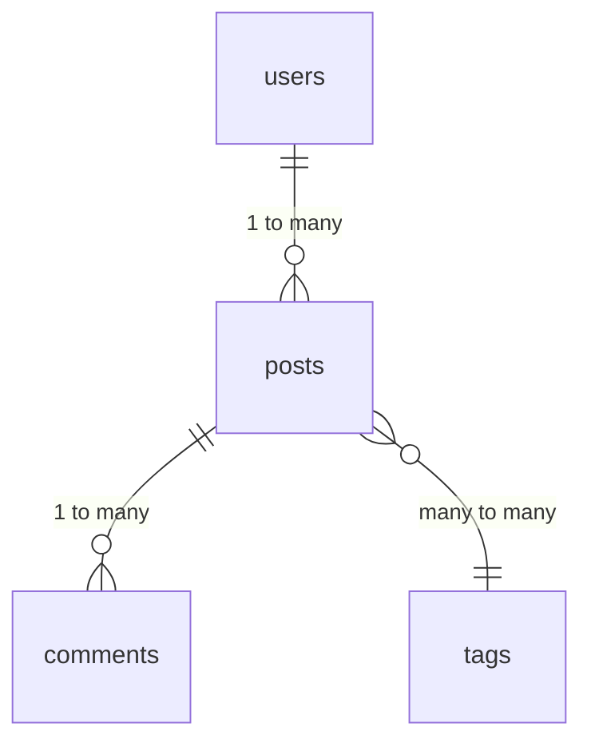

## 介绍

PostgreSQL是一个功能强大的开源关系型数据库管理系统，广泛应用于各种规模的项目中。为了高效地开发和管理PostgreSQL数据库，遵循一个清晰的开发流程至关重要。本文将详细介绍PostgreSQL的开发流程，帮助初学者从需求分析到部署，逐步掌握数据库开发的最佳实践。

## PostgreSQL 开发流程概述

PostgreSQL开发流程通常包括以下几个阶段：

1. **需求分析**
2. **数据库设计**
3. **SQL脚本编写**
4. **测试与优化**
5. **部署与维护**

接下来，我们将逐一讲解每个阶段的具体内容。

## 1. 需求分析

在开始开发之前，首先需要明确项目的需求。需求分析的目的是确定数据库需要存储哪些数据，以及这些数据之间的关系。

:::tip
需求分析阶段的关键是**与业务团队紧密合作**，确保理解业务需求并将其转化为数据库设计。
:::

### 示例

假设我们正在开发一个简单的博客系统，需求如下：

- 用户可以注册、登录和发布博客。
- 每篇博客可以包含多个标签。
- 用户可以评论博客。

## 2. 数据库设计

在需求分析的基础上，我们需要设计数据库的结构。数据库设计包括**表设计**、**字段设计**和**关系设计**。

### 表设计

根据需求，我们可以设计以下表：

- `users`：存储用户信息。
- `posts`：存储博客文章。
- `tags`：存储标签。
- `post_tags`：存储博客与标签的多对多关系。
- `comments`：存储用户对博客的评论。

### 字段设计

以`users`表为例，字段设计如下：

```sql
CREATE TABLE users (
    id SERIAL PRIMARY KEY,
    username VARCHAR(50) UNIQUE NOT NULL,
    email VARCHAR(100) UNIQUE NOT NULL,
    password_hash VARCHAR(255) NOT NULL,
    created_at TIMESTAMP DEFAULT CURRENT_TIMESTAMP
);
```

### 关系设计

- `users`与`posts`是一对多关系。
- `posts`与`tags`是多对多关系，通过`post_tags`表关联。
- `users`与`comments`是一对多关系。



## 3. SQL脚本编写

在数据库设计完成后，我们需要编写SQL脚本来创建表、插入数据以及定义索引等。

### 创建表

```sql
CREATE TABLE posts (
    id SERIAL PRIMARY KEY,
    user_id INT REFERENCES users(id),
    title VARCHAR(255) NOT NULL,
    content TEXT NOT NULL,
    created_at TIMESTAMP DEFAULT CURRENT_TIMESTAMP
);

CREATE TABLE tags (
    id SERIAL PRIMARY KEY,
    name VARCHAR(50) UNIQUE NOT NULL
);

CREATE TABLE post_tags (
    post_id INT REFERENCES posts(id),
    tag_id INT REFERENCES tags(id),
    PRIMARY KEY (post_id, tag_id)
);

CREATE TABLE comments (
    id SERIAL PRIMARY KEY,
    user_id INT REFERENCES users(id),
    post_id INT REFERENCES posts(id),
    content TEXT NOT NULL,
    created_at TIMESTAMP DEFAULT CURRENT_TIMESTAMP
);
```

### 插入数据

```sql
INSERT INTO users (username, email, password_hash) VALUES ('alice', 'alice@example.com', 'hashed_password');
INSERT INTO posts (user_id, title, content) VALUES (1, 'My First Post', 'This is the content of my first post.');
INSERT INTO tags (name) VALUES ('Programming'), ('Database');
INSERT INTO post_tags (post_id, tag_id) VALUES (1, 1), (1, 2);
INSERT INTO comments (user_id, post_id, content) VALUES (1, 1, 'Great post!');
```

## 4. 测试与优化

在数据库开发过程中，测试和优化是不可或缺的环节。我们需要确保数据库的性能和数据的完整性。

### 测试

- **单元测试**：测试每个SQL查询的正确性。
- **性能测试**：测试数据库在高负载下的表现。

### 优化

- **索引优化**：为常用查询字段添加索引。
- **查询优化**：优化复杂查询，避免全表扫描。

```sql
CREATE INDEX idx_posts_user_id ON posts(user_id);
CREATE INDEX idx_comments_post_id ON comments(post_id);
```

## 5. 部署与维护

在测试和优化完成后，数据库可以部署到生产环境。部署后，还需要进行持续的维护，包括备份、监控和性能调优。

### 备份

定期备份数据库是确保数据安全的重要措施。

```bash
pg_dump -U username -d dbname -f backup.sql
```

### 监控

使用工具如`pg_stat_activity`监控数据库的活动。

```sql
SELECT * FROM pg_stat_activity;
```

## 总结

PostgreSQL开发流程涵盖了从需求分析到部署维护的各个环节。通过遵循这一流程，开发者可以高效地设计、开发和维护PostgreSQL数据库。希望本文能帮助你掌握PostgreSQL开发的最佳实践。

## 附加资源

- [PostgreSQL官方文档](https://www.postgresql.org/docs/)
- [SQL教程](https://www.w3schools.com/sql/)
- [数据库设计指南](https://www.databasejournal.com/features/mysql/article.php/3917306/Database-Design-Guidelines.htm)

## 练习

1. 设计一个简单的电商系统数据库，包括用户、商品、订单等表。
2. 编写SQL脚本创建这些表，并插入一些示例数据。
3. 为常用查询字段添加索引，并测试查询性能。
