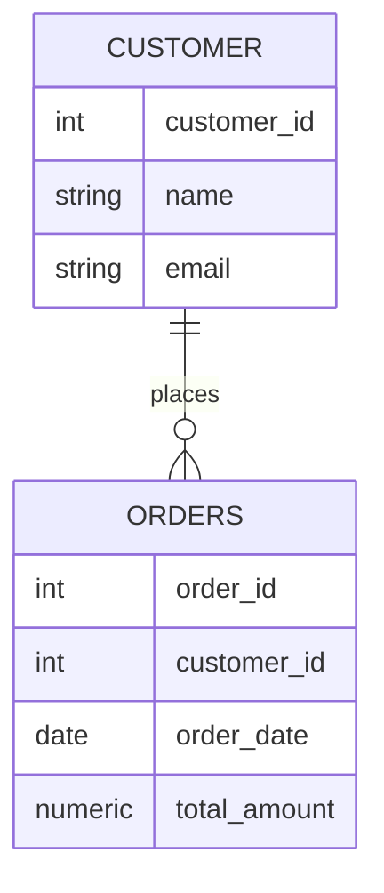

## 介绍

在关系型数据库中，表是存储数据的基本单位。PostgreSQL 是一个功能强大的开源关系型数据库管理系统，支持多种数据类型和高级功能。创建表是使用 PostgreSQL 的第一步，它定义了数据的结构和存储方式。

本文将逐步讲解如何在 PostgreSQL 中创建表，并通过实际案例帮助你理解其应用场景。

## 创建表的基本语法

在 PostgreSQL 中，使用 `CREATE TABLE` 语句来创建表。其基本语法如下：

```sql
CREATE TABLE table_name (
    column1 datatype [constraints],
    column2 datatype [constraints],
    ...
);
```

- `table_name`：表的名称。
- `column1, column2, ...`：表的列名。
- `datatype`：列的数据类型，例如 `INTEGER`, `VARCHAR`, `DATE` 等。
- `constraints`：可选的约束条件，例如 `PRIMARY KEY`, `NOT NULL`, `UNIQUE` 等。

### 示例：创建一个简单的表

假设我们要创建一个名为 `students` 的表，用于存储学生的基本信息。表的结构如下：

- `id`：学生的唯一标识符，类型为 `INTEGER`，并且是主键。
- `name`：学生的姓名，类型为 `VARCHAR(100)`，不能为空。
- `age`：学生的年龄，类型为 `INTEGER`。
- `email`：学生的电子邮件，类型为 `VARCHAR(100)`，必须唯一。

```sql
CREATE TABLE students (
    id SERIAL PRIMARY KEY,
    name VARCHAR(100) NOT NULL,
    age INTEGER,
    email VARCHAR(100) UNIQUE
);
```

:::note
`SERIAL` 是 PostgreSQL 中的一种特殊数据类型，它会自动生成唯一的整数值，通常用于主键。
:::

### 解释

- `id SERIAL PRIMARY KEY`：`id` 列是主键，且会自动递增。
- `name VARCHAR(100) NOT NULL`：`name` 列是可变长度字符串，最大长度为 100 个字符，且不能为空。
- `age INTEGER`：`age` 列是整数类型。
- `email VARCHAR(100) UNIQUE`：`email` 列是可变长度字符串，最大长度为 100 个字符，且必须唯一。

## 实际案例：创建一个订单表

假设我们正在开发一个电子商务网站，需要创建一个 `orders` 表来存储订单信息。表的结构如下：

- `order_id`：订单的唯一标识符，类型为 `SERIAL`，并且是主键。
- `customer_id`：客户的唯一标识符，类型为 `INTEGER`，不能为空。
- `order_date`：订单的日期，类型为 `DATE`，不能为空。
- `total_amount`：订单的总金额，类型为 `NUMERIC(10, 2)`，不能为空。

```sql
CREATE TABLE orders (
    order_id SERIAL PRIMARY KEY,
    customer_id INTEGER NOT NULL,
    order_date DATE NOT NULL,
    total_amount NUMERIC(10, 2) NOT NULL
);
```

:::tip
`NUMERIC(10, 2)` 表示该列存储的数字最多有 10 位，其中小数部分占 2 位。
:::

### 解释

- `order_id SERIAL PRIMARY KEY`：`order_id` 列是主键，且会自动递增。
- `customer_id INTEGER NOT NULL`：`customer_id` 列是整数类型，且不能为空。
- `order_date DATE NOT NULL`：`order_date` 列是日期类型，且不能为空。
- `total_amount NUMERIC(10, 2) NOT NULL`：`total_amount` 列是数值类型，最多 10 位，其中小数部分占 2 位，且不能为空。

## 表的关系图

为了更好地理解表之间的关系，我们可以使用 Mermaid 绘制一个简单的 ER 图。



:::caution
在实际应用中，表之间的关系可能更加复杂，需要根据具体需求设计表结构。
:::

## 总结

在 PostgreSQL 中创建表是数据库设计的基础步骤。通过 `CREATE TABLE` 语句，我们可以定义表的结构、列的数据类型以及约束条件。本文通过两个实际案例展示了如何创建表，并解释了每个部分的作用。

## 附加资源

- [PostgreSQL 官方文档](https://www.postgresql.org/docs/)
- [PostgreSQL 数据类型](https://www.postgresql.org/docs/current/datatype.html)
- [PostgreSQL 约束](https://www.postgresql.org/docs/current/ddl-constraints.html)

## 练习

1. 创建一个名为 `employees` 的表，包含以下列：
   - `employee_id`：主键，自动递增。
   - `first_name`：字符串类型，最大长度为 50，不能为空。
   - `last_name`：字符串类型，最大长度为 50，不能为空。
   - `hire_date`：日期类型，不能为空。
   - `salary`：数值类型，最多 10 位，其中小数部分占 2 位。

2. 创建一个名为 `products` 的表，包含以下列：
   - `product_id`：主键，自动递增。
   - `product_name`：字符串类型，最大长度为 100，不能为空。
   - `price`：数值类型，最多 10 位，其中小数部分占 2 位，不能为空。
   - `stock_quantity`：整数类型，不能为空。

通过完成这些练习，你将更好地掌握如何在 PostgreSQL 中创建表。