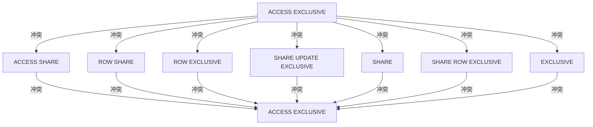

# PostgreSQL 锁机制

在数据库管理系统中，锁机制是确保数据一致性和完整性的重要工具。PostgreSQL通过锁机制来管理多个事务对同一数据的并发访问，防止数据冲突和不一致。本文将详细介绍PostgreSQL中的锁机制，帮助初学者理解其工作原理和应用场景。

## 什么是锁机制？

锁机制是数据库管理系统用来控制并发访问的一种机制。当一个事务对数据进行操作时，数据库会为该数据加锁，以防止其他事务同时修改该数据，从而避免数据冲突和不一致。PostgreSQL提供了多种类型的锁，每种锁都有不同的特性和用途。

## PostgreSQL 中的锁类型

PostgreSQL中的锁可以分为两大类：表级锁和行级锁。

### 表级锁

表级锁是对整个表进行加锁，适用于需要对整个表进行操作的情况。常见的表级锁包括：

- **ACCESS SHARE**：允许并发读取，但禁止写入。
- **ROW SHARE**：允许并发读取和写入，但禁止排他锁。
- **ROW EXCLUSIVE**：允许并发读取和写入，但禁止其他事务获取排他锁。
- **SHARE UPDATE EXCLUSIVE**：允许并发读取，但禁止其他事务获取排他锁。
- **SHARE**：允许并发读取，但禁止写入和排他锁。
- **SHARE ROW EXCLUSIVE**：允许并发读取，但禁止其他事务获取排他锁。
- **EXCLUSIVE**：禁止其他事务获取任何锁。
- **ACCESS EXCLUSIVE**：禁止其他事务获取任何锁，通常用于表结构修改。

### 行级锁

行级锁是对表中的某一行进行加锁，适用于需要对特定行进行操作的情况。常见的行级锁包括：

- **FOR UPDATE**：锁定选中的行，防止其他事务修改或删除。
- **FOR NO KEY UPDATE**：锁定选中的行，但允许其他事务读取。
- **FOR SHARE**：锁定选中的行，允许其他事务读取，但禁止修改。
- **FOR KEY SHARE**：锁定选中的行，允许其他事务读取和修改，但禁止删除。

## 锁的应用场景

### 并发更新

假设有两个事务同时尝试更新同一行数据，如果没有锁机制，可能会导致数据不一致。通过使用行级锁，可以确保只有一个事务能够成功更新数据，另一个事务必须等待锁释放后才能继续。

```sql
-- 事务1
BEGIN;
SELECT * FROM accounts WHERE id = 1 FOR UPDATE;
UPDATE accounts SET balance = balance - 100 WHERE id = 1;
COMMIT;

-- 事务2
BEGIN;
SELECT * FROM accounts WHERE id = 1 FOR UPDATE;
UPDATE accounts SET balance = balance + 100 WHERE id = 1;
COMMIT;
```

在上面的例子中，事务1和事务2都尝试更新`accounts`表中`id`为1的记录。由于使用了`FOR UPDATE`锁，事务2必须等待事务1完成后才能继续。

### 表结构修改

在对表结构进行修改时，通常需要使用`ACCESS EXCLUSIVE`锁，以防止其他事务在修改过程中访问表。

```sql
-- 事务1
BEGIN;
ALTER TABLE accounts ADD COLUMN new_column INT;
COMMIT;

-- 事务2
BEGIN;
SELECT * FROM accounts;
COMMIT;
```

在上面的例子中，事务1对`accounts`表进行了结构修改，使用了`ACCESS EXCLUSIVE`锁，事务2在事务1完成之前无法读取表数据。

## 锁的冲突

不同类型的锁之间可能存在冲突。例如，`ACCESS EXCLUSIVE`锁与任何其他锁都会冲突，而`ACCESS SHARE`锁只与`ACCESS EXCLUSIVE`锁冲突。



## 总结

PostgreSQL的锁机制是确保数据一致性和完整性的重要工具。通过合理使用表级锁和行级锁，可以有效管理并发访问，防止数据冲突和不一致。在实际应用中，应根据具体需求选择合适的锁类型，并注意锁之间的冲突关系。

## 附加资源

- [PostgreSQL官方文档 - 锁机制](https://www.postgresql.org/docs/current/explicit-locking.html)
- [PostgreSQL锁冲突矩阵](https://www.postgresql.org/docs/current/explicit-locking.html#LOCKING-TABLES)

## 练习

1. 尝试在一个事务中使用`FOR UPDATE`锁，并在另一个事务中尝试更新同一行数据，观察锁的行为。
2. 修改表结构时，使用`ACCESS EXCLUSIVE`锁，并观察其他事务的访问行为。